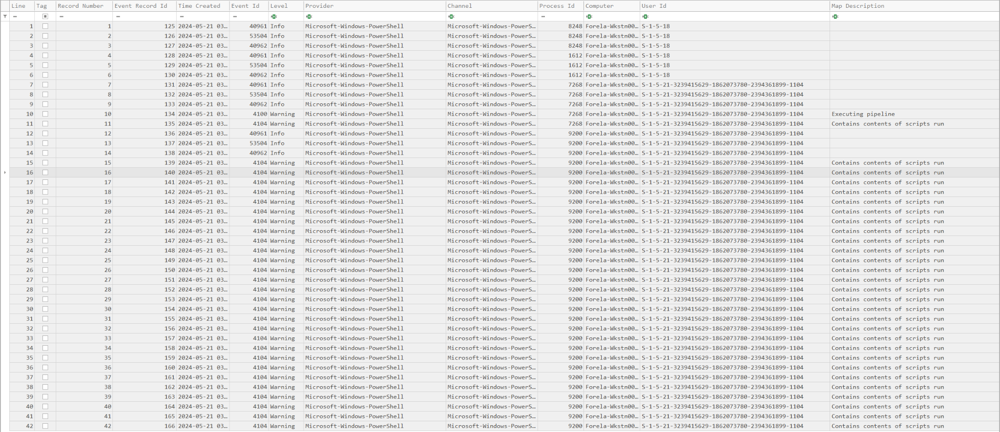
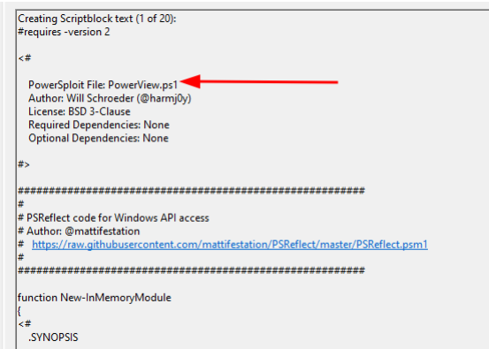
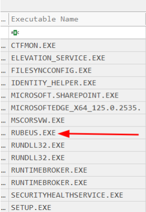
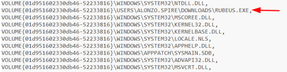
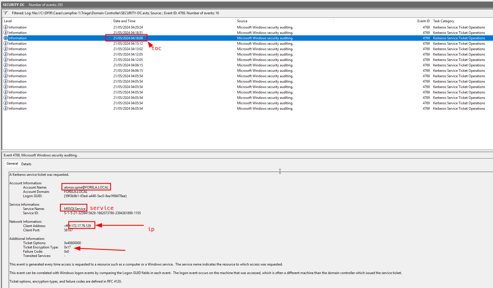

<p align="center">
  
</p>

# Campfire-1 Security Incident Report

> **Category:** Very Easy  
> **Discipline:** DFIR — Windows Event Log and Prefetch Analysis  
> **Primary artifacts:** Domain Controller Security log, PowerShell Operational log, and Windows Prefetch  
> **Time standard:** UTC

---

## Executive Summary

| Field | Value |
|---|---|
| **Incident ID** | `CAMPFIRE1-2024-0521` |
| **Severity** | **High** |
| **Status** | Confirmed Kerberoasting activity |
| **Affected endpoint** | `Forela-Wkstn001.forela.local` |
| **Domain controller** | `DC01.forela.local` |
| **Account used** | `FORELA.LOCAL\alonzo.spire` |
| **Source IP** | `172.17.79.129` |
| **Targeted service account** | `MSSQLService` |
| **Offensive tools** | `PowerView.ps1` and `Rubeus.exe` |
| **Kerberoasting event** | `2024-05-21 03:18:09 UTC` |
| **Assessment confidence** | High |

A user context on `Forela-Wkstn001.forela.local` executed PowerShell with an execution-policy bypass, loaded `PowerView.ps1`, and then ran `Rubeus.exe`. One second after the Rubeus Prefetch execution timestamp, the domain controller logged a successful Kerberos service-ticket request for `MSSQLService` using RC4-HMAC.

The evidence confirms Active Directory enumeration followed by Kerberoasting from `172.17.79.129`. The supplied artifacts do not establish the original compromise vector, successful offline cracking of the ticket, or subsequent use of the service-account password.

---

## Artifact Inventory

| Artifact | Type | Evidentiary value |
|---|---|---|
| `SECURITY-DC.evtx` | Domain Controller Security log | Kerberos ticket activity, requesting account, target service, source IP, encryption type, and result |
| `PowerShell-Operational.evtx` | PowerShell Operational log | Execution-policy bypass and PowerView script-block execution |
| `RUBEUS.EXE-5873E24B.pf` | Windows Prefetch | Confirms Rubeus execution time and files referenced during execution |
| `20260803202740_EvtxECmd_Output.csv` | Parsed Security log | Normalized and searchable Domain Controller event timeline |
| `20260803211234_EvtxECmd_Output.csv` | Parsed PowerShell log | Normalized and searchable PowerShell event timeline |
| `kerberoasting-event.png` | Evidence screenshot | Event ID `4769` showing the account, service, IP address, and RC4 ticket type |
| `powershell-log-overview.png` | Evidence screenshot | PowerShell activity and Script Block Logging events |
| `powerview-script.png` | Evidence screenshot | PowerView identification in the recorded script content |
| `rubeus-prefetch.png` | Evidence screenshot | Rubeus executable identified in parsed Prefetch data |
| `rubeus-full-path.png` | Evidence screenshot | Full Rubeus path recovered from the Prefetch files-loaded data |

> **Timezone note:** Event Viewer may display timestamps in the analyst workstation's local timezone. All timestamps in this report are normalized to UTC from the parsed artifacts.

---

## Scope and Affected Assets

| Asset | Role | Impact |
|---|---|---|
| `Forela-Wkstn001.forela.local` | User workstation | Offensive PowerShell and Kerberos tooling executed |
| `DC01.forela.local` | Domain controller | Processed the malicious TGS request and recorded Event ID `4769` |
| `FORELA.LOCAL\alonzo.spire` | Domain user | Account context used for enumeration and the Kerberoasting request |
| `MSSQLService` | Service account | Kerberos service ticket requested with crackable RC4-HMAC encryption |

---

## Incident Narrative

### 1. PowerShell Execution-Policy Bypass

At `2024-05-21 03:16:29 UTC`, PowerShell Script Block Logging recorded the following command on `Forela-Wkstn001.forela.local`:

```powershell
powershell -ep bypass
```

The command launched PowerShell with the execution policy bypassed, allowing scripts to run without the normal policy restriction.



### 2. Active Directory Enumeration with PowerView

At `2024-05-21 03:16:32 UTC`, Event ID `4104` recorded execution of:

```text
C:\Users\alonzo.spire\Downloads\powerview.ps1
```

The script was logged across multiple Script Block Logging events. PowerView contains functions for enumerating domain users, computers, groups, trust relationships, SPNs, and accounts that may be suitable Kerberoasting targets.



### 3. Rubeus Execution

Windows Prefetch identified `RUBEUS.EXE` with a last-run timestamp of:

```text
2024-05-21 03:18:08 UTC
```

The Prefetch files-loaded data exposed the executable path:

```text
C:\Users\Alonzo.spire\Downloads\Rubeus.exe
```





### 4. Kerberoasting Request

At `2024-05-21 03:18:09 UTC`, `DC01.forela.local` recorded Security Event ID `4769` with the following attributes:

| Field | Value |
|---|---|
| **Requesting account** | `alonzo.spire@FORELA.LOCAL` |
| **Service name** | `MSSQLService` |
| **Client address** | `172.17.79.129` |
| **Ticket encryption** | `RC4-HMAC` / `0x17` |
| **Failure code** | `0x0` — success |

The targeted service name does not end with `$`, is not `krbtgt`, and the ticket used RC4-HMAC. Combined with the PowerView and Rubeus evidence, this event confirms Kerberoasting activity.



### 5. Evidentiary Correlation

The Rubeus execution preceded the malicious TGS request by approximately one second:

```text
03:18:08 UTC — Rubeus execution recorded by Prefetch
03:18:09 UTC — RC4 service ticket requested for MSSQLService
```

This temporal correlation, together with the requesting account and source IP, links the endpoint tooling to the Domain Controller event.

---

## Technical Timeline

| Timestamp (UTC) | Event |
|---|---|
| `2024-05-21 03:16:29` | PowerShell execution-policy bypass recorded in Event ID `4104` |
| `2024-05-21 03:16:32` | `PowerView.ps1` loaded from the user Downloads directory |
| `2024-05-21 03:18:08` | `Rubeus.exe` executed from the user Downloads directory |
| `2024-05-21 03:18:09` | Domain Controller logged Event ID `4769` for `MSSQLService` using RC4-HMAC |

---

## Indicators of Compromise

| Type | Indicator | Context |
|---|---|---|
| IPv4 | `172.17.79.129` | Source workstation address in the malicious TGS request |
| Hostname | `Forela-Wkstn001.forela.local` | Workstation where PowerShell activity was recorded |
| Hostname | `DC01.forela.local` | Domain Controller that issued the service ticket |
| Account | `FORELA.LOCAL\alonzo.spire` | User context associated with the attack |
| Service account | `MSSQLService` | Kerberoasting target |
| File path | `C:\Users\alonzo.spire\Downloads\powerview.ps1` | Active Directory enumeration script |
| File path | `C:\Users\Alonzo.spire\Downloads\Rubeus.exe` | Kerberos attack tool |
| Prefetch | `RUBEUS.EXE-5873E24B.pf` | Execution evidence for Rubeus |
| Event ID | `4104` | PowerShell Script Block Logging |
| Event ID | `4769` | Kerberos service-ticket request |
| Encryption type | `0x17` / `RC4-HMAC` | Ticket type associated with the confirmed Kerberoasting event |

---

## Attack Classification

| Phase | Observed behavior |
|---|---|
| **Execution** | PowerShell launched with execution-policy bypass |
| **Discovery** | PowerView used to enumerate Active Directory objects and potential SPN targets |
| **Credential Access** | Rubeus requested an RC4-encrypted TGS for `MSSQLService` for offline cracking |
| **Collection** | Service-ticket material was obtained for password-cracking attempts |

---

## Root Cause

The supplied evidence does not reveal how the attacker initially gained access to the workstation or the `alonzo.spire` account. The observed activity was enabled by:

- Execution of offensive PowerShell scripts from the user Downloads directory
- Use of PowerShell execution-policy bypass without effective application control
- Execution of `Rubeus.exe` without endpoint prevention or immediate containment
- Availability of RC4-HMAC for the targeted service ticket
- Insufficient real-time correlation between PowerShell telemetry, Prefetch execution, and Domain Controller Event ID `4769`

---

## Impact Assessment

| Area | Assessment |
|---|---|
| **Confidentiality** | High risk. A service ticket suitable for offline password cracking was obtained. |
| **Integrity** | Endpoint execution is confirmed, but no domain or host configuration changes are established. |
| **Availability** | No service disruption is visible in the supplied evidence. |
| **Credential exposure** | `MSSQLService` must be treated as potentially compromised until its password is rotated. |
| **Lateral movement** | Not established from the available artifacts. |
| **Data exfiltration** | Not established from the available artifacts. |
| **Overall impact** | Confirmed Kerberoasting with material risk to the targeted service account and any systems accessible through it. |

---

## Containment and Eradication Recommendations

### Immediate

1. Isolate `Forela-Wkstn001.forela.local` and preserve volatile and disk evidence.
2. Disable or restrict the `alonzo.spire` account pending investigation.
3. Reset the `MSSQLService` password to a long, randomly generated value and update dependent services securely.
4. Terminate active sessions and invalidate relevant Kerberos tickets.
5. Remove `PowerView.ps1`, `Rubeus.exe`, and related artifacts only after forensic acquisition.
6. Hunt across the environment for `172.17.79.129`, `RUBEUS.EXE`, `PowerView.ps1`, Event ID `4104`, and suspicious Event ID `4769` activity.

### Eradication and Recovery

1. Reimage the affected workstation from a trusted baseline if compromise scope cannot be bounded.
2. Review the `alonzo.spire` account for abnormal logons, group changes, mailbox rules, token theft, and credential reuse.
3. Audit the targeted service account's logons, service dependencies, permissions, and access to sensitive systems.
4. Rotate other secrets exposed to the user or workstation.
5. Validate that no scheduled tasks, services, registry autoruns, WMI subscriptions, or remote-management persistence remain.

### Preventive Controls

- Replace user-managed service accounts with group Managed Service Accounts where feasible.
- Require AES for Kerberos service accounts and phase out RC4.
- Deploy application control to block unsigned offensive tooling from user-writable paths.
- Enable and centralize PowerShell Script Block Logging, Module Logging, and transcription.
- Alert on Event ID `4769` where the service name is not `krbtgt`, does not end in `$`, and the encryption type is `0x17`.
- Correlate Kerberos anomalies with endpoint process creation and Prefetch or EDR telemetry.
- Use strong service-account passwords and minimize service-account privileges.

---

## Conclusion

The investigation confirms that `PowerView.ps1` was used to enumerate Active Directory from `Forela-Wkstn001.forela.local`, followed by execution of `Rubeus.exe`. The Domain Controller then issued an RC4-HMAC service ticket for `MSSQLService` to `alonzo.spire` from `172.17.79.129`.

The activity constitutes a confirmed Kerberoasting attack. The targeted service-account password should be rotated immediately, and the workstation and associated user account require full compromise assessment.

---

## Annex A — Evidence-to-Finding Matrix

| Finding | Supporting artifact |
|---|---|
| PowerShell execution policy was bypassed | PowerShell Operational Event ID `4104`, Event Record ID `135` |
| PowerView executed at `03:16:32 UTC` | PowerShell Operational Event ID `4104`, Event Record ID `139` and associated script blocks |
| PowerView path was in the user Downloads directory | `PayloadData1` in the parsed PowerShell log |
| Rubeus executed at `03:18:08 UTC` | `RUBEUS.EXE-5873E24B.pf` parsed with PECmd |
| Rubeus full path was in the user Downloads directory | Prefetch files-loaded data |
| Kerberoasting occurred at `03:18:09 UTC` | Domain Controller Security Event ID `4769`, Event Record ID `6672` |
| Targeted service was `MSSQLService` | Event ID `4769` service information |
| Request originated from `172.17.79.129` | Event ID `4769` network information |
| Ticket encryption was RC4-HMAC | Event ID `4769` ticket information |
| Requesting account was `alonzo.spire` | Event ID `4769` account information |
