<p align="center">
  
</p>

# Jinkies Security Incident Report

> **Category:** Medium  
> **Discipline:** DFIR — Windows Endpoint Forensics / Data Theft Investigation  
> **Primary artifacts:** KAPE triage, Windows Registry, `$MFT`, Windows Event Logs / Sysmon, Chrome History, SAM/SYSTEM hives  
> **Time standard:** UTC for normalized report timestamps

---

## Executive Summary

| Field | Value |
|---|---|
| **Incident ID** | `JINKIES-2023-1006` |
| **Severity** | **High** |
| **Status** | Confirmed unauthorized access; likely intellectual-property exfiltration |
| **Affected host** | `VELMAD100` |
| **Compromised account** | `VELMAD100\Velma` |
| **Initial access vector** | Exposed credentials in a shared project database file, followed by RDP access |
| **Attacker source IP** | `192.168.157.151` |
| **First interactive logon** | `2023-10-06 17:17:23 UTC` |
| **Likely exfiltration service** | `pastes.io` |
| **Attacker handle** | `pwnmaster12` |
| **Assessment confidence** | High for compromise and credential exposure; moderate-high for the exact exfiltration mechanism |

Cloud-guru-management ltd. suffered an unauthorized interactive compromise of the Windows workstation `VELMAD100`. The host exposed both `C:\Users` and `C:\Users\Velma\Documents` as SMB shares. Within the shared project material, the attacker encountered `bk_db.ibd`, an InnoDB database file containing **216 plaintext credential records**, including credentials belonging to Velma.

The exposed password was reused for Velma's local Windows account. Hash validation against the local SAM database confirmed that the password recovered from `bk_db.ibd` matched Velma's Windows NT hash. The attacker then connected from `192.168.157.151` using Remote Desktop and obtained an interactive session as `VELMAD100\Velma` on 6 October 2023.

Post-compromise telemetry shows the attacker issuing `whoami`, enumerating local users and groups, opening the project file `Version-1.0.1 - TERMINAL LOGIN.py` in Visual Studio Code, and then launching Google Chrome. Chrome history records access to `pastes.io` at `17:19:35 UTC`, followed by searches concerning incognito mode and browser-history visibility. This strongly supports `pastes.io` as the likely exfiltration destination, although the endpoint artifacts do not independently prove the contents of any upload. The attacker later created `learn.txt`; resident MFT data preserved the handle `pwnmaster12`.

---

## Artifact Inventory

| Artifact | Type | Evidentiary value |
|---|---|---|
| KAPE triage collection | Windows endpoint triage | Primary source for filesystem, registry, browser, event-log, and user-profile artifacts |
| `SYSTEM` registry hive | Windows Registry | Identified SMB shares and supporting system configuration |
| `SAM` registry hive | Windows Registry | Contained Velma's local account NT hash for credential validation |
| `$MFT` | NTFS metadata | Reconstructed file access and preserved resident data from `learn.txt` |
| Windows Security event log | EVTX | Successful logons and RDP-related authentication evidence |
| Sysmon event log | EVTX | Process creation and network activity during the attacker session |
| Terminal Services logs | EVTX | RDP session establishment, shell start, and disconnection evidence |
| Chrome `History` | SQLite database | Browsing activity during the compromise, including access to `pastes.io` |
| `bk_db.ibd` | MySQL/InnoDB data file | Contained 216 credential records in recoverable plaintext strings |
| LiveResponse network data | Host network snapshot | Confirmed listening SMB (`445`) and RDP (`3389`) services |
| Evidence screenshots | Analyst captures | Visual corroboration of share configuration, authentication, commands, credential exposure, and file access |

> **Evidence note:** `chrome-history-pastes.png` and `attacker-handle-mft.png` were extracted from the supplied Jinkies walkthrough to preserve the browser-history and resident-MFT evidence not present as standalone screenshots in the submitted image set.

---

## Scope and Affected Assets

| Asset | Role | Impact |
|---|---|---|
| `VELMAD100` | Developer Windows workstation | Unauthorized remote interactive access and access to proprietary source code |
| `VELMAD100\Velma` | Developer local account | Password compromised and reused for remote logon |
| `C:\Users\Velma\Documents` | SMB-shared user data | Exposed project files and credential-bearing database material |
| `C:\Users` | SMB-shared user hierarchy | Broadened remote exposure of local user data |
| `bk_db.ibd` | Application database artifact | Exposed 216 plaintext credential records |
| `Version-1.0.1 - TERMINAL LOGIN.py` | Proprietary source-code file | Opened by the attacker shortly before likely exfiltration |
| Chrome profile for Velma | Browser evidence | Recorded access to `pastes.io` and anti-forensic search activity |

---

## Incident Narrative

### 1. Excessive SMB Sharing Exposed Developer Data

Registry analysis of `SYSTEM\<ControlSet>\Services\LanmanServer\Shares` confirmed two non-default data shares:

```text
C:\Users\Velma\Documents
C:\Users
```

The `Documents` share directly exposed Velma's working files, while the broader `C:\Users` share unnecessarily exposed the user-profile hierarchy. LiveResponse data also showed TCP port `445` listening, confirming that the SMB service was available on the host.

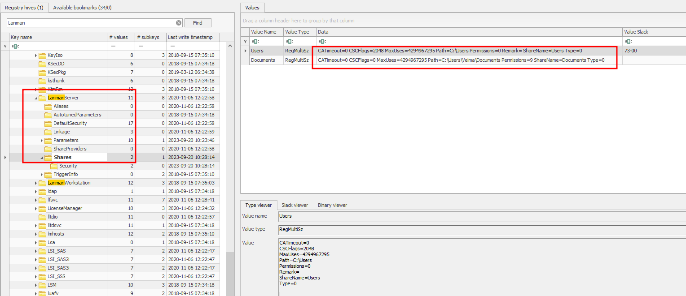

The available forensic evidence supports access to files within the shared material on 6 October. The collection does not provide a complete SMB audit trail proving the exact remote copy operation, so the share-access mechanism should be treated as strongly supported rather than fully reconstructed.

### 2. `bk_db.ibd` Exposed Reusable Credentials

MFT/file-access analysis led investigators to `bk_db.ibd`, located within Velma's project material. String extraction from the InnoDB file revealed credentials stored in a recoverable plaintext structure. Analysis identified **216 credential records**.

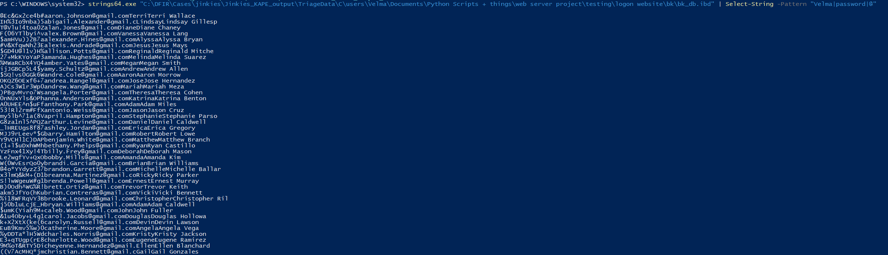

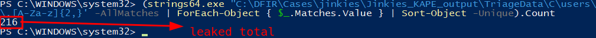

Velma's record was among the exposed credentials. The local Windows account hash was recovered from the offline SAM/SYSTEM hives and compared against the password obtained from the database file. The recovered password matched Velma's local account NT hash:

```text
967452709ae89eaeef4e2c951c3882ce
```

This establishes password reuse between the application credential exposed in `bk_db.ibd` and Velma's Windows account.

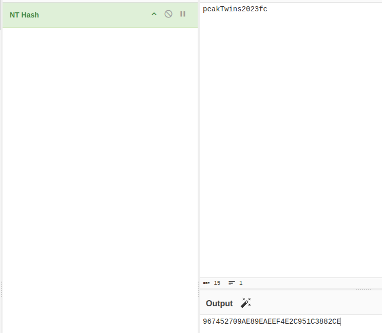

### 3. Remote Desktop Access from `192.168.157.151`

The host was listening on TCP `3389`, permitting Remote Desktop connections. Event-log analysis identified repeated activity from `192.168.157.151` on 6 October 2023. The first attacker authentication activity appeared at approximately `17:15`, followed by the first confirmed interactive RDP logon at:

```text
2023-10-06 17:17:23 UTC
```

The Security log recorded a successful remote interactive logon for `VELMAD100\Velma`, and Terminal Services telemetry correlated the session to the same remote IP.

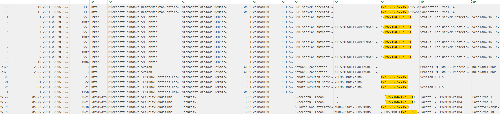

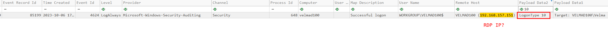

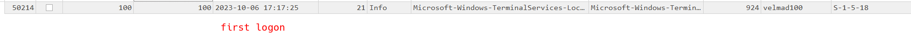

Terminal Services LocalSessionManager Event ID `21` recorded the RDP session logon, with the attacker session associated with source `192.168.157.151` and Session ID `5`. Event ID `22` then recorded the shell/session startup, and Event ID `24` later documented the session state transition/disconnection.

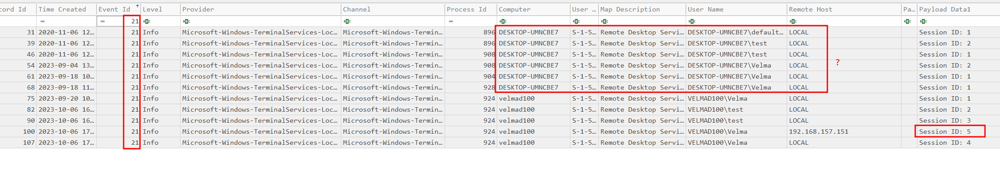

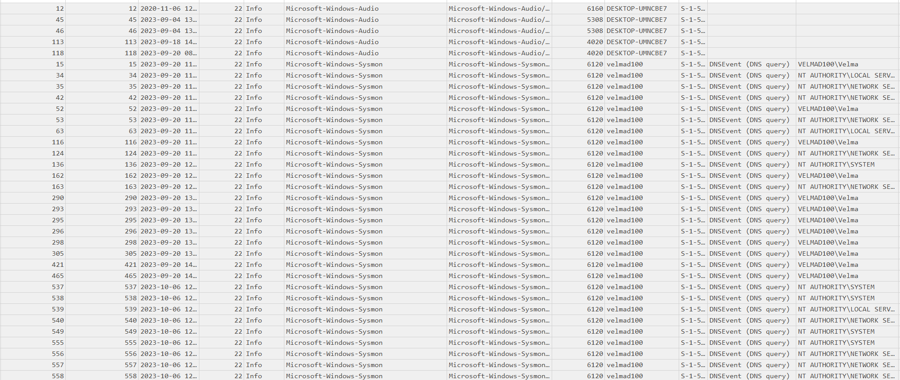

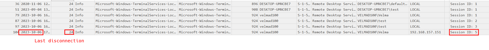

### 4. Command-Line Discovery Activity

Sysmon/process telemetry shows the first attacker-entered command at approximately:

```text
2023-10-06 17:17:45 UTC
whoami
```

The actor then performed basic account discovery using commands including:

```text
net group
net users
```

These commands are consistent with an attacker establishing the current security context and enumerating local/domain account information after obtaining interactive access.

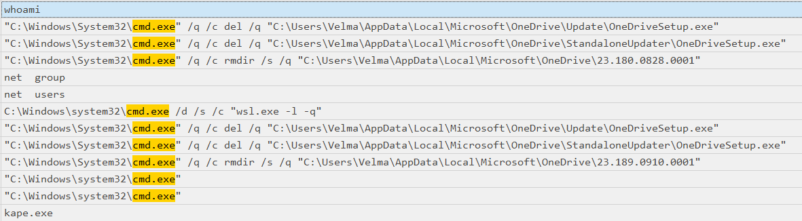

### 5. Proprietary Source Code Opened in Visual Studio Code

At approximately `17:18:26 UTC`, process telemetry showed Visual Studio Code opening:

```text
C:\Users\Velma\Desktop\cloud-gurustuff\official guru terminal aws script\Version-1.0.1 - TERMINAL LOGIN.py
```

This file is directly relevant to the reported intellectual-property theft. The launch occurred shortly before browser activity associated with the suspected exfiltration phase.

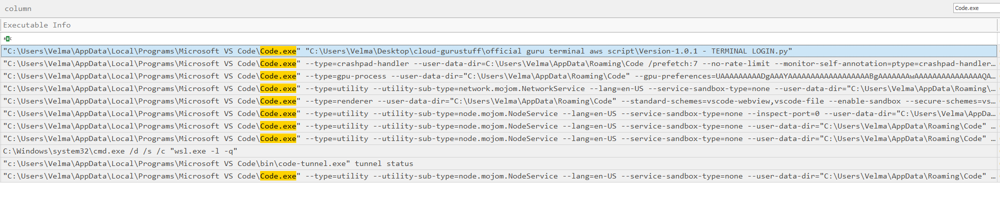

### 6. Likely Exfiltration Through `pastes.io`

Approximately one minute after the source file was opened, Google Chrome was launched. Chrome history records a request to:

```text
pastes.io
```

at:

```text
2023-10-06 17:19:35 UTC
```

Subsequent browser history includes searches concerning whether browsing history remains visible when using incognito/private browsing. The temporal sequence - opening the proprietary source file, launching Chrome, visiting a text-storage service, and then researching history visibility - strongly supports the assessment that `pastes.io` was the likely exfiltration destination.

The browser artifacts do **not** preserve the contents of a paste or otherwise prove exactly what was uploaded; therefore, the exfiltration method is assessed as likely rather than conclusively demonstrated from the endpoint alone.

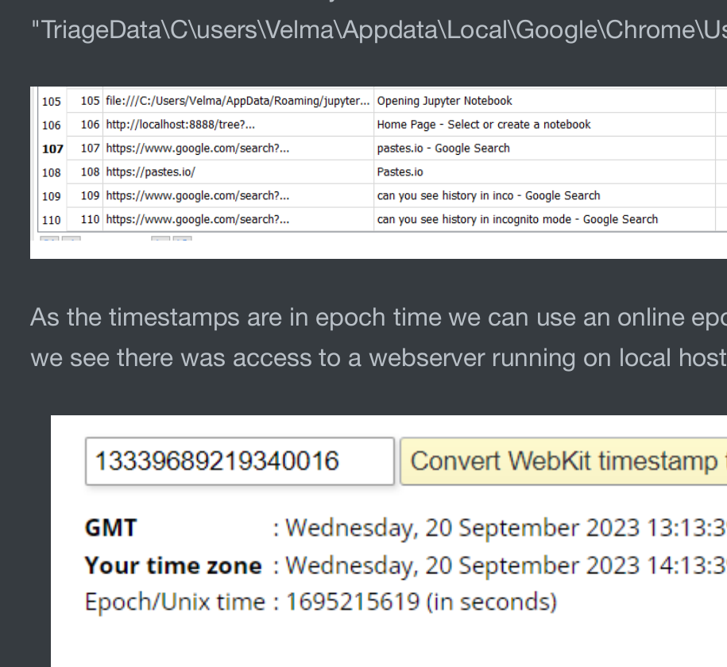

### 7. Attacker Handle Recovered from Resident MFT Data

Later in the session, the attacker created:

```text
C:\Users\Velma\Pictures\learn.txt
```

The file was only 55 bytes and was not present as a normal recovered file in the KAPE collection. Because the content was resident in the NTFS MFT record, the data could still be recovered from `$MFT` entry `78533`.

The recovered content contained the attacker handle:

```text
pwnmaster12
```

The MFT metadata places creation of `learn.txt` at approximately `2023-10-06 17:23:46 UTC`.


---

## Technical Timeline

| Timestamp (UTC) | Event |
|---|---|
| Prior to `2023-10-06` | `C:\Users\Velma\Documents` and `C:\Users` were configured as SMB shares; TCP `445` was listening |
| `2023-10-06` | File-access analysis shows activity against Velma's shared project material, including `bk_db.ibd` |
| `2023-10-06 ~17:15` | Initial authentication activity from `192.168.157.151` observed |
| `2023-10-06 17:17:23` | First confirmed interactive RDP logon to `VELMAD100\Velma` from `192.168.157.151` |
| `2023-10-06 17:17:45` | Attacker issued first observed command: `whoami` |
| `2023-10-06 17:17:52` | `net group` executed |
| `2023-10-06 17:17:56` | `net users` executed |
| `2023-10-06 17:18:26` | VS Code opened `Version-1.0.1 - TERMINAL LOGIN.py` |
| `2023-10-06 ~17:18:42` | Google Chrome launched shortly after source-code access |
| `2023-10-06 17:19:35` | Chrome history recorded access to `pastes.io` |
| Shortly after `17:19:35` | Browser searches investigated whether history/incognito activity could be observed |
| `2023-10-06 17:23:46` | `C:\Users\Velma\Pictures\learn.txt` created; resident MFT content later revealed `pwnmaster12` |

---

## Indicators of Compromise

| Type | Indicator | Context |
|---|---|---|
| IPv4 | `192.168.157.151` | Source of unauthorized RDP activity |
| Hostname | `VELMAD100` | Compromised Windows workstation |
| Account | `VELMAD100\Velma` | Compromised local user account |
| NT hash | `967452709ae89eaeef4e2c951c3882ce` | Velma's local account NT hash validated against the exposed password |
| SMB share | `C:\Users\Velma\Documents` | Exposed developer Documents directory |
| SMB share | `C:\Users` | Overly broad user-profile share |
| File | `bk_db.ibd` | Credential-bearing InnoDB file containing 216 recoverable credential records |
| File | `Version-1.0.1 - TERMINAL LOGIN.py` | Proprietary file opened shortly before suspected exfiltration |
| File | `C:\Users\Velma\Pictures\learn.txt` | Attacker-created file containing identifying handle |
| Domain | `pastes.io` | Likely exfiltration destination |
| Handle | `pwnmaster12` | Attacker-selected identifier recovered from resident MFT content |

---

## Attack Classification

| Phase | Observed behavior |
|---|---|
| **Exposure / Initial Access Preparation** | User data and project material exposed through SMB shares |
| **Credential Access** | Plaintext credentials recovered from `bk_db.ibd` |
| **Valid Account Abuse** | Reused Velma credentials used to authenticate to the Windows host |
| **Remote Services** | Interactive access established over RDP from `192.168.157.151` |
| **Discovery** | `whoami`, `net group`, and `net users` executed after logon |
| **Collection** | Proprietary Python source file opened in VS Code |
| **Exfiltration** | Chrome accessed `pastes.io` shortly after the source file was opened; transfer is strongly suspected but not directly proven |
| **Anti-Forensic Awareness** | Searches concerning incognito mode and browser-history visibility |
| **Operator Identification** | Attacker created `learn.txt`, exposing handle `pwnmaster12` |

---

## Root Cause

The compromise resulted from a chain of preventable security failures rather than a single exploit:

- `C:\Users\Velma\Documents` was exposed as an SMB share, making project data remotely accessible.
- The broader `C:\Users` directory was also shared, unnecessarily increasing exposure.
- `bk_db.ibd` contained **216 recoverable plaintext credentials** within the shared project data.
- Velma reused the exposed application password for her local Windows account.
- RDP was listening on TCP `3389` and accepted password-based remote access.
- No compensating control such as MFA, network allow-listing, VPN-only RDP, or effective alerting prevented use of the exposed credentials.
- Sensitive intellectual property and credential data were stored together on a developer workstation without sufficient access segregation.

The most consequential root cause was **credential exposure combined with password reuse**. The shared folders enabled the attacker to obtain a valid credential, and RDP provided an immediate path to convert that credential into interactive host access.

---

## Impact Assessment

| Area | Assessment |
|---|---|
| **Confidentiality** | **High.** 216 credential records were exposed, and proprietary source code was accessed by an unauthorized actor. |
| **Integrity** | **Moderate.** The attacker had an interactive desktop session and created `learn.txt`; no destructive system modification was established in the supplied evidence. |
| **Availability** | No direct outage or destructive impact was observed. |
| **Credential exposure** | Confirmed. Velma's reused password and 215 additional credential records were present in `bk_db.ibd`. |
| **Account compromise** | Confirmed for `VELMAD100\Velma`. |
| **Data exfiltration** | Highly suspected. `pastes.io` was visited immediately after the proprietary file was opened, but the exact uploaded content was not recovered. |
| **Intellectual property** | At risk / likely stolen, consistent with the company's report that its IP was observed in use elsewhere. |
| **Overall impact** | High-severity compromise involving valid-account abuse, credential exposure, remote interactive access, and likely IP theft. |

---

## Containment and Eradication Recommendations

### Immediate

1. Isolate `VELMAD100` from the network while preserving forensic evidence.
2. Block or investigate `192.168.157.151` across endpoint, firewall, VPN, and remote-access telemetry.
3. Disable the `Documents` and `C:\Users` SMB shares immediately unless explicitly required for business operations.
4. Disable direct RDP exposure; terminate active sessions and restrict remote access to approved administrative paths.
5. Reset Velma's Windows password and revoke active sessions/tokens.
6. Treat **all 216 credentials contained in `bk_db.ibd` as compromised** and rotate them.
7. Block or closely monitor access to `pastes.io` during the incident-response period.
8. Preserve `$MFT`, registry hives, EVTX logs, browser databases, project files, and network telemetry before remediation.

### Eradication and Recovery

1. Review the workstation for persistence mechanisms, unauthorized accounts, startup entries, scheduled tasks, remote-access tools, and additional attacker-created files.
2. Reimage `VELMAD100` from a trusted baseline if the organization cannot establish host integrity with confidence.
3. Remove credential-bearing database exports and development artifacts from user-accessible/shared folders.
4. Reissue application secrets, API keys, database passwords, cloud tokens, and developer credentials accessible to Velma or stored within the exposed projects.
5. Review source-control platforms and build/deployment systems for unauthorized access using the compromised credentials.
6. Hunt across the environment for `pwnmaster12`, `pastes.io`, `192.168.157.151`, `bk_db.ibd`, and unusual RDP logons around 6 October 2023.
7. Request proxy, DNS, firewall, and upstream network logs to determine whether the suspected `pastes.io` transfer can be confirmed and scoped.

### Preventive Controls

- Do not store plaintext passwords or credential records in development databases, test exports, notebooks, or project directories.
- Enforce unique passwords and prevent reuse between application accounts and operating-system accounts.
- Require MFA for remote desktop and other externally reachable administrative services.
- Place RDP behind a VPN, RD Gateway, bastion host, or strict network allow-list rather than exposing it broadly.
- Disable unnecessary SMB shares and apply least-privilege ACLs to required shares.
- Implement secrets management for application credentials and cloud/API tokens.
- Alert on successful RDP logons from new hosts, especially after unusual SMB/file-access activity.
- Centralize Security, Sysmon, Terminal Services, DNS, proxy, and firewall telemetry.
- Apply DLP/source-code controls to detect uploads to paste sites and unauthorized external storage services.
- Conduct regular credential scanning of source repositories and development directories.

---

## Conclusion

The Jinkies investigation identified a clear compromise chain. Velma's developer data was exposed through SMB shares, and `bk_db.ibd` within the shared project material contained 216 recoverable credential records. Velma had reused the exposed password for her Windows account, allowing the attacker to authenticate remotely without exploiting a software vulnerability.

On 6 October 2023, `192.168.157.151` established an interactive RDP session as `VELMAD100\Velma`. The attacker performed basic account discovery, opened the proprietary `Version-1.0.1 - TERMINAL LOGIN.py` source file in Visual Studio Code, launched Chrome, and accessed `pastes.io`. The timing and subsequent searches about browser-history visibility make `pastes.io` the most likely exfiltration channel, although the endpoint artifacts do not preserve the actual uploaded payload. The attacker subsequently left behind `learn.txt`, whose resident MFT data revealed the handle `pwnmaster12`.

The incident should therefore be treated as a **confirmed valid-account compromise with likely intellectual-property exfiltration**. The primary corrective priorities are immediate credential rotation, removal of unnecessary SMB exposure, restriction of RDP, elimination of plaintext credential storage, and broader enterprise hunting for reuse of the exposed credentials and attacker indicators.

---

## Annex A — Evidence-to-Finding Matrix

| Finding | Supporting artifact |
|---|---|
| `C:\Users\Velma\Documents` and `C:\Users` were shared | `SYSTEM` hive — `LanmanServer\Shares`; `images/smb-share.png` |
| SMB was available on the host | LiveResponse network-connections data showing TCP `445` listening |
| `bk_db.ibd` contained credential material | `bk_db.ibd`; `images/bk-db-ibd.png` |
| 216 credential records were recovered | Strings analysis; `images/leaked-credentials-count.png` |
| Velma reused the exposed password for Windows | SAM/SYSTEM extraction and NT-hash validation; `images/nt-hash-validation.png` |
| Velma's NT hash was `967452709ae89eaeef4e2c951c3882ce` | Offline SAM analysis |
| Attacker source was `192.168.157.151` | Security, Sysmon, RDP/Terminal Services logs; `images/attacker-source-ip.png` |
| First interactive attacker logon was `2023-10-06 17:17:23` | Security Event 4624 / RemoteInteractive evidence; `images/first-interactive-logon.png` |
| RDP session was established as Velma | Security Logon Type 10 and Terminal Services events; `images/logon-type-10.png`, `images/rdp-session-logon.png` |
| First attacker command was `whoami` | Sysmon/process telemetry; `images/attacker-command-history.png` |
| Attacker performed account discovery | `net group` and `net users` in process telemetry |
| Proprietary file opened in VS Code | Sysmon process command line; `images/vscode-file-access.png` |
| `pastes.io` was accessed at `17:19:35` | Chrome `History`; `images/chrome-history-pastes.png` |
| Attacker researched browser-history visibility | Chrome `History` records following the paste-site visit |
| `learn.txt` was created in Velma's Pictures directory | `$MFT`, entry `78533` |
| Attacker handle was `pwnmaster12` | Resident MFT file content; `images/attacker-handle-mft.png` |

---

## Annex B — Sherlock Answer Summary

| Question | Answer |
|---|---|
| Which folders were shared on the host? | `C:\Users\Velma\Documents, C:\Users` |
| What file gave the attacker access to the user's account? | `bk_db.ibd` |
| How many user credentials were found in the file? | `216` |
| What is the NT hash of the user's password? | `967452709ae89eaeef4e2c951c3882ce` |
| Is the user's computer password the same as the password found in the IBD file? | `Yes` |
| When did the attacker first interactively log on? | `2023-10-06 17:17:23` |
| First command issued in the command line? | `whoami` |
| File opened in VS Code before the browser? | `Version-1.0.1 - TERMINAL LOGIN.py` |
| Likely exfiltration domain? | `pastes.io` |
| Attacker handle? | `pwnmaster12` |
