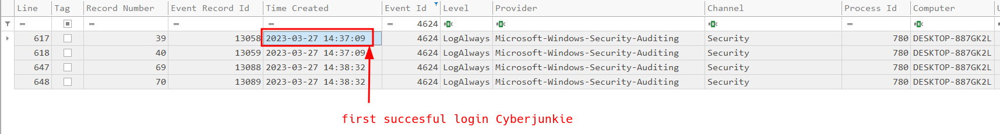
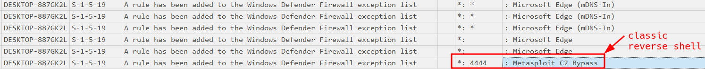
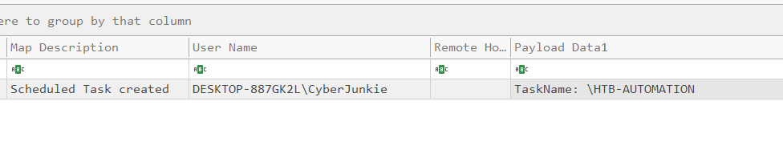
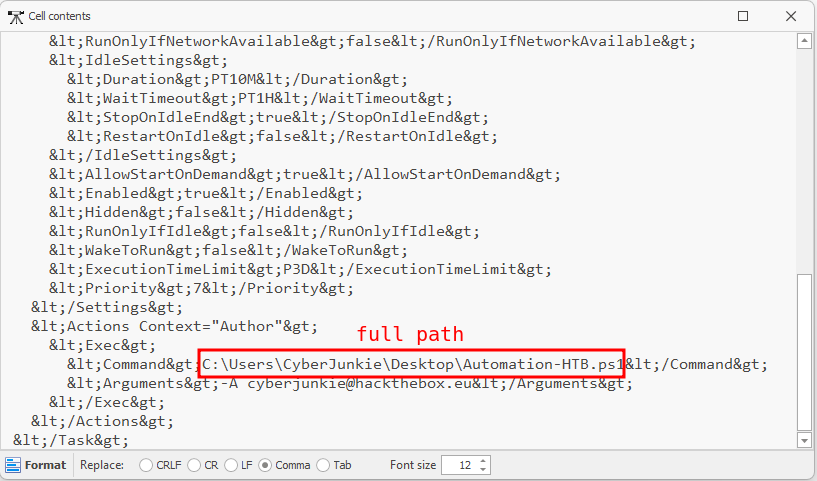
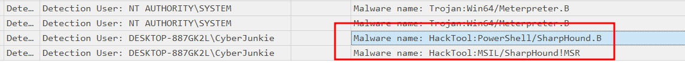
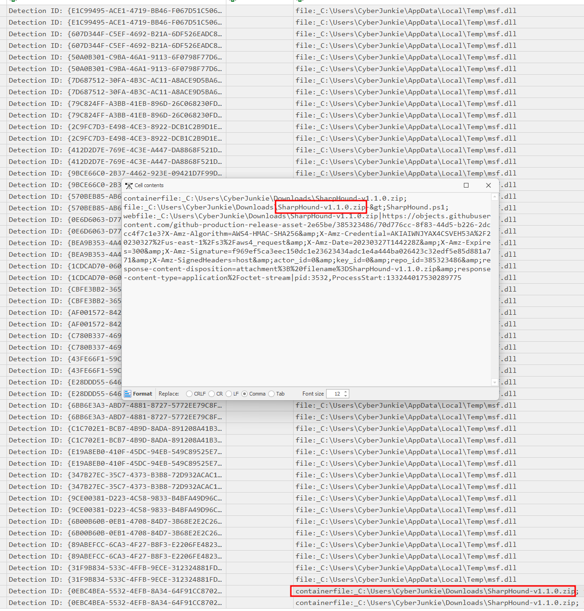
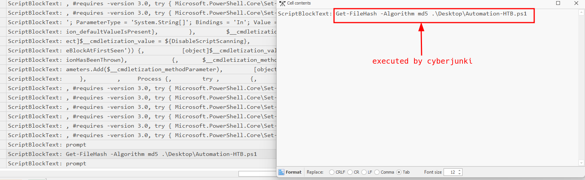

<p align="center">
  
</p>

# LogJammer Security Incident Report


> **Category:**  Easy  
> **Discipline:** DFIR — Windows Event Log Analysis  
> **Primary artifacts:** Windows Security, PowerShell Operational, Windows Defender Operational, System, and Windows Firewall event logs  
> **Time standard:** UTC

---

## Executive Summary

| Field | Value |
|---|---|
| **Incident ID** | `LOGJAMMER-2023-0327` |
| **Severity** | **Critical** |
| **Status** | Confirmed malicious activity |
| **Affected host** | `DESKTOP-887GK2L` |
| **Observed user** | `DESKTOP-887GK2L\CyberJunkie` |
| **First confirmed activity** | Successful logon at `2023-03-27 14:37:09 UTC` |
| **Persistence mechanism** | Scheduled task `\HTB-AUTOMATION` |
| **C2-related firewall rule** | `Metasploit C2 Bypass` — TCP/4444 |
| **Discovery tooling** | SharpHound `v1.1.0` |
| **Defense evasion** | Firewall tampering, audit-policy modification, and event-log clearing |
| **Assessment confidence** | High |

A successful Windows logon by `CyberJunkie` was followed by security-control tampering and attacker tooling. The user added a firewall rule named `Metasploit C2 Bypass` for port `4444`, modified audit policy, created the scheduled task `\HTB-AUTOMATION`, and referenced `Automation-HTB.ps1` from the user's desktop.

Microsoft Defender subsequently identified Meterpreter and SharpHound-related threats. Evidence also shows the SharpHound archive in the user's Downloads directory, PowerShell activity involving `Automation-HTB.ps1`, and clearing of the Sysmon Operational log. The combined activity is consistent with persistence, Active Directory reconnaissance, command-and-control preparation, and defense evasion.

The supplied evidence does not establish how the `CyberJunkie` credentials were obtained or the exact remediation action performed by Microsoft Defender.

---

## Artifact Inventory

| Artifact | Type | Evidentiary value |
|---|---|---|
| `Security.evtx` | Windows Security log | Successful logon, audit-policy modification, and scheduled-task creation |
| `Powershell-Operational.evtx` | PowerShell Operational log | PowerShell script-block and command activity |
| `Windows Defender-Operational.evtx` | Defender Operational log | Meterpreter and SharpHound detections, file/container paths |
| `System.evtx` | Windows System log | Event-log clearing activity |
| `Windows Firewall-Firewall.evtx` | Windows Firewall log | Firewall rule creation and firewall-log activity |
| `first-login.png` | Evidence screenshot | First observed successful `CyberJunkie` logon |
| `c2-bypass.png` | Evidence screenshot | Added firewall rule `Metasploit C2 Bypass` on port `4444` |
| `scheduled-task.png` | Evidence screenshot | Creation of `\HTB-AUTOMATION` by `CyberJunkie` |
| `scheduled-task-path.png` | Evidence screenshot | Task action referencing `Automation-HTB.ps1` |
| `sharphound-detections.png` | Evidence screenshot | Defender detections for SharpHound |
| `sharphound-archive.png` | Evidence screenshot | SharpHound archive and related Defender telemetry |
| `powershell-command.png` | Evidence screenshot | PowerShell `Get-FileHash` command against the automation script |

---

## Scope and Affected Assets

| Asset | Role | Impact |
|---|---|---|
| `DESKTOP-887GK2L` | Windows workstation | Security controls modified; attacker tooling and persistence observed |
| `DESKTOP-887GK2L\CyberJunkie` | Local user context | Account associated with malicious configuration and PowerShell activity |
| Windows Defender Firewall | Host security control | Rule added to permit C2-related traffic on port `4444` |
| Windows audit policy | Host auditing control | `Other Object Access Events` subcategory modified |
| Sysmon Operational log | Endpoint telemetry | Cleared, reducing forensic visibility |
| Windows Task Scheduler | Persistence/execution mechanism | Task `\HTB-AUTOMATION` created |

---

## Incident Narrative

### 1. Successful Logon

The first confirmed successful logon associated with `CyberJunkie` occurred at:

```text
2023-03-27 14:37:09 UTC
```

The event is recorded as Windows Security Event ID `4624` on `DESKTOP-887GK2L`.



### 2. Firewall Tampering and C2 Preparation

A new Windows Defender Firewall exception was created with the following values:

```text
Rule Name: Metasploit C2 Bypass
Port:      4444
```

Port `4444` is commonly used by Metasploit/Meterpreter handlers. In this incident, the rule name itself explicitly identifies the purpose as a Metasploit C2 bypass, making the change directly suspicious.



### 3. Audit-Policy Modification

The user changed the local Windows audit policy. The affected subcategory was:

```text
Other Object Access Events
```

This reduces confidence in subsequent host telemetry if the change disabled or weakened auditing. The supplied evidence identifies the modified subcategory but does not preserve the exact before/after success and failure audit settings.

### 4. Scheduled-Task Persistence

`CyberJunkie` created the scheduled task:

```text
\HTB-AUTOMATION
```



The task configuration references the following script:

```text
C:\Users\CyberJunkie\Desktop\Automation-HTB.ps1
```

and contains the argument:

```text
-A CyberJunkie@hackthebox.eu
```

This establishes a persistent execution mechanism tied to a PowerShell script in the user's profile.



### 5. Defender Detection of Meterpreter and SharpHound

Microsoft Defender identified multiple malicious or dual-use components, including:

```text
Trojan:Win64/Meterpreter.B
HackTool:PowerShell/SharpHound.B
HackTool:MSIL/SharpHound!MSR
```

The Meterpreter-related telemetry references:

```text
C:\Users\CyberJunkie\AppData\Local\Temp\msf.dll
```

SharpHound detections are associated with the `CyberJunkie` user context.



### 6. SharpHound Archive Acquisition

Defender telemetry identifies the archive:

```text
C:\Users\CyberJunkie\Downloads\SharpHound-v1.1.0.zip
```

The event data also references `SharpHound.ps1` inside the archive and a web-origin URL hosted under GitHub's object storage. This supports acquisition of SharpHound for Active Directory reconnaissance.



### 7. PowerShell Activity

PowerShell Script Block Logging recorded the following command under the suspicious user activity:

```powershell
Get-FileHash -Algorithm md5 .\Desktop\Automation-HTB.ps1
```

The command calculates the MD5 hash of the script used by the scheduled task. The supplied screenshot confirms the command itself; it does not independently show the script contents.



### 8. Event-Log Clearing

Event-log analysis showed repeated clearing of:

```text
Microsoft-Windows-Sysmon/Operational
```

The same analysis view also contained a clear event for:

```text
Microsoft-Windows-Windows Firewall With Advanced Security/Firewall
```

Clearing endpoint and firewall telemetry after the other observed activity is consistent with defense evasion and materially reduces the available forensic record.

---

## Technical Timeline

| Timestamp (UTC) | Event |
|---|---|
| `2023-03-27 14:37:09` | First confirmed successful `CyberJunkie` logon recorded by Security Event ID `4624` |
| Not visible in supplied screenshot | Firewall rule `Metasploit C2 Bypass` added for port `4444` |
| Not visible in supplied screenshot | Audit policy subcategory `Other Object Access Events` modified |
| Not visible in supplied screenshot | Scheduled task `\HTB-AUTOMATION` created by `CyberJunkie` |
| Not visible in supplied screenshot | Task configured to reference `C:\Users\CyberJunkie\Desktop\Automation-HTB.ps1` |
| Not visible in supplied screenshot | Defender detected `Trojan:Win64/Meterpreter.B` and SharpHound-related threats |
| Not visible in supplied screenshot | `SharpHound-v1.1.0.zip` observed in the user's Downloads directory |
| Not visible in supplied screenshot | PowerShell executed `Get-FileHash -Algorithm md5 .\Desktop\Automation-HTB.ps1` |
| Not visible in supplied screenshot | Sysmon Operational log repeatedly cleared; Windows Firewall log clear also observed |

> Only the first successful logon timestamp is visible in the supplied screenshots. Screenshot creation times were not used as incident timestamps.

---

## Indicators of Compromise

| Type | Indicator | Context |
|---|---|---|
| Hostname | `DESKTOP-887GK2L` | Affected Windows workstation |
| Username | `CyberJunkie` | User associated with suspicious activity |
| Firewall rule | `Metasploit C2 Bypass` | Rule created to permit C2-related traffic |
| TCP port | `4444` | Port allowed by the suspicious firewall rule |
| Scheduled task | `\HTB-AUTOMATION` | Persistence/execution mechanism |
| File path | `C:\Users\CyberJunkie\Desktop\Automation-HTB.ps1` | PowerShell script referenced by scheduled task |
| File path | `C:\Users\CyberJunkie\Downloads\SharpHound-v1.1.0.zip` | SharpHound archive |
| File path | `C:\Users\CyberJunkie\AppData\Local\Temp\msf.dll` | Meterpreter-related Defender detection path |
| Malware name | `Trojan:Win64/Meterpreter.B` | Microsoft Defender detection |
| Tool detection | `HackTool:PowerShell/SharpHound.B` | Microsoft Defender detection |
| Tool detection | `HackTool:MSIL/SharpHound!MSR` | Microsoft Defender detection |
| Event log | `Microsoft-Windows-Sysmon/Operational` | Cleared repeatedly |

---

## Attack Classification

| Phase | Observed behavior |
|---|---|
| **Initial Access** | Successful logon as `CyberJunkie`; credential-acquisition method not established |
| **Execution** | PowerShell activity involving `Automation-HTB.ps1`; Meterpreter component detected |
| **Persistence** | Scheduled task `\HTB-AUTOMATION` referencing a user-controlled PowerShell script |
| **Discovery** | SharpHound tooling acquired/detected for Active Directory reconnaissance |
| **Command and Control** | Firewall exception `Metasploit C2 Bypass` opened port `4444` |
| **Defense Evasion** | Firewall modification, audit-policy modification, and event-log clearing |

---

## Root Cause

The supplied evidence does not establish the original credential-compromise method or exploit vector. It does establish that activity performed under `CyberJunkie` had sufficient local access to modify host security controls, create persistence, run PowerShell commands, and manipulate event logging.

The incident was enabled or worsened by:

- An authenticated user context with permissions sufficient to alter security-sensitive configuration
- Firewall changes being permitted without effective prevention or immediate containment
- Scheduled-task creation from a user-writable path
- Execution or acquisition of known offensive tooling on the endpoint
- Audit and event-log controls that could be modified or cleared locally

---

## Impact Assessment

| Area | Assessment |
|---|---|
| **Confidentiality** | High risk. SharpHound reconnaissance can expose Active Directory relationships and privileged paths. |
| **Integrity** | High impact. Firewall, audit policy, scheduled tasks, and logging configuration were modified. |
| **Availability** | No direct service outage is established by the supplied evidence. |
| **Persistence** | Confirmed through `\HTB-AUTOMATION`. |
| **Command and Control** | Strongly indicated by the explicitly named Metasploit C2 firewall rule and Meterpreter detection. |
| **Defense evasion** | Confirmed through audit-policy changes and event-log clearing. |
| **Overall impact** | Endpoint compromise with persistence, reconnaissance tooling, C2 preparation, and anti-forensic activity. |

---

## Containment and Eradication Recommendations

### Immediate

1. Isolate `DESKTOP-887GK2L` from the network.
2. Disable or restrict the `CyberJunkie` account pending investigation.
3. Remove or disable the `Metasploit C2 Bypass` firewall rule and block unauthorized traffic on port `4444`.
4. Disable `\HTB-AUTOMATION` after preserving its XML definition and related script for evidence.
5. Preserve `Automation-HTB.ps1`, `SharpHound-v1.1.0.zip`, `msf.dll`, Defender history, PowerShell logs, and remaining Windows event logs.
6. Rotate credentials and tokens accessible to the affected user or host.

### Eradication and Recovery

1. Perform a full forensic review of `Automation-HTB.ps1` before deletion.
2. Hunt the host for Meterpreter payloads, SharpHound output, additional scheduled tasks, services, Run keys, WMI persistence, and user-profile artifacts.
3. Restore Windows Firewall and audit policy from a known-good baseline.
4. Re-enable and validate Sysmon and centralized event forwarding.
5. Rebuild the workstation from a trusted image if complete attacker activity cannot be bounded with confidence.
6. Review Active Directory for reconnaissance or follow-on activity originating from this workstation.

### Preventive Controls

- Alert on Security Event ID `4698` for scheduled-task creation outside approved software paths.
- Alert on firewall rule additions exposing uncommon listener ports such as `4444`.
- Alert on Defender detections for Meterpreter, SharpHound, and other offensive-security tooling.
- Enable centralized PowerShell Script Block Logging and protected log forwarding.
- Alert on audit-policy changes and event-log clearing, particularly Security Event ID `4719` and System Event ID `104`.
- Restrict local administrative privileges and prevent standard users from modifying endpoint security controls.

---

## Conclusion

`DESKTOP-887GK2L` shows a coherent sequence of malicious post-logon activity associated with `CyberJunkie`. The user modified firewall and audit settings, established scheduled-task persistence, introduced or interacted with Meterpreter and SharpHound components, executed PowerShell commands, and cleared forensic telemetry.

The evidence supports a **confirmed endpoint compromise** with persistence, Active Directory reconnaissance, C2 preparation, and defense evasion. The original method used to obtain access is not established by the supplied artifacts and should remain an open investigative question.

---

## Annex A — Evidence-to-Finding Matrix

| Finding | Supporting artifact |
|---|---|
| First successful `CyberJunkie` logon at `2023-03-27 14:37:09 UTC` | `Security.evtx` / `first-login.png` |
| Firewall rule `Metasploit C2 Bypass` exposed port `4444` | Windows Firewall log / `c2-bypass.png` |
| Audit subcategory `Other Object Access Events` was modified | `Security.evtx` audit-policy event analysis |
| Scheduled task `\HTB-AUTOMATION` was created | `Security.evtx` / `scheduled-task.png` |
| Task referenced `C:\Users\CyberJunkie\Desktop\Automation-HTB.ps1` | Scheduled-task XML / `scheduled-task-path.png` |
| Meterpreter and SharpHound were detected by Defender | `Windows Defender-Operational.evtx` / `sharphound-detections.png` |
| SharpHound archive existed under the user's Downloads directory | Defender telemetry / `sharphound-archive.png` |
| PowerShell hashed `Automation-HTB.ps1` with MD5 | `Powershell-Operational.evtx` / `powershell-command.png` |
| Sysmon Operational log was repeatedly cleared | `System.evtx` Event ID `104` analysis |
| Windows Firewall event log clear was also observed | `System.evtx` Event ID `104` analysis |
