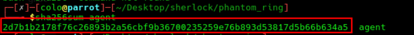
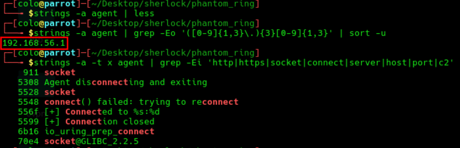
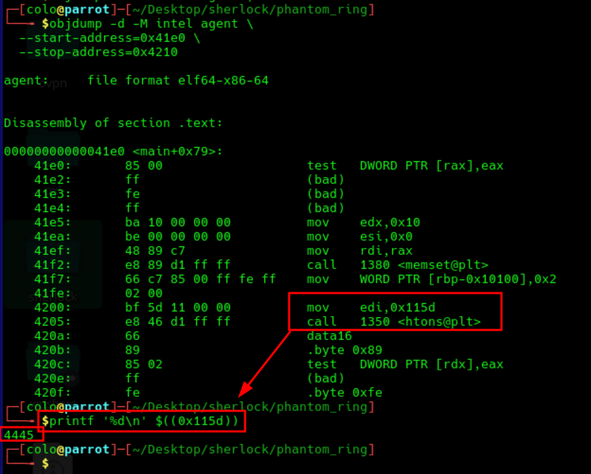
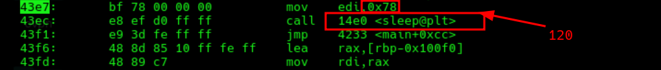
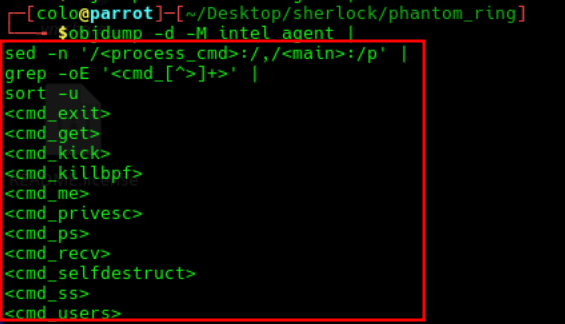
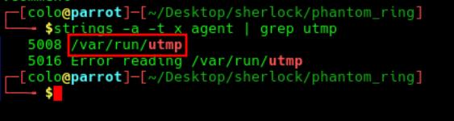
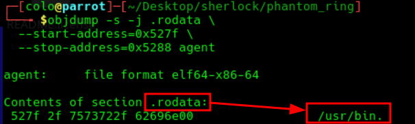
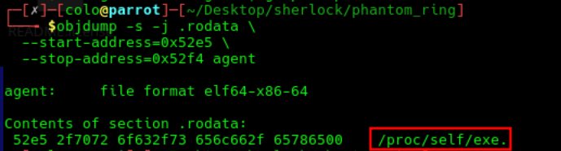
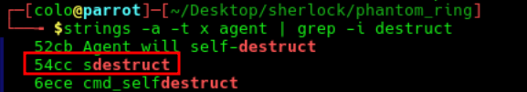

<p align="center">
  
</p>
# PhantomRing Security Incident Report

> **Category:** Very Easy  
> **Discipline:** Malware Analysis — Static Analysis  
> **Primary artifact:** Linux ELF binary `agent`  
> **Report date:** 2026-08-01

---

## Executive Summary

| Field | Value |
|---|---|
| **Incident ID** | `PHANTOMRING-MAL-001` |
| **Severity** | **High** |
| **Status** | Confirmed malware; host compromise not established |
| **Artifact** | `agent` |
| **Platform** | Linux x86-64 |
| **C2 endpoint** | `192.168.56.1:4445/TCP` |
| **Reconnect interval** | `120 seconds` |
| **Primary evasion mechanism** | Linux `io_uring` |
| **Command handlers** | `11` |
| **Assessment confidence** | High |

The recovered `agent` binary is a Linux post-exploitation implant with a hardcoded command-and-control endpoint. It uses `io_uring` for asynchronous network and file operations, reducing its reliance on conventional syscalls commonly monitored by EDR products.

The implant supports file transfer, user and process discovery, network enumeration, terminal-session disruption, SUID discovery, anti-eBPF actions, and self-deletion. Its defense-evasion routine attempts to disable kernel tracing, remove pinned BPF objects, and terminate processes associated with BPF maps.

The supplied evidence confirms malicious capability but does not prove successful C2 communication, execution on a victim host, persistence, credential theft, or data exfiltration.

---

## Artifact Inventory

| Artifact | Type | Evidentiary value |
|---|---|---|
| `agent` | ELF 64-bit PIE executable | Primary malware sample |
| `PhantomRing.md` | Analysis record | Consolidated static-analysis findings |
| `images/sha256.png` | Evidence screenshot | SHA-256 identification |
| `images/IP.png` | Evidence screenshot | Hardcoded C2 address |
| `images/objdumpport.png` | Evidence screenshot | C2 port conversion through `htons()` |
| `images/sleep@plt.png` | Evidence screenshot | Reconnect delay passed to `sleep()` |
| `images/agentsupport.png` | Evidence screenshot | Command-handler inventory |
| `images/enumerateusers.png` | Evidence screenshot | Logged-in user data source |
| `images/SUIDbinaries.png` | Evidence screenshot | SUID search directory |
| `images/eBPF.png` | Evidence screenshot | BPF process-detection marker |
| `images/self-destructionpath.png` | Evidence screenshot | Self-executable procfs link |
| `images/sdestruct.png` | Evidence screenshot | Self-deletion command string |

---

## Scope and Limitations

| Area | Assessment |
|---|---|
| **Analysis method** | Static analysis of the recovered ELF binary |
| **Host identity** | Not supplied |
| **Execution evidence** | Not supplied |
| **Network telemetry** | Not supplied |
| **Persistence evidence** | Not identified in the analyzed command set |
| **Attribution** | Not established |

The report describes functionality embedded in the binary. Capability should not be interpreted as proof that every function was executed.

---

## Malware Profile

### Binary Identification

| Property | Value |
|---|---|
| **Filename** | `agent` |
| **Format** | ELF 64-bit LSB PIE executable |
| **Architecture** | x86-64 |
| **Linking** | Dynamically linked |
| **Symbols** | Not stripped |
| **SHA-256** | `2d7b1b2178f76c26893b2a56cbf9b36700235259e76b893d53817d5b66b634a5` |



### Command-and-Control Configuration

The binary contains a hardcoded IPv4 address and establishes a TCP connection to port `4445`. Failed connection attempts trigger a fixed two-minute retry delay.

| Setting | Value |
|---|---|
| **C2 address** | `192.168.56.1` |
| **C2 port** | `4445/TCP` |
| **Reconnect delay** | `120 seconds` |
| **Address conversion** | `inet_pton()` |
| **Port conversion** | `htons(0x115d)` |







---

## Operational Capabilities

### Asynchronous I/O and EDR Evasion

The implant uses the Linux `io_uring` interface for connection setup, socket send and receive operations, file opening, reading, writing, closing, and deletion. This design can evade telemetry that depends primarily on direct interception of traditional `connect`, `read`, `write`, `send`, or `recv` syscalls.

Relevant functions include:

```text
io_uring_prep_connect
io_uring_prep_send
io_uring_prep_recv
io_uring_prep_openat
io_uring_prep_read
io_uring_prep_write
io_uring_prep_close
io_uring_prep_unlinkat
```

### Command Interface

The binary implements **11 command handlers**. The `ss` function also accepts `netstat` as an alias.

| Command | Capability |
|---|---|
| `get <path>` | Reads a local file and sends its contents to the C2 server |
| `recv <path> <size>` | Receives data from the C2 server and writes it to disk |
| `users` | Enumerates logged-in users from `/var/run/utmp` |
| `ss` / `netstat` | Enumerates TCP connections from `/proc/net/tcp` |
| `ps` | Enumerates processes through `/proc/<pid>/comm` |
| `me` | Returns the agent PID and attached terminal |
| `kick [pts]` | Lists terminal sessions or kills a process using a selected PTS |
| `privesc` | Searches `/usr/bin` for SUID binaries |
| `sdestruct` | Deletes the running binary using `/proc/self/exe` |
| `killbpf` | Disables tracing, removes BPF objects, and targets BPF-using processes |
| `exit` | Disconnects and terminates the agent |



---

## Discovery and Privilege-Escalation Support

### Logged-in User Enumeration

The `users` handler reads:

```text
/var/run/utmp
```

The file contains active login-session records and allows the agent to identify logged-in users and terminals.



### SUID Binary Discovery

The `privesc` handler scans:

```text
/usr/bin
```

It reports SUID executables that may provide local privilege-escalation opportunities. The routine identifies candidates; the supplied evidence does not show automated exploitation.



---

## Defense Evasion

### Tracing Disruption

The `killbpf` routine attempts to modify Linux tracing controls. The first targeted file is:

```text
/sys/kernel/debug/tracing/tracing_on
```

Additional targets include:

```text
/sys/kernel/debug/tracing/set_event
/sys/kernel/debug/tracing/current_tracer
```

The routine also enumerates `/sys/fs/bpf` and attempts to delete pinned BPF objects.

### Security-Tool Process Identification

For each numeric `/proc` entry, the agent reads:

```text
/proc/<pid>/maps
```

It searches the file contents for:

```text
anon_inode:bpf-map
```

A matching process is treated as a BPF user and targeted with `SIGKILL`.

![The agent constructs /proc/[pid]/maps paths and searches for anon_inode:bpf-map.](images/eBPF.png)

---

## Self-Destruction

The command dispatcher compares incoming data against:

```text
sdestruct
```

When matched, the self-destruction handler resolves the current executable through:

```text
/proc/self/exe
```

It then submits an unlink operation to delete the binary from disk before terminating.





---

## Indicators of Compromise

| Type | Indicator | Context |
|---|---|---|
| SHA-256 | `2d7b1b2178f76c26893b2a56cbf9b36700235259e76b893d53817d5b66b634a5` | Malware sample hash |
| IPv4 | `192.168.56.1` | Hardcoded C2 address |
| TCP port | `4445` | Hardcoded C2 port |
| Filename | `agent` | Recovered binary name |
| Library | `liburing.so.2` | Runtime dependency supporting `io_uring` operations |
| File path | `/var/run/utmp` | Logged-in user enumeration |
| File path | `/proc/net/tcp` | TCP connection enumeration |
| Directory | `/usr/bin` | SUID discovery target |
| Directory | `/sys/fs/bpf` | BPF object deletion target |
| File path | `/sys/kernel/debug/tracing/tracing_on` | First tracing control targeted for disablement |
| Procfs pattern | `/proc/%s/maps` | Per-process memory-map inspection |
| Detection string | `anon_inode:bpf-map` | BPF-using process marker |
| File path | `/proc/self/exe` | Self-executable resolution |
| Command | `sdestruct` | Self-deletion trigger |
| Command | `killbpf` | Anti-monitoring routine trigger |

---

## Attack Classification

| Phase | Embedded capability |
|---|---|
| **Command and Control** | Hardcoded TCP connection with automatic reconnection |
| **Collection** | Local file acquisition through `get` |
| **Ingress Tool Transfer** | Remote file placement through `recv` |
| **Discovery** | User, process, network, terminal, and SUID enumeration |
| **Privilege Escalation Support** | Identification of SUID binaries in `/usr/bin` |
| **Defense Evasion** | `io_uring` abuse, tracing disruption, BPF object deletion, and process termination |
| **Impact** | Forced termination of processes and interactive terminal sessions |
| **Indicator Removal** | Self-deletion through `/proc/self/exe` |

---

## Risk and Impact Assessment

| Area | Assessment |
|---|---|
| **Confidentiality** | High potential impact. The agent can read and transmit arbitrary accessible files. |
| **Integrity** | High potential impact. It can create or overwrite files received from the C2 server. |
| **Availability** | High potential impact. It can kill processes and disrupt terminal sessions. |
| **Defense visibility** | High risk. It actively targets tracing and eBPF-based monitoring controls. |
| **Persistence** | No dedicated persistence mechanism was identified in the supplied command set. |
| **Observed compromise** | Not established from the supplied static evidence. |

---

## Containment and Eradication Recommendations

### Immediate

1. Isolate any host containing or executing the identified SHA-256.
2. Preserve volatile memory, the binary, process metadata, open file descriptors, and network telemetry before termination.
3. Block `192.168.56.1:4445/TCP` where relevant and identify the internal asset assigned to that private address.
4. Hunt for the sample hash, filename `agent`, `liburing.so.2` usage, and connections to TCP port `4445`.
5. Verify the integrity of kernel tracing controls and inspect `/sys/fs/bpf` for deleted or unexpected objects.

### Eradication and Recovery

1. Terminate the process only after evidence preservation.
2. Rebuild the affected host from a trusted image if the agent executed with elevated privileges.
3. Review files created or modified by the process and recover deleted evidence where possible.
4. Rotate credentials and secrets accessible to the process account.
5. Examine surrounding hosts for the same hash, C2 endpoint, command strings, and `io_uring`-based network activity.

### Detection Improvements

- Monitor `io_uring_setup`, `io_uring_enter`, and suspicious `IORING_OP_CONNECT`, `IORING_OP_OPENAT`, `IORING_OP_UNLINKAT`, and socket operations.
- Alert on writes to `/sys/kernel/debug/tracing/*` and deletion under `/sys/fs/bpf`.
- Detect processes reading large numbers of `/proc/<pid>/maps` files followed by `SIGKILL` activity.
- Alert on processes resolving `/proc/self/exe` immediately before unlinking their own executable.
- Correlate newly written ELF files with outbound TCP connections and repeated 120-second retry intervals.

---

## Conclusion

`agent` is a confirmed Linux command-and-control implant designed for post-exploitation operations and defense evasion. Its use of `io_uring`, anti-eBPF functionality, file-transfer commands, host-discovery routines, process-killing capability, and self-deletion mechanism present a substantial risk if executed.

The analyzed evidence establishes the binary's functionality and indicators. It does not establish the affected host, initial access method, successful C2 activity, or the extent of any real-world compromise.

---

## Annex A — Evidence-to-Finding Matrix

| Finding | Supporting evidence |
|---|---|
| Sample SHA-256 identified | `images/sha256.png` |
| C2 address is `192.168.56.1` | `images/IP.png` |
| C2 port is `4445/TCP` | `images/objdumpport.png` |
| Reconnect delay is 120 seconds | `images/sleep@plt.png` |
| Binary contains 11 command handlers | `images/agentsupport.png` |
| Logged-in users are read from `/var/run/utmp` | `images/enumerateusers.png` |
| SUID scan targets `/usr/bin` | `images/SUIDbinaries.png` |
| BPF marker is `anon_inode:bpf-map` | `images/eBPF.png` |
| Self-path is resolved through `/proc/self/exe` | `images/self-destructionpath.png` |
| Self-deletion is triggered by `sdestruct` | `images/sdestruct.png` |
