<p align="center">
  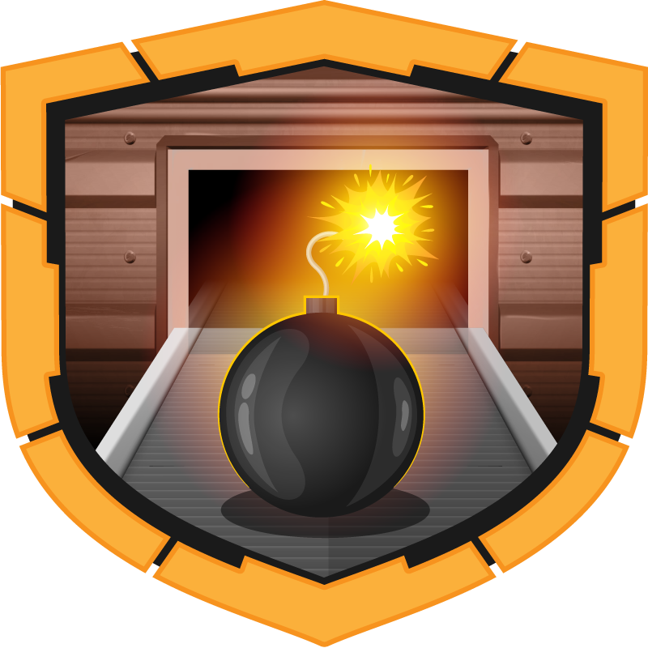
</p>

# ReliableThreat Security Incident Report

> **Category:** Medium  
> **Discipline:** DFIR — Windows Memory & Disk Analysis  
> **Primary artifacts:** `memdump.dmp` and `Users.ad1`  
> **Time standard:** UTC

---

## Executive Summary

| Field | Value |
|---|---|
| **Incident ID** | `RELIABLETHREAT-2024-0723` |
| **Severity** | **Critical** |
| **Status** | Confirmed compromise |
| **Affected host** | `DESKTOP-UV1SFA2` |
| **Compromised account** | `User2` |
| **User SID** | `S-1-5-21-1998887770-13753423-1649717590-1001` |
| **Initial access vector** | Malicious Visual Studio Code extension |
| **Malicious extension** | `0xs1rx58d3v.chatgpt-b0t-0.0.1` |
| **Reverse-shell endpoint** | `6.tcp.eu.ngrok.io:16587` |
| **Malicious payload** | `C:\Users\Public\RuntimeBroker.exe` |
| **Persistence** | Recycle Bin COM hijacking |
| **MITRE technique** | `T1546.015` — Component Object Model Hijacking |
| **Assessment confidence** | High |

The workstation was compromised through a malicious Visual Studio Code extension masquerading as a ChatGPT programming assistant. The extension contained obfuscated JavaScript that activated malicious behavior when the user entered `help`. A VS Code child process then established a reverse-shell connection to `6.tcp.eu.ngrok.io:16587`.

Post-compromise activity included execution of a masqueraded `RuntimeBroker.exe` from `C:\Users\Public`, a second outbound connection, registry-based persistence through the Windows Recycle Bin COM object, source-code collection into a public archive, and unauthorized modification of a Laravel project file.

The evidence supports compromise of the developer workstation rather than deliberate source-code disclosure by the employee. Outbound transfer of the source archive is not independently proven by the supplied artifacts.

---

## Artifact Inventory

| Artifact | Type | Evidentiary value |
|---|---|---|
| `memdump.dmp` | Windows memory/crash dump | Process tree, command lines, network connections, user SID, VS Code extension artifacts, malicious JavaScript strings |
| `Users.ad1` | AccessData logical image | User files, project source, suspicious binaries, archive staging, file timestamps |
| `memdump.dmp` MD5 | `9bb12cc4720335a59850ea31c6f71f6e` | Hash supplied with the case material |
| `Users.ad1` MD5 | `92a5014e3c2566fb37848036c4e7f429` | Hash supplied with the case material |
| `extension.js` | Malicious VS Code extension script | Initial-access logic, trigger condition, reverse-shell configuration |
| `temp.exe` | Suspicious executable from `Users.ad1` | Registry modification used for COM hijacking persistence |
| `filex221.zip` | Source-code archive | Copies of project data located under the Public profile |
| Evidence screenshots | Analyst captures | Process, network, SID, persistence, and source-code tampering findings |

> **Collection note:** KAPE and DumpIt processes visible in memory are forensic acquisition activity and are not treated as attacker execution.

---

## Scope and Affected Assets

| Asset | Role | Impact |
|---|---|---|
| `DESKTOP-UV1SFA2` | Windows 10 developer workstation | Remote code execution, persistence, source-code exposure and tampering |
| `User2` | Compromised developer account | VS Code execution context used by the malicious extension |
| Visual Studio Code | Developer application | Abused as the initial malicious execution context |
| `C:\Users\User2\Desktop\Project` | Project workspace | Projects enumerated; Laravel source modified |
| `C:\Users\Public` | Shared writable location | Malicious payload and project archive used/staged here |
| Windows Registry | Persistence target | Recycle Bin COM handler modified |

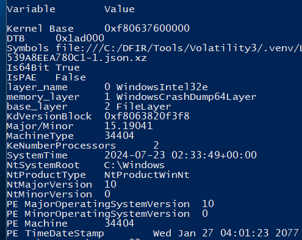

---

## Incident Narrative

### 1. Malicious VS Code Extension

Visual Studio Code was the first application in the suspicious execution chain. `Code.exe` PID `8108` spawned a VS Code Node service as PID `1612`.

Memory analysis identified the following malicious extension:

```text
C:\Users\User2\.vscode\extensions\0xs1rx58d3v.chatgpt-b0t-0.0.1\extension.js
```

The extension metadata identified the developer display name as:

```text
0xS1rx58.D3V
```

The marketplace release time recorded in the case material was:

```text
2024-07-23 01:41:19 UTC
```

The JavaScript contained an input check that triggered the malicious code when the user entered:

```text
help
```

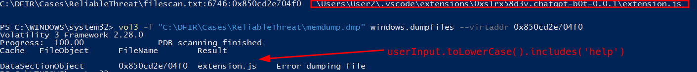

### 2. Reverse Shell Established Through VS Code

The malicious JavaScript created a TCP socket and configured the following endpoint:

```text
6.tcp.eu.ngrok.io:16587
```

Volatility `netscan` recorded `Code.exe` PID `1612` establishing the corresponding connection:

```text
192.168.122.54:49799 -> 52.28.247.255:16587
```

The connection was established at `2024-07-23 02:31:43 UTC`.

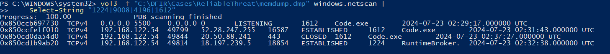

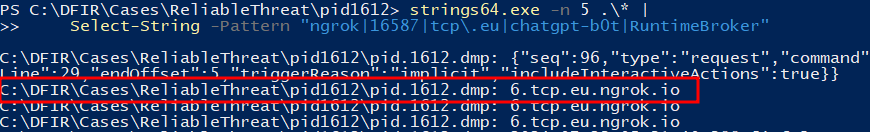

Threat-intelligence enrichment also showed detections associated with `52.28.247.255`; this is supporting context rather than the primary forensic basis for attribution.

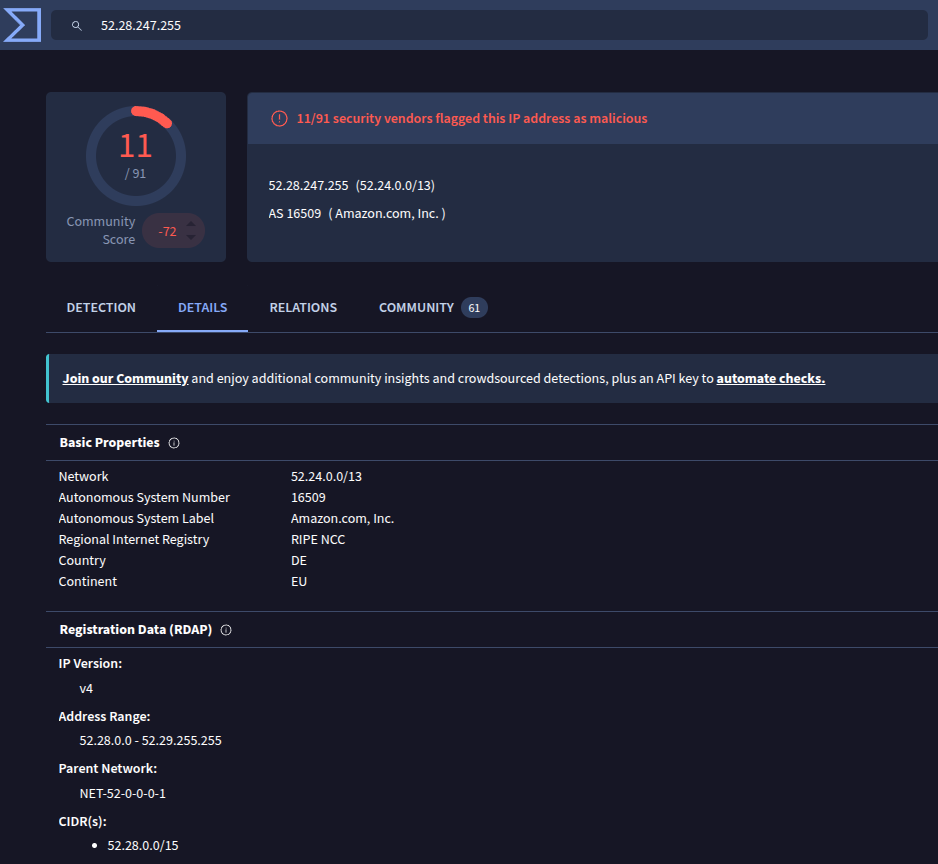

### 3. Payload Execution and Masquerading

The process tree shows the following relevant chain:

```text
explorer.exe
└── Code.exe                 PID 8108
    └── Code.exe             PID 1612
        └── cmd.exe          PID 4196
            └── RuntimeBroker.exe   PID 1224
                └── cmd.exe         PID 9008
```

PID `4196` executed:

```text
C:\Windows\System32\cmd.exe /d /s /c "C:\Users\Public\RuntimeBroker.exe"
```

The executable name imitates the legitimate Windows `RuntimeBroker.exe`, but the legitimate component normally resides under `C:\Windows\System32`. Execution from `C:\Users\Public` is anomalous and consistent with masquerading.

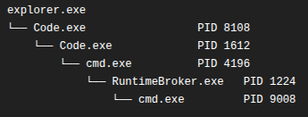

Volatility memory inspection also identified executable memory associated with the suspicious `RuntimeBroker.exe` process.

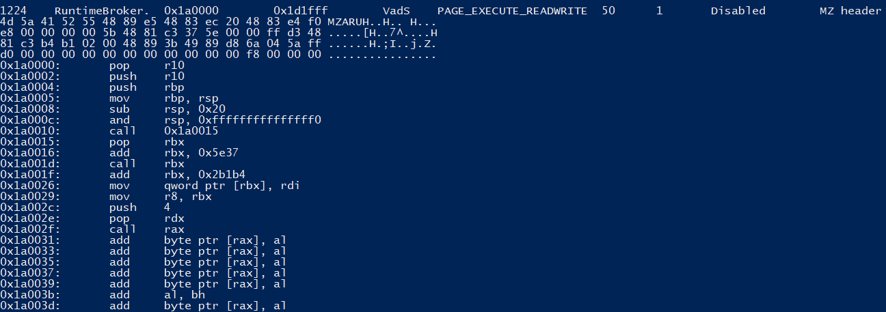

At `2024-07-23 02:32:38 UTC`, PID `1224` established an additional outbound connection:

```text
192.168.122.54:49814 -> 18.197.239.5:18854
```

### 4. Persistence Through Recycle Bin COM Hijacking

Disk analysis identified `temp.exe` under the Public profile. Analysis of the executable showed registry operations targeting:

```text
SOFTWARE\Classes\CLSID\
{645FF040-5081-101B-9F08-00AA002F954E}\
shell\open\command
```

CLSID `{645FF040-5081-101B-9F08-00AA002F954E}` corresponds to the Windows **Recycle Bin**.

The registry change causes attacker-controlled execution when the legitimate component is invoked. This is:

```text
T1546.015 — Event Triggered Execution:
Component Object Model Hijacking
```

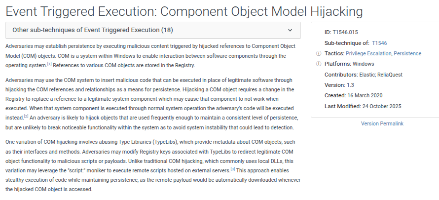

### 5. Source-Code Collection

The logical disk image contained project source under:

```text
C:\Users\User2\Desktop\Project
```

A separate archive named `filex221.zip` was present under the Public user area and contained copies of multiple projects. This is consistent with source-code collection or staging.

The available artifacts establish that source code was copied into an archive. They do not independently establish the final outbound transfer channel or destination.

### 6. Project Source Tampering

The Laravel project contained Git metadata, allowing the working tree to be compared against its expected state. The modified file was:

```text
C:\Users\User2\Desktop\Project\
laravel-11.1.4\public\index.php
```

Its modification timestamp was:

```text
2024-07-23 02:37:13 UTC
```

The unauthorized line added to the file was:

```php
$testc = $_GET['s1']; echo "$testc";
```

The modification introduces attacker-controlled request data into the application's response and confirms an integrity violation of the source tree.

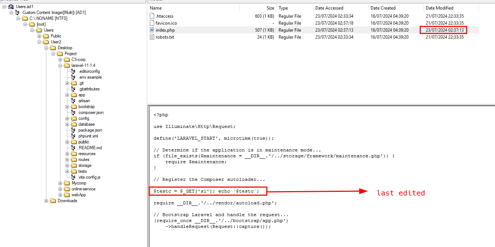

---

## Technical Timeline

| Timestamp (UTC) | Event |
|---|---|
| `2024-07-23 01:41:19` | Malicious `ChatGPT-B0T` extension release time recorded in case material |
| `2024-07-23 02:28:58` | Main Visual Studio Code process `Code.exe` PID `8108` started |
| `2024-07-23 02:29:03` | VS Code Node service `Code.exe` PID `1612` started |
| `2024-07-23 02:31:43` | PID `1612` established a TCP session to `52.28.247.255:16587`, corresponding to `6.tcp.eu.ngrok.io` |
| `2024-07-23 02:32:35` | `cmd.exe` PID `4196` started and invoked `C:\Users\Public\RuntimeBroker.exe` |
| `2024-07-23 02:32:35` | Masqueraded `RuntimeBroker.exe` PID `1224` started |
| `2024-07-23 02:32:38` | PID `1224` established a TCP session to `18.197.239.5:18854` |
| `2024-07-23 02:35:37` | Malicious `RuntimeBroker.exe` spawned `cmd.exe` PID `9008` |
| `2024-07-23 02:37:13` | Laravel `public\index.php` recorded the unauthorized modification |

---

## Indicators of Compromise

| Type | Indicator | Context |
|---|---|---|
| Extension ID | `0xs1rx58d3v.chatgpt-b0t` | Malicious Visual Studio Code extension |
| Developer | `0xS1rx58.D3V` | Publisher display name associated with the extension |
| File path | `C:\Users\User2\.vscode\extensions\0xs1rx58d3v.chatgpt-b0t-0.0.1\extension.js` | Initial malicious code |
| Trigger | `help` | User input that activates the malicious logic |
| Domain | `6.tcp.eu.ngrok.io` | Reverse-shell hostname |
| IPv4 | `52.28.247.255` | Reverse-shell destination resolved in memory |
| TCP port | `16587` | Reverse-shell port |
| File path | `C:\Users\Public\RuntimeBroker.exe` | Masqueraded malicious executable |
| IPv4 | `18.197.239.5` | Secondary outbound destination used by PID `1224` |
| TCP port | `18854` | Secondary outbound port |
| File | `temp.exe` | Executable associated with registry persistence |
| CLSID | `{645FF040-5081-101B-9F08-00AA002F954E}` | Recycle Bin COM object targeted for hijacking |
| SID | `S-1-5-21-1998887770-13753423-1649717590-1001` | Compromised `User2` account |
| Archive | `filex221.zip` | Archive containing project source |
| Modified file | `laravel-11.1.4\public\index.php` | Source file altered after compromise |
| GET parameter | `s1` | Parameter introduced by the unauthorized PHP modification |

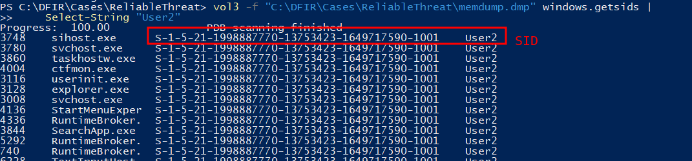

---

## Attack Classification

| Phase | Observed behavior |
|---|---|
| **Initial Access** | Malicious VS Code extension delivered through the extension ecosystem |
| **Execution** | Obfuscated JavaScript executed inside the VS Code process context |
| **Command and Control** | Reverse shell to `6.tcp.eu.ngrok.io:16587` |
| **Command Execution** | `cmd.exe` spawned from the compromised VS Code process |
| **Masquerading** | Malicious `RuntimeBroker.exe` placed in `C:\Users\Public` |
| **Persistence** | Recycle Bin COM hijacking — `T1546.015` |
| **Collection** | Multiple project directories present in `filex221.zip` |
| **Impact / Integrity** | Laravel `public\index.php` modified with unauthorized PHP code |

---

## Root Cause

The root cause was installation and execution of a malicious Visual Studio Code extension presented as a ChatGPT programming assistant.

The extension operated inside a trusted development application, concealed its network behavior in obfuscated JavaScript, and required only normal user interaction to activate. Once triggered, it established remote command execution, launched additional malware, created persistence, located project source, and modified application code.

The evidence therefore supports compromise of the employee's development environment rather than intentional source-code disclosure by the user.

---

## Impact Assessment

| Area | Assessment |
|---|---|
| **Confidentiality** | High. Project source was collected into a public archive and the attacker obtained remote command execution. Final outbound transfer of the archive is not directly proven. |
| **Integrity** | High. Windows registry state and Laravel source code were modified. |
| **Availability** | No direct outage or destructive action is visible in the supplied evidence. |
| **Persistence** | Confirmed through Recycle Bin COM hijacking. |
| **Remote access** | Confirmed through the VS Code reverse shell and subsequent malicious process chain. |
| **User attribution** | Evidence indicates the developer account was compromised; intentional employee involvement is not supported by the supplied artifacts. |
| **Overall impact** | Critical workstation compromise with source-code exposure and integrity loss. |

---

## Containment and Eradication Recommendations

### Immediate

1. Isolate `DESKTOP-UV1SFA2` from all production and developer networks.
2. Block `6.tcp.eu.ngrok.io`, `52.28.247.255`, `18.197.239.5`, and associated malicious infrastructure.
3. Revoke active sessions and credentials used by `User2`.
4. Preserve the memory image, logical disk image, VS Code profile, registry hives, browser data, and network telemetry.
5. Remove the malicious extension only after evidence preservation.
6. Quarantine `RuntimeBroker.exe`, `temp.exe`, and `filex221.zip`.

### Eradication and Recovery

1. Rebuild the workstation from a trusted image.
2. Restore project repositories from a validated source-control state.
3. Review all commits and working-tree changes made during the compromise window.
4. Remove the malicious COM registration and validate affected CLSID handlers.
5. Rotate source-control credentials, API keys, tokens, SSH keys, database credentials, and secrets accessible from the workstation.
6. Search for the extension ID, publisher, payload paths, CLSID, IP addresses, and domains across the environment.
7. Review source repositories for copies of the injected `$_GET['s1']` code and other unauthorized changes.

### Preventive Controls

- Restrict VS Code extensions to an approved allowlist for managed developer systems.
- Monitor installation of extensions from new or low-reputation publishers.
- Alert on executables launched from user-writable shared directories such as `C:\Users\Public`.
- Detect child shells spawned by `Code.exe` and other development tools.
- Monitor outbound connections to tunneling services such as ngrok where not required.
- Alert on modifications to `HKLM\SOFTWARE\Classes\CLSID` and COM `shell\open\command` handlers.
- Enforce source-control branch protection and integrity monitoring for production code.
- Prevent secrets from being stored directly on developer workstations where possible.

---

## Conclusion

ReliableThreat was a developer-workstation compromise initiated through a malicious Visual Studio Code extension. User interaction with the extension triggered an obfuscated reverse shell, after which the attacker executed a masqueraded payload, established COM-based persistence, collected project source, and altered a Laravel application file.

The evidence does not support the employee as the intentional source of the leak. The workstation and credentials accessible from it must be treated as compromised, affected repositories must be integrity-checked, and the system should be rebuilt from a trusted baseline.

---

## Annex A — Evidence-to-Finding Matrix

| Finding | Supporting artifact |
|---|---|
| Host was a Windows 10 developer workstation | `memdump.dmp` — `windows.info` |
| Visual Studio Code initiated the suspicious chain | `memdump.dmp` — `windows.pstree` |
| Initial malicious file was `extension.js` under the `ChatGPT-B0T` extension | `memdump.dmp` — `windows.filescan` and PID `1612` strings |
| User input `help` triggered malicious logic | Recovered JavaScript strings from PID `1612` |
| Reverse shell used `6.tcp.eu.ngrok.io:16587` | PID `1612` memory strings and `windows.netscan` |
| Compromised user SID ended in `-1001` | `memdump.dmp` — `windows.getsids` |
| Malicious executable ran from `C:\Users\Public\RuntimeBroker.exe` | `memdump.dmp` — `windows.pstree` / `windows.cmdline` |
| Payload established secondary network activity | `memdump.dmp` — `windows.netscan` |
| Recycle Bin COM object was hijacked | `Users.ad1` — analysis of `temp.exe` registry behavior |
| Persistence maps to `T1546.015` | CLSID analysis and MITRE ATT&CK mapping |
| Project source was collected into an archive | `Users.ad1` — `filex221.zip` |
| Laravel `public\index.php` was modified | `Users.ad1`, Git comparison, file timestamp |
| Unauthorized PHP code accepted `s1` request data | Modified `public\index.php` |
