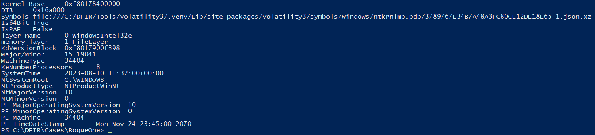
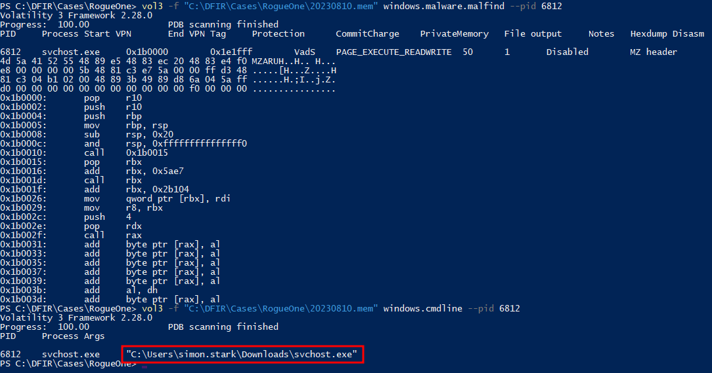
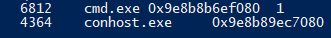
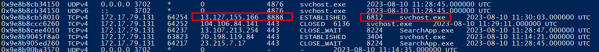
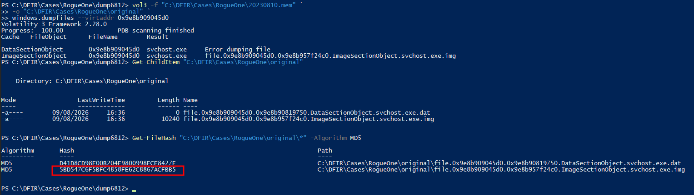
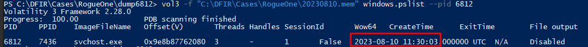
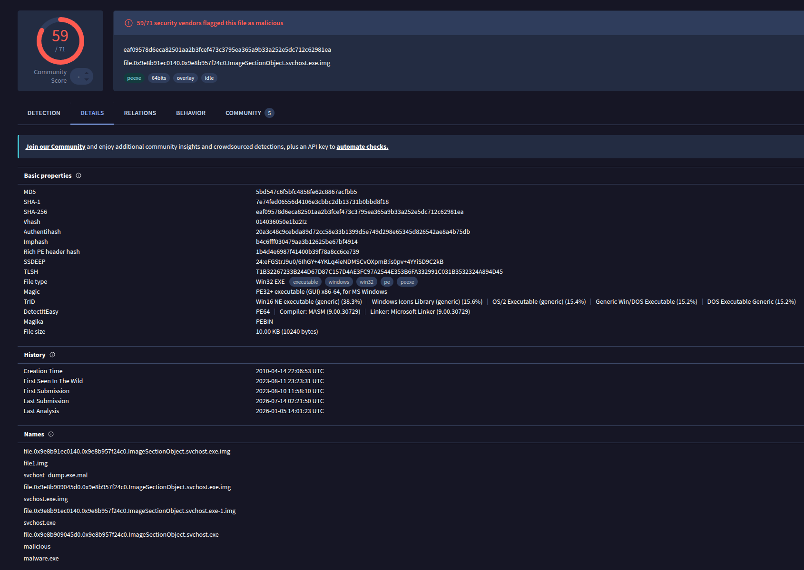

<p align="center">
  
</p>

# RogueOne Security Incident Report

> **Category:** Easy  
> **Discipline:** DFIR — Memory Forensics  
> **Primary artifact:** Windows memory image `20230810.mem`  
> **Analysis tooling:** Volatility 3  
> **Time standard:** UTC

---

## Executive Summary

| Field | Value |
|---|---|
| **Incident ID** | `ROGUEONE-2023-0810` |
| **Severity** | **High** |
| **Status** | Confirmed compromise |
| **Affected user** | `simon.stark` |
| **Affected endpoint IP** | `172.17.79.131` |
| **Malicious process** | `svchost.exe` — PID `6812` |
| **Malware path** | `C:\Users\simon.stark\Downloads\svchost.exe` |
| **C2 endpoint** | `13.127.155.166:8888` |
| **Execution / C2 time** | `2023-08-10 11:30:03 UTC` |
| **Malware MD5** | `5bd547c6f5bfc4858fe62c8867acfbb5` |
| **Assessment confidence** | High |

A malicious executable masquerading as the legitimate Windows `svchost.exe` was executed from Simon Stark's Downloads directory. Unlike normal `svchost.exe` instances launched by `services.exe`, the malicious process was launched under `explorer.exe`, confirming execution in the interactive user session.

The process established an outbound TCP connection to `13.127.155.166:8888` and spawned `cmd.exe`, providing a mechanism for command execution. Memory analysis also identified executable, writable memory associated with the process. The supplied evidence confirms malware execution and active C2 communication, but does not establish the original delivery vector, persistence, credential theft, or data exfiltration.

---

## Artifact Inventory

| Artifact | Type | Evidentiary value |
|---|---|---|
| `20230810.mem` | Windows memory image | Process state, process relationships, command lines, network connections, memory regions, and cached file objects |
| `MemDump.zip` | Source evidence archive | Walkthrough-provided archive; MD5 `5810AA928E827D5AB8373AA4E1107572` |
| `windowsinfo.png` | Evidence screenshot | Windows kernel and memory-image information |
| `6812.png` | Evidence screenshot | Malicious process path and suspicious executable memory identified with Volatility |
| `childprocess.png` | Evidence screenshot | `cmd.exe` child process associated with PID `6812` |
| `suspiciousipprocess.png` | Evidence screenshot | Established C2 connection owned by malicious PID `6812` |
| `hashsvchost.png` | Evidence screenshot | Recovered malicious image and MD5 calculation |
| `timestamp.png` | Evidence screenshot | Process creation timestamp and process memory offset |
| `virustotaldetails.png` | Threat-intelligence screenshot | Hash metadata, detection ratio, and first VirusTotal submission time |
| `rogueonelogo.png` | Case artwork | Sherlock case logo |

---

## Scope and Affected Assets

| Asset | Role | Impact |
|---|---|---|
| Simon Stark's workstation | Windows 10 endpoint | Confirmed malware execution and external C2 communication |
| `simon.stark` | Interactive user profile | Malicious executable ran from the user's Downloads directory |
| `172.17.79.131` | Compromised endpoint IP | Origin of the confirmed C2 session |
| `C:\Users\simon.stark\Downloads\svchost.exe` | Malicious executable | Masqueraded as a legitimate Windows system binary |
| `13.127.155.166:8888` | External C2 endpoint | Established connection from malicious PID `6812` |

---

## Incident Narrative

### 1. Memory Acquisition and Initial Triage

The SOC received repeated alerts indicating possible C2 traffic from Simon Stark's workstation. Task Manager did not reveal an obviously malicious process, so the endpoint was contained and a memory image was acquired for forensic analysis.

Volatility identified the image as a Windows 10 system with kernel version `10.0.19041`. The memory image records system time close to the acquisition at `2023-08-10 11:32:00 UTC`.



### 2. Malicious Process Identification

Process analysis identified `svchost.exe` PID `6812` as anomalous. Legitimate `svchost.exe` processes on the endpoint were normally children of `services.exe` PID `788`, while PID `6812` had parent PID `7436`, `explorer.exe`.

The command-line and image path confirmed that the process was not running from the legitimate Windows system directory:

```text
C:\Users\simon.stark\Downloads\svchost.exe
```

This path, parent relationship, and process behavior confirm that the executable was masquerading as the Windows Service Host binary.

Volatility `malfind` also identified a `PAGE_EXECUTE_READWRITE` VAD containing an `MZ` header inside PID `6812`, providing additional evidence of suspicious executable memory associated with the process.



### 3. Command Execution Capability

The malicious process spawned `cmd.exe` PID `4364`:

```text
svchost.exe  PID 6812
└── cmd.exe  PID 4364
```

The `cmd.exe` binary itself was the legitimate Windows command interpreter, but its parent process was the malicious `svchost.exe`. This process relationship is consistent with the malware invoking a command shell for post-compromise command execution.



### 4. C2 Communication

Network-memory analysis correlated the suspicious process directly with an established outbound connection:

```text
172.17.79.131:64254 -> 13.127.155.166:8888/TCP
State: ESTABLISHED
PID:   6812
Image: svchost.exe
Time:  2023-08-10 11:30:03 UTC
```

The process creation time and network-object creation time are the same, showing that the C2 channel was established immediately when the malicious process started.



### 5. Malware Recovery and Hashing

The malicious file object was recovered from memory and associated with the original path:

```text
\Users\simon.stark\Downloads\svchost.exe
```

The recovered malicious image produced the following MD5:

```text
5bd547c6f5bfc4858fe62c8867acfbb5
```



### 6. Timeline Confirmation

Volatility `pslist` recorded PID `6812` with the following creation time and process offset:

```text
Create time: 2023-08-10 11:30:03 UTC
Offset(V):   0x9e8b87762080
```



### 7. Threat-Intelligence Enrichment

VirusTotal enrichment for the recovered sample showed the MD5 `5bd547c6f5bfc4858fe62c8867acfbb5` and a detection ratio of **59/71** security vendors in the supplied screenshot. The sample's first submission to VirusTotal was recorded at:

```text
2023-08-10 11:58:10 UTC
```

This enrichment occurred after the confirmed execution and C2 activity and is supporting intelligence rather than primary host evidence.



---

## Technical Timeline

| Timestamp (UTC) | Event |
|---|---|
| `2023-08-10 11:30:03` | Malicious `svchost.exe` PID `6812` created under `explorer.exe` PID `7436` |
| `2023-08-10 11:30:03` | PID `6812` established TCP C2 communication from `172.17.79.131:64254` to `13.127.155.166:8888` |
| `2023-08-10 11:30:57` | Malicious PID `6812` spawned `cmd.exe` PID `4364` |
| `2023-08-10 11:31:52` | `RamCapture64.exe` started as part of memory acquisition activity |
| `2023-08-10 11:32:00` | Memory image system time recorded near acquisition |
| `2023-08-10 11:58:10` | Recovered sample first submitted to VirusTotal |

---

## Indicators of Compromise

| Type | Indicator | Context |
|---|---|---|
| IPv4 | `13.127.155.166` | Confirmed external C2 server |
| TCP port | `8888` | C2 destination port |
| Endpoint IPv4 | `172.17.79.131` | Compromised workstation address |
| File name | `svchost.exe` | Malware masquerading as the Windows Service Host binary |
| File path | `C:\Users\simon.stark\Downloads\svchost.exe` | Malicious executable location |
| MD5 | `5bd547c6f5bfc4858fe62c8867acfbb5` | Recovered malicious sample |
| SHA-1 | `7e74fed06556d4106e3cbbc2db13731b0bd8f18` | VirusTotal sample metadata |
| SHA-256 | `eaf09578d6eca82501aa2b3fcef473c3795ea365a9b33a252e5dc712c62981ea` | VirusTotal sample metadata |
| Process ID | `6812` | Confirmed malicious process instance |
| Child PID | `4364` | `cmd.exe` spawned by the malware |
| Process offset | `0x9e8b87762080` | Volatility process-memory offset for PID `6812` |

---

## Attack Classification

| Phase | Observed behavior |
|---|---|
| **Initial Access** | Not established by the supplied memory evidence |
| **Execution** | Masquerading `svchost.exe` executed from the user's Downloads directory |
| **Defense Evasion** | Malware used the name of a legitimate Windows system process |
| **Command Execution** | Malicious process spawned `cmd.exe` PID `4364` |
| **Command and Control** | Established TCP session to `13.127.155.166:8888` |
| **Persistence** | Not established from the supplied evidence |
| **Credential Access** | Not established from the supplied evidence |
| **Exfiltration** | Not established from the supplied evidence |

---

## Root Cause

The immediate cause of compromise was execution of an untrusted executable named `svchost.exe` from Simon Stark's Downloads directory. The binary masqueraded as a legitimate Windows component and communicated with an external C2 endpoint.

The memory image does **not** establish how the file was delivered to the workstation. Root-cause investigation should therefore focus on browser/download history, email, web proxy records, endpoint telemetry, and filesystem metadata surrounding the appearance of `C:\Users\simon.stark\Downloads\svchost.exe`.

---

## Impact Assessment

| Area | Assessment |
|---|---|
| **Confidentiality** | Potentially affected. Active C2 provided a remote communication channel, but data theft is not proven. |
| **Integrity** | High impact. Unauthorized code executed and spawned a command shell. |
| **Availability** | No direct outage or destructive activity is visible in the supplied evidence. |
| **Command and Control** | Confirmed to `13.127.155.166:8888`. |
| **Persistence** | Not established. |
| **Data exfiltration** | Not established. |
| **Overall impact** | Confirmed endpoint compromise requiring eradication and wider IOC hunting. |

---

## Containment and Eradication Recommendations

### Immediate

1. Keep the affected workstation isolated from production networks.
2. Block `13.127.155.166` and destination TCP port `8888` where operationally appropriate.
3. Quarantine the malicious file identified by MD5 `5bd547c6f5bfc4858fe62c8867acfbb5`.
4. Terminate malicious process activity only after required volatile evidence has been preserved.
5. Preserve the memory image and acquire a forensic disk image for root-cause analysis.
6. Hunt across the environment for the file hashes, C2 IP, port, filename, and execution path.

### Eradication and Recovery

1. Reimage the endpoint from a trusted baseline if additional compromise cannot be confidently excluded.
2. Review user and system persistence locations, scheduled tasks, services, Run keys, WMI subscriptions, and startup folders.
3. Review browser history, downloads, email artifacts, proxy logs, and EDR telemetry to establish the malware delivery mechanism.
4. Review credentials and authenticated sessions used from the endpoint during the compromise window and rotate credentials where exposure is plausible.
5. Validate the rebuilt endpoint with EDR and network telemetry before restoring normal access.

### Preventive Controls

- Alert when Windows system-binary names such as `svchost.exe` execute outside expected system directories.
- Alert when `svchost.exe` is parented by an interactive process such as `explorer.exe`.
- Alert on `svchost.exe` spawning command interpreters such as `cmd.exe` or PowerShell where not expected.
- Monitor outbound connections to uncommon external ports and newly observed destinations.
- Block or restrict execution from user-writable directories where business requirements permit.
- Correlate SIEM C2 alerts with process lineage and endpoint network telemetry.

---

## Conclusion

Memory analysis confirmed that Simon Stark's workstation executed a malicious `svchost.exe` from the user's Downloads directory. The process, PID `6812`, was launched by `explorer.exe`, established an outbound C2 connection to `13.127.155.166:8888`, and spawned `cmd.exe` for command execution.

The recovered sample has MD5 `5bd547c6f5bfc4858fe62c8867acfbb5`. The endpoint should be treated as compromised, the IOCs should be hunted across the environment, and disk/browser/email telemetry should be examined to determine the original delivery vector and full scope of post-compromise activity.

---

## Annex A — Evidence-to-Finding Matrix

| Finding | Supporting artifact |
|---|---|
| Memory image represents a Windows 10 system | `windowsinfo.png` / Volatility `windows.info` |
| Malicious process was `svchost.exe` PID `6812` | Volatility `pslist`, `cmdline`, and `6812.png` |
| Malware executed from the user's Downloads directory | `6812.png` / Volatility `cmdline` |
| Parent process was `explorer.exe` PID `7436` | Volatility process-tree analysis |
| Malware spawned `cmd.exe` PID `4364` | `childprocess.png` |
| C2 destination was `13.127.155.166:8888` | `suspiciousipprocess.png` / Volatility `netscan` |
| C2 source endpoint was `172.17.79.131` | `suspiciousipprocess.png` |
| Execution and C2 began at `2023-08-10 11:30:03 UTC` | `timestamp.png` and `suspiciousipprocess.png` |
| Malicious process offset was `0x9e8b87762080` | `timestamp.png` / Volatility `pslist` |
| Malware MD5 was `5bd547c6f5bfc4858fe62c8867acfbb5` | `hashsvchost.png` |
| Sample first submitted to VirusTotal at `2023-08-10 11:58:10 UTC` | `virustotaldetails.png` |
