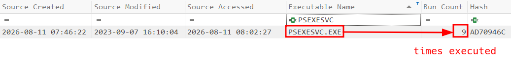
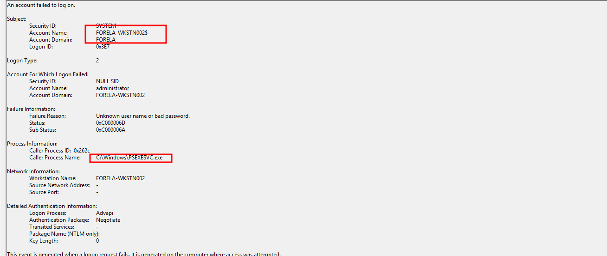
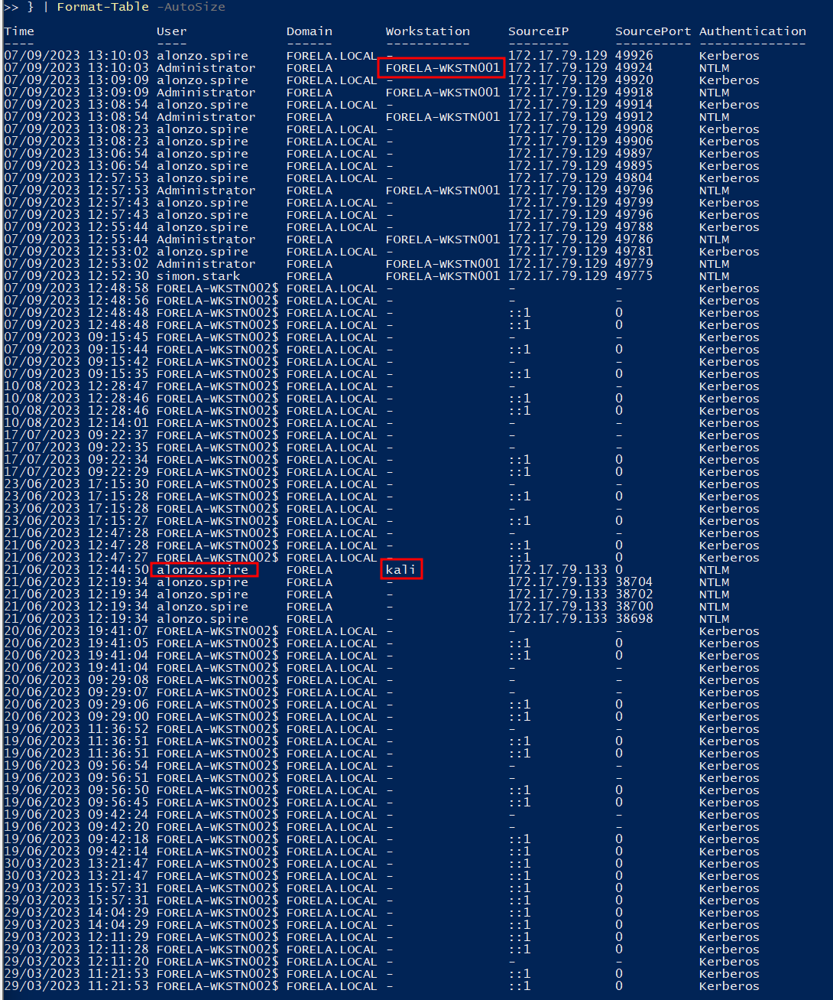
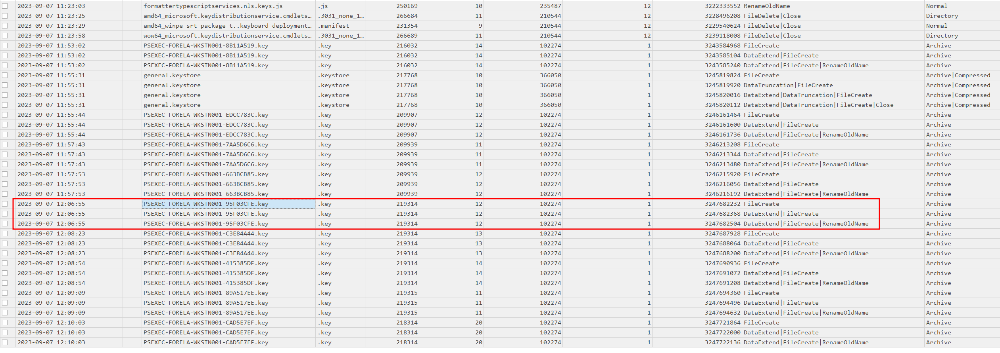
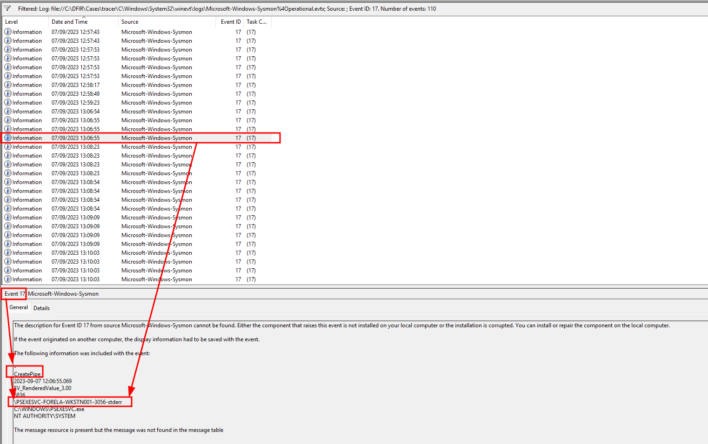

<p align="center">
  
</p>

# Tracer Security Incident Report

> **Category:** Very Easy  
> **Discipline:** DFIR — Windows Artifact & Log Analysis  
> **Primary artifacts:** Windows Event Logs, Sysmon, Prefetch, and NTFS USN Journal  
> **Time standard:** UTC

---

## Executive Summary

| Field | Value |
|---|---|
| **Incident ID** | `TRACER-2023-0907` |
| **Severity** | **High** |
| **Status** | Confirmed lateral movement |
| **Source workstation** | `FORELA-WKSTN001` |
| **Target workstation** | `FORELA-WKSTN002` |
| **Source IP** | `172.17.79.129` |
| **Lateral movement method** | Sysinternals PsExec |
| **Service binary** | `PSEXESVC.exe` |
| **Observed PsExec executions** | `9` |
| **Fifth-last execution** | `2023-09-07 12:06:54 UTC` |
| **Assessment confidence** | High |

The investigation confirms repeated PsExec-based lateral movement from `FORELA-WKSTN001` to `FORELA-WKSTN002`. Prefetch records show that `PSEXESVC.exe` executed **nine times** on the target workstation. Windows authentication telemetry and PsExec-specific key-file artifacts identify `FORELA-WKSTN001` as the source system, with activity originating from `172.17.79.129`.

The fifth-last PsExec execution occurred at `2023-09-07 12:06:54 UTC`. One second later, PsExec created the key file `PSEXEC-FORELA-WKSTN001-95F03CFE.key`, followed by PsExec named-pipe activity including `\PSEXESVC-FORELA-WKSTN001-3056-stderr`. The supplied evidence confirms remote service execution on the second workstation but does not establish the original compromise vector on the source workstation or subsequent data theft.

---

## Artifact Inventory

| Artifact | Type | Evidentiary value |
|---|---|---|
| `C\Windows\prefetch` | Windows Prefetch | Execution evidence, run count, and recent execution timestamps for `PSEXESVC.exe` |
| `System.evtx` | Windows System log | Service installation telemetry associated with remote service execution |
| `Security.evtx` | Windows Security log | Authentication activity, source workstation, source IP, and account context |
| `Microsoft-Windows-Sysmon%4Operational.evtx` | Sysmon log | Named-pipe creation and process attribution for `PSEXESVC.exe` |
| `C\$Extend\$J` | NTFS USN Journal | Creation and filesystem activity for PsExec `.key` files |
| `PSEXESVCtimes.png` | Evidence screenshot | Prefetch run count showing nine executions |
| `attackeruser.png` | Evidence screenshot | Authentication event tied to `C:\Windows\PSEXESVC.exe` on `FORELA-WKSTN002` |
| `workstation.png` | Evidence screenshot | Source host `FORELA-WKSTN001` and source IP `172.17.79.129` in logon telemetry |
| `PSEXECkey.png` | Evidence screenshot | PsExec key-file sequence and fifth-last key file |
| `createpipe.png` | Evidence screenshot | Sysmon Event ID 17 for the fifth-last PsExec `stderr` named pipe |

---

## Scope and Affected Assets

| Asset | Role | Impact |
|---|---|---|
| `FORELA-WKSTN001` | Source workstation | Confirmed origin of PsExec lateral movement; must be treated as already compromised |
| `172.17.79.129` | Source IP | Network address associated with source-host authentication activity |
| `FORELA-WKSTN002` | Target workstation | Remote PsExec service execution confirmed |
| `C:\Windows\PSEXESVC.exe` | PsExec service binary | Executed repeatedly under privileged service context |
| `Administrator` | Local administrative account context | Authentication activity observed during the PsExec execution window |

The evidence set begins after the attacker already has a foothold on the source workstation. Initial compromise of `FORELA-WKSTN001` is therefore outside the available scope.

---

## Incident Narrative

### 1. Repeated PsExec Execution Confirmed

Prefetch analysis identified `PSEXESVC.EXE-AD70946C.pf`. Its **Run Count** is `9`, confirming repeated execution of the PsExec service binary on the target workstation.

PsExec creates its service binary on the destination host to execute remote commands. Repeated executions therefore indicate multiple PsExec operations rather than a single isolated event.



### 2. PsExec Service Binary on the Target

The service binary used for remote execution was:

```text
C:\Windows\PSEXESVC.exe
```

Security-log evidence on `FORELA-WKSTN002` shows `PSEXESVC.exe` as the caller process during authentication activity. The process operated from the Windows directory in the expected PsExec service location.



### 3. Lateral Movement Source Identified

Authentication telemetry identifies the source workstation as:

```text
FORELA-WKSTN001
```

with source IP:

```text
172.17.79.129
```

The same activity window contains NTLM authentication using the `Administrator` account and Kerberos activity associated with `alonzo.spire`. The source-host attribution is independently reinforced by PsExec key-file naming, which embeds the originating hostname.



### 4. Fifth-Last PsExec Execution and Key File

The fifth-last execution of the PsExec service binary occurred at:

```text
2023-09-07 12:06:54 UTC
```

The NTFS USN Journal records the corresponding PsExec key file one second later:

```text
PSEXEC-FORELA-WKSTN001-95F03CFE.key
```

Creation time:

```text
2023-09-07 12:06:55 UTC
```

The key-file naming convention directly exposes the source hostname, providing a high-value lateral-movement artifact even after the service binary is removed.



### 5. Named-Pipe Communication

Sysmon Event ID `17` records PsExec named-pipe creation immediately after the fifth-last execution. The `stderr` pipe was:

```text
\PSEXESVC-FORELA-WKSTN001-3056-stderr
```

The event was recorded at:

```text
2023-09-07 12:06:55.069 UTC
```

The creating image was `C:\WINDOWS\PSEXESVC.exe`, running as `NT AUTHORITY\SYSTEM`. This links the named pipe directly to the PsExec service process and the source workstation.



---

## Technical Timeline

| Timestamp (UTC) | Event |
|---|---|
| `2023-09-07 11:53:02` | PsExec key-file activity begins in the preserved USN Journal evidence |
| `2023-09-07 12:06:54` | Fifth-last `PSEXESVC.exe` execution |
| `2023-09-07 12:06:55` | `PSEXEC-FORELA-WKSTN001-95F03CFE.key` created on disk |
| `2023-09-07 12:06:55.069` | Sysmon Event ID 17 records `\PSEXESVC-FORELA-WKSTN001-3056-stderr` |
| `2023-09-07 12:08:23` | Subsequent PsExec key file `PSEXEC-FORELA-WKSTN001-C3E84A44.key` recorded |
| `2023-09-07 12:08:54` | Subsequent PsExec key file `PSEXEC-FORELA-WKSTN001-415385DF.key` recorded |
| `2023-09-07 12:09:09` | Subsequent PsExec key file `PSEXEC-FORELA-WKSTN001-89A517EE.key` recorded |
| `2023-09-07 12:10:03` | Latest preserved PsExec execution/key-file activity; total execution count remains `9` |

---

## Indicators of Compromise

| Type | Indicator | Context |
|---|---|---|
| Hostname | `FORELA-WKSTN001` | Source workstation used for lateral movement |
| Hostname | `FORELA-WKSTN002` | Target workstation receiving PsExec execution |
| IPv4 | `172.17.79.129` | Source address associated with the lateral-movement host |
| Executable | `PSEXESVC.exe` | PsExec remote service binary |
| File path | `C:\Windows\PSEXESVC.exe` | Service binary location on the target |
| Prefetch | `PSEXESVC.EXE-AD70946C.pf` | Execution history showing run count `9` |
| Key file | `PSEXEC-FORELA-WKSTN001-95F03CFE.key` | Fifth-last PsExec instance key artifact |
| Named pipe | `\PSEXESVC-FORELA-WKSTN001-3056-stderr` | PsExec inter-process communication artifact |
| Account | `Administrator` | Administrative authentication activity during PsExec operations |

---

## Attack Classification

| Phase | Observed behavior |
|---|---|
| **Initial Access** | Not established in the supplied target-host evidence; attacker already had a foothold on `FORELA-WKSTN001` |
| **Lateral Movement** | PsExec used from `FORELA-WKSTN001` to execute remotely on `FORELA-WKSTN002` |
| **Execution** | `PSEXESVC.exe` executed as a Windows service on the target |
| **Privilege Use** | PsExec service activity ran under `NT AUTHORITY\SYSTEM` |
| **Inter-Process Communication** | PsExec created service and stdin/stdout/stderr named pipes |
| **Artifact Creation** | PsExec `.key` files were written to the target filesystem |

---

## Root Cause

The supplied artifacts establish the lateral-movement mechanism but not the original compromise. The attacker already controlled `FORELA-WKSTN001` and had sufficient credentials or administrative access to execute PsExec against `FORELA-WKSTN002`.

The exact method used to compromise the source workstation and obtain the required credentials is not present in the evidence set. The incident should therefore be treated as a **multi-host compromise**, with `FORELA-WKSTN001` prioritized for follow-on root-cause analysis.

---

## Impact Assessment

| Area | Assessment |
|---|---|
| **Confidentiality** | Potentially high. SYSTEM-level execution could access data available to the target host, but data access or exfiltration is not demonstrated. |
| **Integrity** | High. Remote code execution through a SYSTEM-level service gives the attacker the ability to modify the workstation. |
| **Availability** | No direct outage or destructive action is visible in the supplied evidence. |
| **Lateral movement** | Confirmed from `FORELA-WKSTN001` to `FORELA-WKSTN002`. |
| **Persistence** | No separate persistence mechanism is established by the supplied artifacts. |
| **Overall impact** | Confirmed administrative remote execution on a second workstation; both systems should be considered compromised until validated. |

---

## Containment and Eradication Recommendations

### Immediate

1. Isolate both `FORELA-WKSTN001` and `FORELA-WKSTN002` from the network.
2. Disable or rotate credentials used for administrative access between the two systems.
3. Preserve Event Logs, Sysmon, Prefetch, USN Journal, MFT, registry hives, and volatile evidence before cleanup.
4. Terminate unauthorized remote-service activity and remove residual PsExec service artifacts only after evidence preservation.
5. Hunt enterprise-wide for `PSEXESVC.exe`, `PSEXEC-*.key`, and PsExec named-pipe patterns.

### Eradication and Recovery

1. Perform full forensic triage of `FORELA-WKSTN001` to identify the original foothold and credential source.
2. Review administrative group membership, cached credentials, service accounts, remote logons, and credential material on both hosts.
3. Rebuild affected workstations from trusted images if system integrity cannot be confidently restored.
4. Review neighboring hosts for authentication from `172.17.79.129` and remote service creation during the same period.
5. Validate that no additional remote-access tooling, scheduled tasks, services, or startup persistence was introduced.

### Preventive Controls

- Restrict workstation-to-workstation SMB and administrative-share access.
- Limit local administrator privileges and prevent credential reuse across endpoints.
- Monitor Windows System Event ID `7045` for unexpected service creation.
- Monitor Sysmon Event IDs `1`, `11`, `17`, and `18` for PsExec process, file, and named-pipe artifacts.
- Alert on `PSEXESVC.exe`, `PSEXEC-*.key`, and pipe names ending in `-stdin`, `-stdout`, or `-stderr` when not part of approved administration.
- Centralize endpoint logs so transient PsExec artifacts remain available after local cleanup.

---

## Conclusion

The investigation confirms repeated PsExec lateral movement from `FORELA-WKSTN001` to `FORELA-WKSTN002`. Prefetch records nine executions of `PSEXESVC.exe`, while authentication logs, PsExec key files, and Sysmon named-pipe telemetry independently identify the source workstation and reconstruct the fifth-last execution at `2023-09-07 12:06:54 UTC`.

The attacker achieved privileged remote execution on the target workstation. Because the source system was already compromised before the captured activity, response scope must include both workstations and any systems accessible with the same administrative credentials.

---

## Annex A — Evidence-to-Finding Matrix

| Finding | Supporting artifact |
|---|---|
| PsExec executed nine times | Prefetch `PSEXESVC.EXE-AD70946C.pf` / `PSEXESVCtimes.png` |
| Service binary was `PSEXESVC.exe` | Windows Security/System telemetry / `attackeruser.png` |
| Target workstation was `FORELA-WKSTN002` | Windows Security telemetry / `attackeruser.png` |
| Source workstation was `FORELA-WKSTN001` | Security-log authentication telemetry and PsExec key-file naming / `workstation.png`, `PSEXECkey.png` |
| Source IP was `172.17.79.129` | Security-log authentication telemetry / `workstation.png` |
| Fifth-last PsExec execution was `12:06:54 UTC` | Prefetch execution timeline |
| Fifth-last key file was `PSEXEC-FORELA-WKSTN001-95F03CFE.key` | NTFS USN Journal / `PSEXECkey.png` |
| Key file was created at `12:06:55 UTC` | NTFS USN Journal / `PSEXECkey.png` |
| Fifth-last stderr pipe was `\PSEXESVC-FORELA-WKSTN001-3056-stderr` | Sysmon Event ID 17 / `createpipe.png` |
| Pipe was created by `PSEXESVC.exe` as SYSTEM | Sysmon Event ID 17 / `createpipe.png` |

> **Technical context reference:** Hack The Box, *Detecting PsExec lateral movements: 4 artifacts to sniff out intruders*. The reference was used to contextualize PsExec artifact behavior; incident findings above are grounded in the supplied Tracer evidence.

