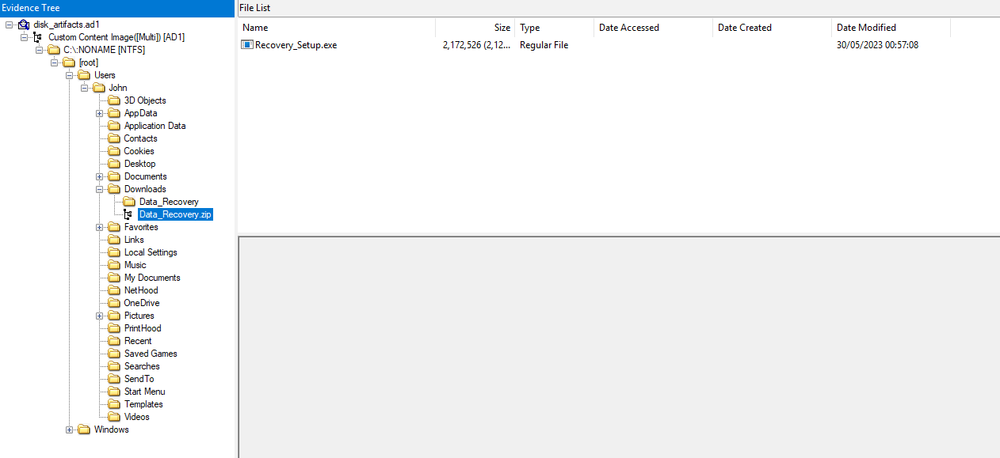
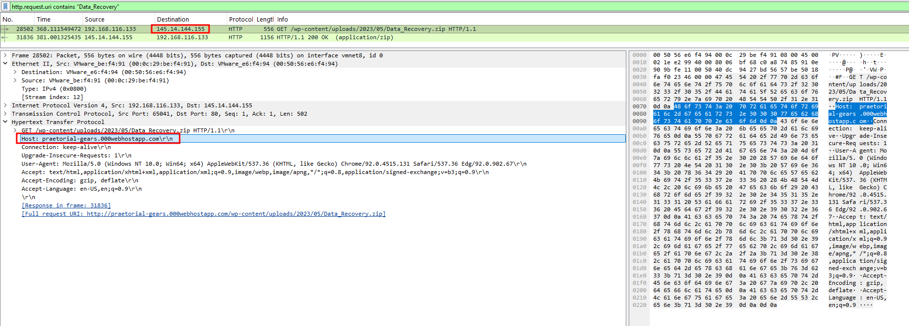
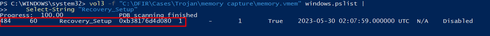
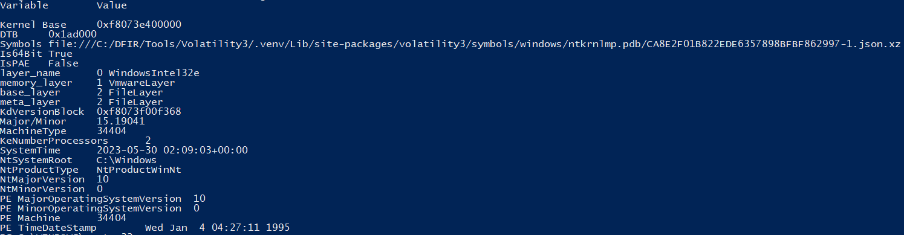
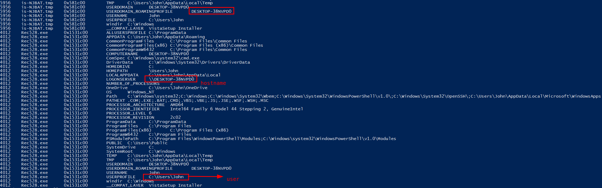
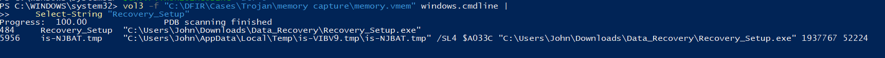
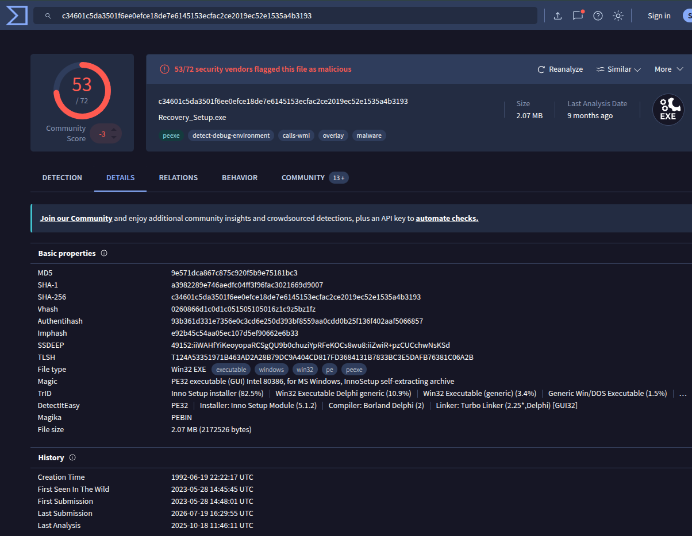
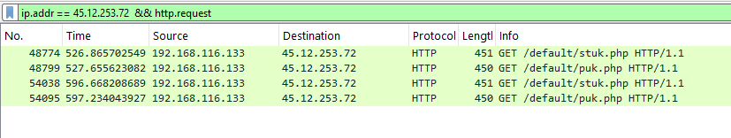

<p align="center">
  
</p>

# Trojan Security Incident Report

> **Category:** Easy  
> **Discipline:** DFIR - Memory, Disk & Network Forensics  
> **Primary artifacts:** `memory.vmem`, `memory.vmsn`, `disk_artifacts.ad1`, `network.pcapng`  
> **Time standard:** UTC

---

## Executive Summary

| Field | Value |
|---|---|
| **Incident ID** | `TROJAN-2023-0530` |
| **Severity** | **High** |
| **Status** | Confirmed malware compromise |
| **Affected host** | `DESKTOP-38NVPD0` |
| **Affected user** | `John` |
| **Operating system** | Windows 10 build `19041` |
| **Initial access vector** | User-downloaded trojanized data-recovery software |
| **Malicious executable** | `Recovery_Setup.exe` |
| **Process PID** | `484` |
| **First execution** | `2023-05-30 02:06:29 UTC` |
| **Assessment confidence** | High |

John downloaded `Data_Recovery.zip` from `praetorial-gears.000webhostapp.com` after attempting to recover an accidentally deleted accounting document. The archive contained `Recovery_Setup.exe`, which was executed twice. Memory analysis confirmed the process as PID `484`, while network evidence showed subsequent HTTP communication with attacker-controlled infrastructure and retrieval of a secondary binary named `puk.php`.

The executable was identified as malicious and masqueraded as **FinalRecovery v3.0.7.0325**. The supplied evidence confirms execution, command-and-control communication, and secondary payload transfer. It does not independently establish data exfiltration or the final actions of the downloaded payload.

---

## Artifact Inventory

| Artifact | Type | Evidentiary value |
|---|---|---|
| `memory.vmem` | VMware memory image | OS build, process execution, PID, command line, and volatile process state |
| `memory.vmsn` | VMware snapshot metadata | Snapshot state associated with the memory image |
| `disk_artifacts.ad1` | AD1 logical disk image | User Downloads data, extracted executable, Registry artifacts, and Prefetch evidence |
| `network.pcapng` | Packet capture | Download source, HTTP requests, C2 traffic, and secondary payload retrieval |
| `RECOVERY_SETUP.EXE-A808CDAB.pf` | Windows Prefetch | Execution count and historical execution timestamps for `Recovery_Setup.exe` |
| `windowsinfo.png` | Evidence screenshot | Windows build `19041` and memory-image system information |
| `hostname.png` | Evidence screenshot | Registry analysis identifying hostname `DESKTOP-38NVPD0` |
| `suszipfile.png` | Evidence screenshot | `Data_Recovery.zip` and `Recovery_Setup.exe` in John's Downloads directory |
| `hostdownloadip.png` | Evidence screenshot | HTTP download of the ZIP from `praetorial-gears.000webhostapp.com` |
| `malwarePID.png` | Evidence screenshot | `Recovery_Setup.exe` running as PID `484` |
| `tempfile.png` | Evidence screenshot | Process command-line and temporary-file references |
| `virustotaldetails.png` | Evidence screenshot | Threat-intelligence details for the malicious executable |
| `pukstukphp.png` | Evidence screenshot | HTTP requests to C2 infrastructure including `puk.php` |

---

## Scope and Affected Assets

| Asset | Role | Impact |
|---|---|---|
| `DESKTOP-38NVPD0` | Windows 10 workstation | Confirmed malware execution and outbound C2 communication |
| `John` | Local workstation user | Executed the trojanized recovery application |
| `C:\Users\John\Downloads\Data_Recovery.zip` | Downloaded archive | Initial malicious delivery artifact |
| `C:\Users\John\Downloads\Data_Recovery\Recovery_Setup.exe` | Trojanized executable | Primary malicious process executed by the user |
| `45.12.253.72` | Remote HTTP infrastructure | Observed serving C2 paths including `/default/puk.php` |
| `145.14.144.155` | Download server IP | Destination IP for the initial ZIP download |

---

## Incident Narrative

### 1. User Downloaded a Trojanized Recovery Utility

Disk analysis of John's Downloads directory identified the archive:

```text
C:\Users\John\Downloads\Data_Recovery.zip
```

The ZIP contained `Recovery_Setup.exe`. Network evidence independently confirmed an HTTP request for `/wp-content/uploads/2023/05/Data_Recovery.zip` from the host `praetorial-gears.000webhostapp.com`, resolving the delivery source used by the victim.





### 2. Malicious Application Execution

Volatility analysis of the memory image identified `Recovery_Setup.exe` as an active process with PID `484`. Its full path was:

```text
C:\Users\John\Downloads\Data_Recovery\Recovery_Setup.exe
```

The process creation timestamp visible in memory was `2023-05-30 02:07:59 UTC`. Prefetch analysis showed that the program had executed **two times**, with the first recorded execution at `2023-05-30 02:06:29 UTC`.



### 3. Host and Memory Context

The captured memory corresponded to Windows 10 build `19041`. Registry analysis identified the compromised workstation as `DESKTOP-38NVPD0`.





### 4. Malicious File Characteristics

The SHA-256 of `Recovery_Setup.exe` was:

```text
c34601c5da3501f6ee0efce18de7e6145153ecfac2ce2019ec52e1535a4b3193
```

The executable referenced two temporary files during execution:

```text
IS-NJBAT.TMP
IS-R7RFP.TMP
```

Analysis of the sample and related artifacts indicated that the malware was masquerading as:

```text
FinalRecovery v3.0.7.0325
```

Threat-intelligence analysis classified the executable as malicious; the supplied walkthrough recorded **four contacted URLs** as malicious in VirusTotal at the time of analysis.





### 5. Command-and-Control and Secondary Payload Retrieval

The network capture showed HTTP communication with `45.12.253.72`. Requests included:

```text
/default/stuk.php
/default/puk.php
```

The application downloaded a binary response associated with `puk.php`. This confirms that `Recovery_Setup.exe` functioned as more than a fake recovery utility: after execution it contacted remote infrastructure and staged an additional payload.



---

## Technical Timeline

| Timestamp (UTC) | Event |
|---|---|
| Before `02:06:29` | John downloaded `Data_Recovery.zip` from `praetorial-gears.000webhostapp.com` |
| `2023-05-30 02:06:29` | First recorded execution of `Recovery_Setup.exe` based on Prefetch |
| `2023-05-30 02:07:59` | `Recovery_Setup.exe` process recorded in memory as PID `484` |
| After execution | Malware contacted HTTP C2 infrastructure at `45.12.253.72` |
| After execution | Requests observed for `/default/stuk.php` and `/default/puk.php` |
| After execution | Secondary binary `puk.php` retrieved from C2 infrastructure |
| `2023-05-30 02:09:03` | Memory image system time at acquisition/snapshot state |

> **Timeline note:** The provided evidence establishes the sequence of download, execution, C2 communication, and payload retrieval. An absolute timestamp for the initial ZIP download was not established in the supplied material, so no time is inferred for that event.

---

## Indicators of Compromise

| Type | Indicator | Context |
|---|---|---|
| Hostname | `DESKTOP-38NVPD0` | Compromised workstation |
| Username | `John` | User who executed the malicious application |
| Filename | `Data_Recovery.zip` | Trojan delivery archive |
| Filename | `Recovery_Setup.exe` | Primary malicious executable |
| SHA-256 | `c34601c5da3501f6ee0efce18de7e6145153ecfac2ce2019ec52e1535a4b3193` | Hash of `Recovery_Setup.exe` |
| Domain | `praetorial-gears.000webhostapp.com` | Source of the malicious ZIP download |
| IPv4 | `145.14.144.155` | IP contacted for initial ZIP download |
| IPv4 | `45.12.253.72` | Observed C2 infrastructure |
| URI | `/default/stuk.php` | Observed HTTP request to C2 |
| URI | `/default/puk.php` | Observed HTTP request and secondary binary retrieval |
| Filename | `puk.php` | Secondary binary downloaded by the malware |
| Temp file | `IS-NJBAT.TMP` | Temporary file referenced by the malicious application |
| Temp file | `IS-R7RFP.TMP` | Second temporary file referenced by the malicious application |
| Masqueraded product | `FinalRecovery v3.0.7.0325` | Legitimate-looking recovery software identity used by the malware |

---

## Attack Classification

| Phase | Observed behavior |
|---|---|
| **Initial Access** | Trojanized recovery utility delivered through a web-hosted ZIP archive |
| **Execution** | User launched `Recovery_Setup.exe` from the Downloads directory |
| **Masquerading** | Malware presented itself as `FinalRecovery v3.0.7.0325` |
| **Command and Control** | Outbound HTTP communication with attacker-controlled infrastructure |
| **Payload Staging** | Secondary binary `puk.php` downloaded from a C2 URL |

---

## Root Cause

The incident was initiated when the user downloaded and executed untrusted data-recovery software after accidentally deleting an accounting document. The recovery application was a trojanized executable hosted on third-party web infrastructure.

Contributing control gaps include:

- Execution of software obtained outside an approved software-distribution channel
- Insufficient application control to prevent unknown executables from running from user-writable directories
- Insufficient web filtering/reputation controls for newly encountered or untrusted hosting domains
- Lack of an effective preventive control before the secondary C2 communication occurred

---

## Impact Assessment

| Area | Assessment |
|---|---|
| **Confidentiality** | Potentially impacted. The malware achieved C2 communication, but the supplied evidence does not prove data theft. |
| **Integrity** | High impact. Untrusted code executed and downloaded an additional binary onto the workstation. |
| **Availability** | No direct service outage is established by the supplied evidence. |
| **Command and Control** | Confirmed through HTTP communication with remote infrastructure. |
| **Secondary payload** | Confirmed through retrieval of `puk.php`. |
| **Persistence** | Not established from the supplied evidence. |
| **Data exfiltration** | Not established from the supplied evidence. |
| **Overall impact** | Confirmed workstation compromise requiring containment, credential review, and rebuild or validated remediation. |

---

## Containment and Eradication Recommendations

### Immediate

1. Isolate `DESKTOP-38NVPD0` from the network.
2. Block `praetorial-gears.000webhostapp.com`, `145.14.144.155`, and `45.12.253.72` at applicable network controls.
3. Quarantine `Data_Recovery.zip`, `Recovery_Setup.exe`, `puk.php`, and associated temporary files.
4. Search endpoint and network telemetry for the executable SHA-256 and observed C2 indicators.
5. Preserve memory, disk artifacts, browser/download records, Prefetch, and network captures before remediation.

### Eradication and Recovery

1. Reimage the affected workstation from a trusted baseline or perform a validated full malware eradication procedure.
2. Reset credentials used on the workstation after reviewing evidence for credential-access activity.
3. Inspect persistence locations, scheduled tasks, services, Run keys, startup folders, WMI subscriptions, and user profile startup artifacts.
4. Review all files created or modified after the first execution at `2023-05-30 02:06:29 UTC`.
5. Validate that no additional payloads or lateral movement originated from the workstation.

### Preventive Controls

- Restrict executable content from user-writable locations such as Downloads and Temp through application control.
- Require approved software repositories for recovery and administration tools.
- Deploy web filtering and reputation-based controls for untrusted hosting services.
- Alert on unsigned or low-reputation executables spawning network connections shortly after download.
- Correlate browser downloads, process creation, and outbound HTTP activity in endpoint/SIEM telemetry.

---

## Conclusion

John downloaded a malicious recovery archive after accidentally deleting an important document. The contained executable, `Recovery_Setup.exe`, was launched twice and remained active as PID `484` during memory capture. The malware contacted remote HTTP infrastructure and downloaded a secondary binary named `puk.php` while masquerading as **FinalRecovery v3.0.7.0325**.

The evidence confirms a successful malware compromise of `DESKTOP-38NVPD0`. The workstation should be treated as untrusted until rebuilt or fully validated, and the identified file, domain, IP, URI, and hash indicators should be hunted across the environment.

---

## Annex A - Evidence-to-Finding Matrix

| Finding | Supporting artifact |
|---|---|
| Windows build was `19041` | `memory.vmem` - Volatility `windows.info` |
| Hostname was `DESKTOP-38NVPD0` | `memory.vmem` - Registry hive/key analysis |
| Downloaded archive was `Data_Recovery.zip` | `disk_artifacts.ad1` and `network.pcapng` |
| Download domain was `praetorial-gears.000webhostapp.com` | `network.pcapng` - HTTP Host header |
| Malicious executable was `Recovery_Setup.exe` | `disk_artifacts.ad1` |
| Process PID was `484` | `memory.vmem` - Volatility process listing |
| Full executable path was `C:\Users\John\Downloads\Data_Recovery\Recovery_Setup.exe` | `memory.vmem` - Volatility `windows.cmdline` |
| SHA-256 was `c34601c5da3501f6ee0efce18de7e6145153ecfac2ce2019ec52e1535a4b3193` | Exported `Recovery_Setup.exe` |
| First execution was `2023-05-30 02:06:29 UTC` | `RECOVERY_SETUP.EXE-A808CDAB.pf` |
| Application executed two times | `RECOVERY_SETUP.EXE-A808CDAB.pf` |
| Second referenced TMP file was `IS-R7RFP.TMP` | `RECOVERY_SETUP.EXE-A808CDAB.pf` |
| Four contacted URLs were marked malicious at analysis time | VirusTotal relationship data documented in the supplied walkthrough |
| Secondary binary was `puk.php` | `network.pcapng` - HTTP object/requests |
| Malware masqueraded as `FinalRecovery v3.0.7.0325` | Dynamic/sample analysis documented in the supplied walkthrough |
