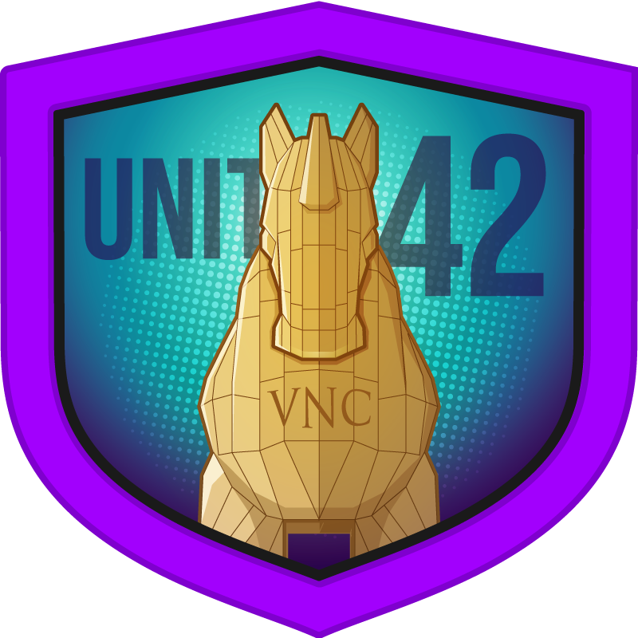
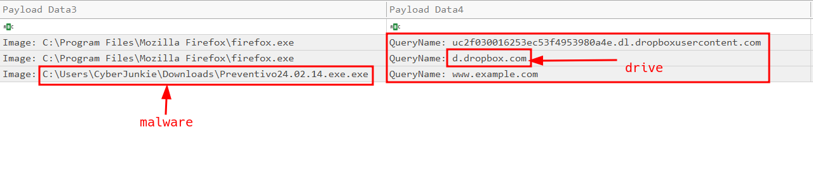
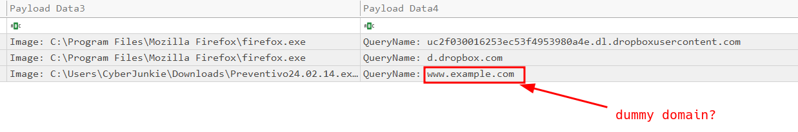
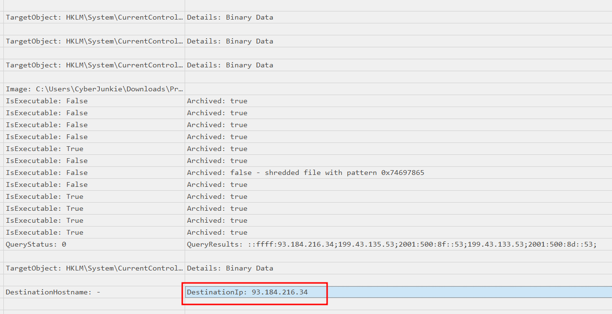
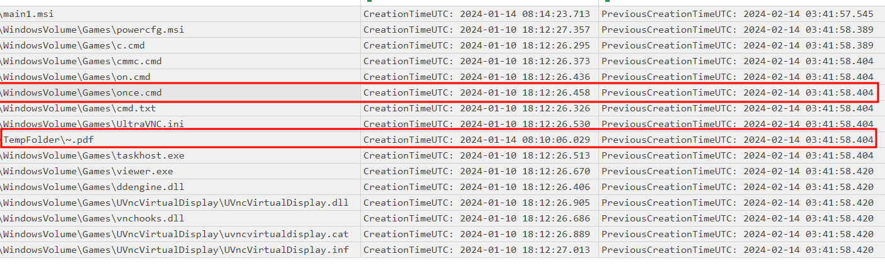
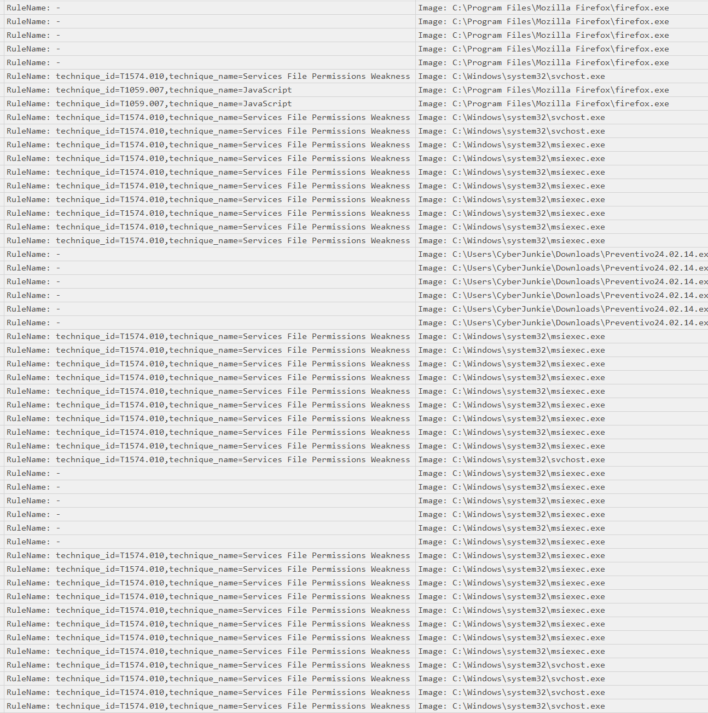
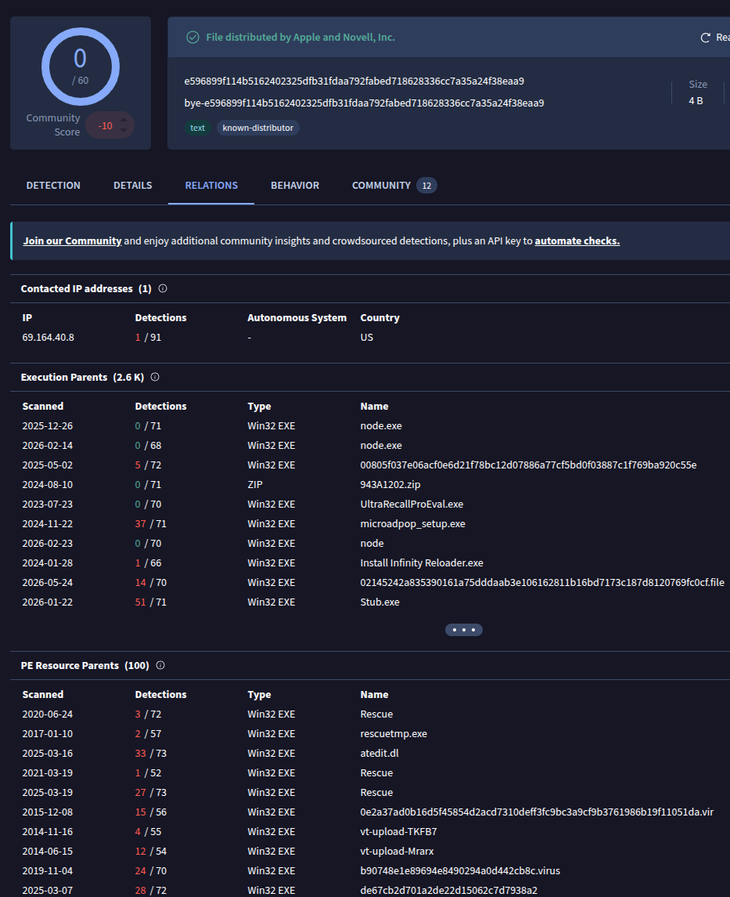

<p align="center">
  
</p>

# Unit42 Security Incident Report

> **Category:** Very Easy  
> **Discipline:** DFIR — Windows Sysmon Analysis  
> **Primary artifact:** `Microsoft-Windows-Sysmon-Operational.evtx`  
> **Time standard:** UTC

---

## Executive Summary

| Field | Value |
|---|---|
| **Incident ID** | `UNIT42-2024-0214` |
| **Severity** | **High** |
| **Status** | Confirmed malicious execution |
| **Affected host** | `DESKTOP-887GK2L` |
| **Affected user** | `CyberJunkie` |
| **Initial access vector** | User-downloaded executable from Dropbox |
| **Malicious file** | `Preventivo24.02.14.exe.exe` |
| **Execution time** | `2024-02-14 03:41:56.538 UTC` |
| **External connection** | `93.184.216.34:80` |
| **Assessment confidence** | High |

The user downloaded and manually executed `Preventivo24.02.14.exe.exe` from Dropbox. The executable unpacked an MSI-based payload under the user's roaming profile, launched `msiexec.exe`, staged UltraVNC-related components, manipulated file creation timestamps, and installed multiple files under `C:\Games`.

The executable also resolved `www.example.com` and connected to `93.184.216.34` over TCP port `80`. The available Sysmon data confirms payload execution and host modification, but does not prove an active remote-control session, credential theft, or data exfiltration.

---

## Artifact Inventory

| Artifact | Type | Evidentiary value |
|---|---|---|
| `Sysmon.csv` | Parsed Windows Sysmon log | DNS, file creation, process creation, network connection, timestomping, image loading, and file deletion activity |
| `download-and-payload.png` | Evidence screenshot | Dropbox delivery path and malicious executable name |
| `sysmon-event-overview.png` | Evidence screenshot | Processes and Sysmon rule mappings associated with the installer activity |
| `timestamp-manipulation.png` | Evidence screenshot | Original and altered creation timestamps |
| `dns-query.png` | Evidence screenshot | DNS query issued by the malicious executable |
| `network-connection.png` | Evidence screenshot | Destination IP associated with the executable |
| `virustotal-enrichment.png` | Enrichment screenshot | External context for one staged script hash; not primary host evidence |

> **Evidence note:** Event timestamps in this report use the Sysmon `UtcTime` field. Sysmon rule names are treated as detection metadata, not independent proof of a technique.

---

## Scope and Affected Assets

| Asset | Role | Impact |
|---|---|---|
| `DESKTOP-887GK2L` | Windows workstation | Untrusted code executed and files installed |
| `DESKTOP-887GK2L\CyberJunkie` | Logged-on user | Executed the downloaded payload |
| `C:\Users\CyberJunkie\Downloads\Preventivo24.02.14.exe.exe` | Initial executable | Launched the malicious installation chain |
| `C:\Games` | Payload destination | Received scripts and executables from the MSI installation |
| `C:\Users\CyberJunkie\AppData\Roaming\Photo and Fax Vn\...` | Staging directory | Temporarily held extracted and timestomped components |

---

## Incident Narrative

### 1. Payload Delivery

At `2024-02-14 03:41:25.269 UTC`, Firefox resolved a Dropbox content-delivery hostname. One second later, Firefox created the downloaded file and renamed it to:

```text
C:\Users\CyberJunkie\Downloads\Preventivo24.02.14.exe.exe
```

The `Zone.Identifier` alternate data stream recorded `ZoneId=3`, a Dropbox referrer, and the full `dropboxusercontent.com` source URL. The double `.exe.exe` extension and invoice-style Italian filename are consistent with masquerading.



### 2. User Execution

Windows Explorer removed the file's `Zone.Identifier` at `03:41:56.467 UTC`. At `03:41:56.538 UTC`, Explorer launched the executable as `CyberJunkie`:

```text
"C:\Users\CyberJunkie\Downloads\Preventivo24.02.14.exe.exe"
```

Primary payload hashes:

```text
MD5     32F35B78A3DC5949CE3C99F2981DEF6B
SHA1    18A24AA0AC052D31FC5B56F5C0187041174FFC61
SHA256  0CB44C4F8273750FA40497FCA81E850F73927E70B13C8F80CDCFEE9D1478E6F3
```

### 3. Network Activity

The executable queried `www.example.com` at `03:41:56.955 UTC` and established a TCP connection from `172.17.79.132:61177` to `93.184.216.34:80` at `03:41:57.159 UTC`.

The destination is confirmed in Sysmon. The supplied evidence does not establish that this connection was command-and-control traffic; it may have been a connectivity check.





### 4. MSI Execution Chain

The executable extracted the following MSI package:

```text
C:\Users\CyberJunkie\AppData\Roaming\Photo and Fax Vn\Photo and vn 1.1.2\install\F97891C\main1.msi
```

At `03:41:57.905 UTC`, it launched Windows Installer with:

```text
"C:\Windows\system32\msiexec.exe" /i "...\F97891C\main1.msi" \
AI_SETUPEXEPATH=C:\Users\CyberJunkie\Downloads\Preventivo24.02.14.exe.exe \
SETUPEXEDIR=C:\Users\CyberJunkie\Downloads\ \
EXE_CMD_LINE="/exenoupdates /forcecleanup /wintime 1707880560"
```

The MSI SHA-256 recorded during cleanup was:

```text
B73B46F35142989A10C91AA887F94037271B8EE7148CC3BFB061AE9848ED1FD9
```

### 5. Payload Staging and Timestomping

The installer staged scripts, executables, DLLs, an MSI, an INI file, a PDF decoy, and UltraVNC-related files below the roaming-profile installation directory. Sysmon Event ID `2` recorded **16 creation-time modifications**.

Most staged files were changed from their actual `2024-02-14` creation time to timestamps around `2024-01-10`; `main1.msi` and the PDF decoy were shifted to `2024-01-14`.

Examples:

| File | Actual creation time | Altered creation time |
|---|---|---|
| `main1.msi` | `2024-02-14 03:41:57.545` | `2024-01-14 08:14:23.713` |
| `once.cmd` | `2024-02-14 03:41:58.404` | `2024-01-10 18:12:26.458` |
| `taskhost.exe` | `2024-02-14 03:41:58.404` | `2024-01-10 18:12:26.513` |
| `viewer.exe` | `2024-02-14 03:41:58.420` | `2024-01-10 18:12:26.670` |



### 6. Files Installed Under `C:\Games`

Between `03:41:58.561` and `03:41:58.608 UTC`, `msiexec.exe` created:

```text
C:\Games\on.cmd
C:\Games\c.cmd
C:\Games\cmmc.cmd
C:\Games\viewer.exe
C:\Games\once.cmd
C:\Games\taskhost.exe
```

The staging set also contained `UltraVNC.ini`, `vnchooks.dll`, `UVncVirtualDisplay.dll`, and related driver files. This supports assessment of a VNC-capable payload. The supplied Sysmon interval does not show `viewer.exe` or `taskhost.exe` starting, nor does it confirm a remote VNC session.



### 7. Cleanup and Anti-Forensic Activity

At `03:41:58.733–03:41:58.748 UTC`, the initial executable deleted the extracted MSI and staged payload files. Sysmon recorded `once.cmd` as:

```text
Archived: false - shredded file with pattern 0x74697865
```

The original process terminated at `03:41:58.795 UTC`. The final files written to `C:\Games` were not shown being deleted within the available evidence window.

---

## Technical Timeline

| Timestamp (UTC) | Event |
|---|---|
| `2024-02-14 03:41:25.269` | Firefox queried the Dropbox content-delivery hostname |
| `2024-02-14 03:41:26.459` | Firefox created `Preventivo24.02.14.exe.exe` in Downloads |
| `2024-02-14 03:41:30.472` | `Zone.Identifier` recorded the Dropbox referrer and source URL |
| `2024-02-14 03:41:56.467` | Explorer removed the `Zone.Identifier` stream |
| `2024-02-14 03:41:56.538` | User executed `Preventivo24.02.14.exe.exe` |
| `2024-02-14 03:41:56.955` | Executable queried `www.example.com` |
| `2024-02-14 03:41:57.159` | Executable connected to `93.184.216.34:80` |
| `2024-02-14 03:41:57.545` | `main1.msi` creation time changed to `2024-01-14` |
| `2024-02-14 03:41:57.604` | SYSTEM `msiexec.exe /V` process started |
| `2024-02-14 03:41:57.905` | Initial executable launched `msiexec.exe /i main1.msi` |
| `2024-02-14 03:41:58.389–03:41:58.420` | Multiple staged files were timestomped |
| `2024-02-14 03:41:58.561–03:41:58.608` | Scripts and executables were installed under `C:\Games` |
| `2024-02-14 03:41:58.733–03:41:58.748` | Extracted staging files were deleted; `once.cmd` was shredded |
| `2024-02-14 03:41:58.795` | Initial executable terminated |

---

## Indicators of Compromise

### Network Indicators

| Type | Indicator | Context |
|---|---|---|
| Domain | `uc2f030016253ec53f4953980a4e.dl.dropboxusercontent.com` | Payload download host |
| Domain | `www.example.com` | Queried by the executed payload |
| IPv4 | `93.184.216.34` | Destination contacted over TCP port `80` |
| Internal IPv4 | `172.17.79.132` | Source address of the affected workstation |

### File Indicators

| Indicator | SHA-256 | Context |
|---|---|---|
| `Preventivo24.02.14.exe.exe` | `0CB44C4F8273750FA40497FCA81E850F73927E70B13C8F80CDCFEE9D1478E6F3` | Initial downloaded executable |
| `main1.msi` | `B73B46F35142989A10C91AA887F94037271B8EE7148CC3BFB061AE9848ED1FD9` | Extracted MSI installer |
| `taskhost.exe` | `3FB38EEFB8DB4D52BE428FACC8A242997AB2AD58A8D08980A7688C9BF0B30454` | Staged executable |
| `viewer.exe` | `E48AAC5148B261371C714B9E00268809832E4F82D23748E44F5CFBBF20CA3D3F` | Staged executable |
| `UVncVirtualDisplay.dll` | `FF9D8F7FC2C3F5D0AFAF6F76E87D41FEEABF54FACBE26DC59661A78830F32972` | Staged UltraVNC-related DLL |
| `vnchooks.dll` | `4D12FEBD622266220AA2DD2074972EE82545C144DC599F68866212A29DB9F442` | Staged VNC hook DLL |
| `once.cmd` | `E596899F114B5162402325DFB31FDAA792FABED718628336CC7A35A24F38EAA9` | Staged and shredded command script |

### Path Indicators

```text
C:\Users\CyberJunkie\Downloads\Preventivo24.02.14.exe.exe
C:\Users\CyberJunkie\AppData\Roaming\Photo and Fax Vn\Photo and vn 1.1.2\
C:\Games\on.cmd
C:\Games\c.cmd
C:\Games\cmmc.cmd
C:\Games\viewer.exe
C:\Games\once.cmd
C:\Games\taskhost.exe
```

---

## Attack Classification

| Phase | Observed behavior | ATT&CK mapping |
|---|---|---|
| **Delivery** | Executable downloaded from Dropbox | `T1105` — Ingress Tool Transfer |
| **Execution** | User launched the downloaded executable | `T1204.002` — Malicious File |
| **Defense Evasion** | Double-extension and invoice-style filename | `T1036` — Masquerading |
| **Defense Evasion** | Payload launched through `msiexec.exe` | `T1218.007` — Msiexec |
| **Defense Evasion** | Creation timestamps changed to older dates | `T1070.006` — Timestomp |
| **Defense Evasion** | Extracted files deleted and one script shredded | `T1070.004` — File Deletion |
| **Staging / Capability** | UltraVNC-related components staged | Potential `T1219`; remote session not observed |

---

## Root Cause

The incident began when an internet-downloaded executable from Dropbox was manually launched from the user's Downloads directory. The evidence indicates insufficient prevention or containment of untrusted executable content. The supplied logs do not identify the message, website, or social-engineering channel that caused the user to download the file.

---

## Impact Assessment

| Area | Assessment |
|---|---|
| **Confidentiality** | Potentially affected. VNC-related tooling was staged, but no remote session or collection activity is proven. |
| **Integrity** | High impact. The installer wrote scripts and executables to `C:\Games` and manipulated timestamps. |
| **Availability** | No service disruption is visible in the supplied Sysmon interval. |
| **Persistence** | Not confirmed. Residual payload files remained, but no service, scheduled task, or autorun activation is shown. |
| **Data exfiltration** | Not established. |
| **Overall impact** | Confirmed malicious execution and unauthorized host modification. |

---

## Containment and Eradication Recommendations

### Immediate

1. Isolate `DESKTOP-887GK2L` from the network.
2. Block the payload SHA-256 and Dropbox delivery hostname in endpoint and network controls.
3. Preserve disk, memory, Sysmon, browser history, Prefetch, Amcache, Shimcache, SRUM, and Task Scheduler artifacts.
4. Quarantine `Preventivo24.02.14.exe.exe`, `main1.msi`, and all files under `C:\Games` after forensic acquisition.
5. Search for active VNC processes, listening ports, services, drivers, scheduled tasks, and firewall rules.

### Eradication and Recovery

1. Reimage the workstation from a trusted source if remote-access activation or additional payload execution is confirmed.
2. Remove unauthorized files, services, scheduled tasks, drivers, and registry entries identified during full-disk analysis.
3. Reset credentials used on the host after the compromise window.
4. Validate that endpoint protection, SmartScreen, and application-control policies are active and centrally managed.
5. Hunt across the environment for the listed hashes, paths, Dropbox hostname, and `msiexec` command line.

### Preventive Controls

- Restrict execution from user-writable directories such as Downloads and AppData.
- Block or detonate executables delivered through public file-sharing services.
- Alert on double-extension executable names.
- Alert on `msiexec.exe` installing MSI packages from user-profile paths.
- Alert on Sysmon Event ID `2` involving multiple files in rapid succession.
- Alert on VNC components appearing outside approved software-distribution paths.

---

## Conclusion

The Unit42 evidence records a user downloading and executing a masqueraded installer from Dropbox. The executable launched an MSI installation chain, staged VNC-related components, timestomped extracted files, installed scripts and executables under `C:\Games`, and removed staging artifacts. The host should be treated as compromised until a full disk investigation confirms that no remote-access mechanism or secondary payload remained active.

---

## Annex A — Evidence-to-Finding Matrix

| Finding | Supporting evidence |
|---|---|
| Payload originated from Dropbox | Sysmon Event IDs `22`, `11`, and `15`; `Zone.Identifier` contents |
| User executed the downloaded file | Sysmon Event ID `1`; parent `explorer.exe` |
| Payload connected to `93.184.216.34:80` | Sysmon Event IDs `22` and `3` |
| MSI installation was launched | Sysmon Event ID `1`; `msiexec.exe /i ...\main1.msi` |
| Files were timestomped | Sixteen Sysmon Event ID `2` records |
| Payload files were written to `C:\Games` | Sysmon Event ID `11` records |
| UltraVNC-related components were staged | Paths containing `UltraVNC.ini`, `UVncVirtualDisplay.dll`, and `vnchooks.dll` |
| Extracted artifacts were deleted | Sysmon Event ID `23`; `once.cmd` shredding metadata |
| Remote-control session was not established in supplied evidence | No execution or network events for the staged VNC binaries in the available interval |

---

## Annex B — Enrichment Caveat

The supplied VirusTotal screenshot relates to SHA-256 `E596899F114B5162402325DFB31FDAA792FABED718628336CC7A35A24F38EAA9`, the staged `once.cmd` script. It is retained as supplemental enrichment only. Relationship data shown by an external service does not prove that `DESKTOP-887GK2L` contacted every listed infrastructure item.


